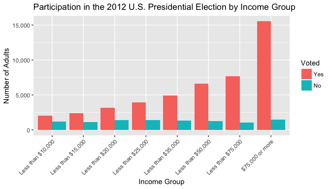
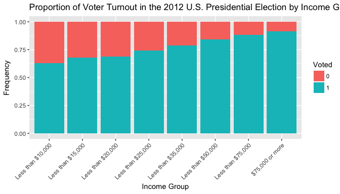
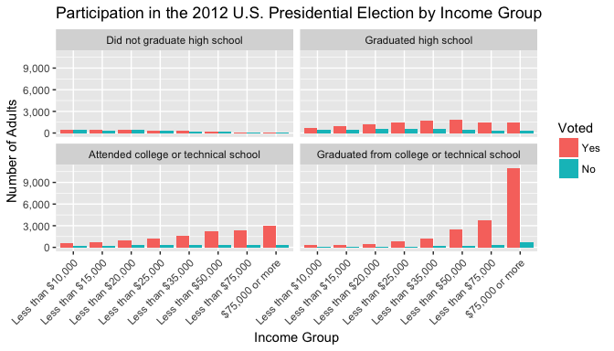
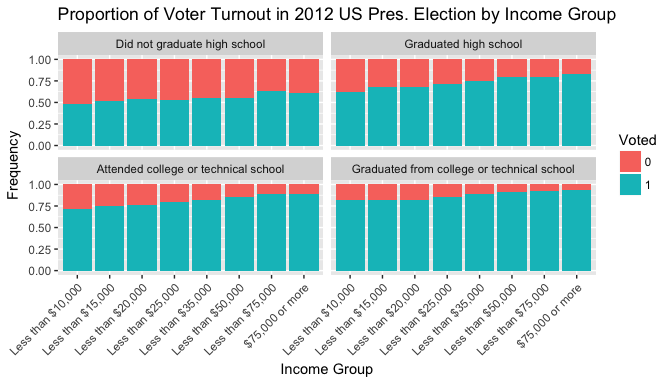
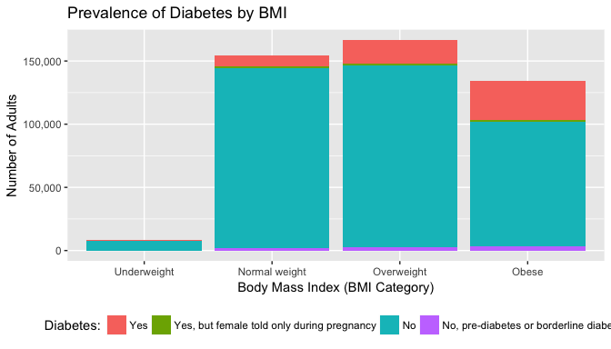
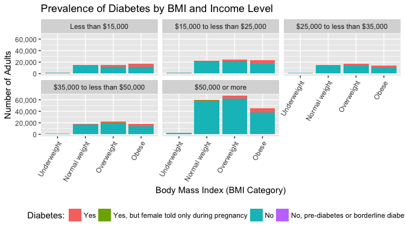
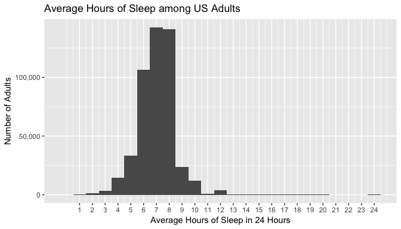
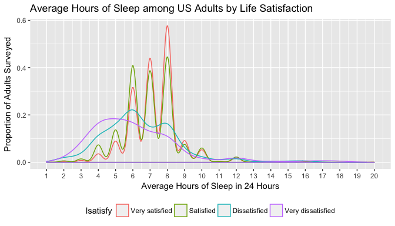
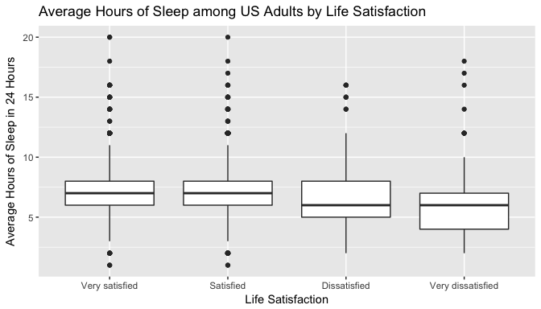

# Exploring the BRFSS data
2017-10-13  

## Setup


### Load packages


```r
library(ggplot2)
library(dplyr)
library(scales)
```

### Load data


```r
if (!file.exists("brfss2013.RData")) {
    url <- "https://d3c33hcgiwev3.cloudfront.net/_384b2d9eda4b29131fb681b243a7767d_brfss2013.RData?Expires=1504137600&Signature=Vi9smA4IM4KMBw36jNxIY5zzsh2IUamTXhXOUV-tFZLYNYwsEk9Giv~YBRPX529pVmeFjPszsgo411L4CMlrGkLg6j8v~cQjuwNFE32zOUQTcY7cCvATbuy4pt9cRLA0Sq3bpjPyBx187zDmjAAaPTPncP59lnfrpPF-ZWftC9g_&Key-Pair-Id=APKAJLTNE6QMUY6HBC5A"
    download.file(url, dest = "brfss2013.RData", mode = "wb") 
}
load("brfss2013.RData")
```

* * *

## Part 1: Data

The data used to investigate the questions below come from the 2013 Behavioral Risk Factor Surveillance System (BRFSS).

The BRFSS is an observational study. The population it is concerned with is the US adult population, more specifically US residents (both states and territories) over the age of 18. The data was collected via telephone interview (either landline or cellular). A stratified random sample strategy was employed in order to achieve the objective of having state-specific data.

Because this is an observational study with random sampling rather than an experiment with random assignment, we are not able to infer causality. Random sampling does however allow us to attempt to generalize findings from the sample to the larger population, in this case the US adult population.

Potential biases in the sample could result from the nature of persons agreeing to complete a telephone interview. On one hand, many people might not be willing to give time for such an interview. This could lead to nonresponse bias. The sample may also exclude disadvantaged individuals without a telephone. This could be seen as undercoverage bias. 

Nevertheless, given the efforts of the survey teams to overcome these potential sources of bias, neither is likely significant enough for concern that the sample is biased.

More information about the BRFSS, including the sample design, can be found [here](https://www.cdc.gov/brfss/annual_data/2013/pdf/Overview_2013.pdf).

* * *

## Part 2: Research questions
                          
**Research question 1:**

For the health of a democracy, it is important that all individuals have an equal opportunity to vote. Many factors could impact the likelihood of someone voting, such as their interest in voting, but also logistical factors such as poll opening hours, locations of polling booths, and the day of the election.

Before suggesting such hypotheses and possible policy to address them, it would be important to examine the relationship between income groups and voting participation.

*To what extent if any, does voting participation vary by income?*

To explore this question, I drew on two variables in the dataset: 
- `scntvot1`: Did You Vote In The Last Presidential Election?
- `income2`: Income Level

`scntvot1` is a categorical variable of Yes/No answers of participation in the 2012 presidential election between Barack Obama and Mitt Romney.

For income data, there was a choice between `income2` (Income Level) and `X_incomg` (Computed Income Categories). I chose the former because there is further segmentation among income groups to better discern if there is a relationship income and voting likelihood.

**Research question 2:**

One disease assuming an increasing role in the consciousness of public health officials is diabetes. The prevalence of diabetes, particularly Type 2 diabetes, is on the rise around the world. This disease has often been connected with the concurrent rise in obesity rates. 

Rather than being something entirely inherited, obesity one could argue may be tied to a number of important social and economic factors. Accordingly, I wanted to investigate how the relationship between diabetes and obesity varies, if at all, by income group.

*Specficially, is there an association between the likelihood of someone having diabetes and someone being obese? Moreover, to what extent, does income level affect this relationship?*

To explore this question, I drew on three categorical variables in the BRFSS dataset:
- `diabete3` : (Ever Told) You Have Diabetes
- `X_bmi5cat` : Computed Body Mass Index Categories
- `X_incomg` : Computed Income Categories

**Research question 3:**

We all know sleep is important for our health, and while it is one thing under our control, it is perhaps an underappreciated component of our overall well-being.

*To what extent, if any, does life satisfaction vary by average sleep time?*

In order to explore this question, I drew on two variables in the dataset:
- `sleptim1` : How Much Time Do You Sleep
- `lsatisfy` : Satisfaction With Life

`sleptim1` is a continuous variable ranging from 1 to 24.
`lsatisfy` is a categorical variable divided into four bins on a scale of "Very Satisfied" to "Very Dissatisfied".

* * *

## Part 3: Exploratory data analysis

**Research question 1:**

*To what extent if any, does voting participation vary by income?*


```r
# remove na values for income group and voting record
income_vote <- brfss2013 %>%
    filter(!is.na(income2),
           !is.na(scntvot1))

# plot voting participation by income group
ggplot(income_vote, aes(x = income2, fill = scntvot1)) +
    geom_bar(position = "dodge") +
    theme(axis.text.x = element_text(angle = 45, hjust = 1)) +
    xlab("Income Group") +
    scale_y_continuous(name = "Number of Adults", labels = comma) +
    guides(fill = guide_legend(title = "Voted")) +
    ggtitle("Participation in the 2012 U.S. Presidential Election by Income Group")
```

<!-- -->

In the plot above, we can see a clear trend of increasing likelihood of having voted in the 2012 presidential election as one's income increases. This trend is confirmed in the table of raw counts below. 


```r
# table form
table(income_vote$income2, income_vote$scntvot1)
```

```
##                    
##                       Yes    No
##   Less than $10,000  2022  1198
##   Less than $15,000  2387  1118
##   Less than $20,000  3163  1421
##   Less than $25,000  3957  1389
##   Less than $35,000  4940  1331
##   Less than $50,000  6632  1231
##   Less than $75,000  7677  1017
##   $75,000 or more   15549  1448
```

We can similarly view the relationship by analyzing proportions of those who voted and who did not according to income group.


```r
# change yes no to 1 0 and make factor
income_vote$vote <- ifelse(income_vote$scntvot1 == "Yes", 1, 0)
income_vote$vote <- as.factor(income_vote$vote)

# calculate voting frequency
income_vote_freq <- income_vote %>%
    group_by(income2, vote) %>%
    summarise(n = n()) %>%
    mutate(freq = n / sum(n))

# plot
ggplot(income_vote_freq, 
    aes(x = income2, y = freq, fill = vote)) +
    geom_bar(stat = "identity") +
    theme(axis.text.x = element_text(angle = 45, hjust = 1)) +
    xlab("Income Group") +
    ylab("Frequency") +
    guides(fill = guide_legend(title = "Voted")) +
    ggtitle("Proportion of Voter Turnout in the 2012 U.S. Presidential Election by Income Group")
```

<!-- -->

The disparities in voting frequency across income groups can be seen in the table below.


```r
income_vote_freq
```

```
## # A tibble: 16 x 4
## # Groups:   income2 [8]
##              income2   vote     n      freq
##               <fctr> <fctr> <int>     <dbl>
##  1 Less than $10,000      0  1198 0.3720497
##  2 Less than $10,000      1  2022 0.6279503
##  3 Less than $15,000      0  1118 0.3189729
##  4 Less than $15,000      1  2387 0.6810271
##  5 Less than $20,000      0  1421 0.3099913
##  6 Less than $20,000      1  3163 0.6900087
##  7 Less than $25,000      0  1389 0.2598204
##  8 Less than $25,000      1  3957 0.7401796
##  9 Less than $35,000      0  1331 0.2122469
## 10 Less than $35,000      1  4940 0.7877531
## 11 Less than $50,000      0  1231 0.1565560
## 12 Less than $50,000      1  6632 0.8434440
## 13 Less than $75,000      0  1017 0.1169772
## 14 Less than $75,000      1  7677 0.8830228
## 15   $75,000 or more      0  1448 0.0851915
## 16   $75,000 or more      1 15549 0.9148085
```

We can also facet our dataset by education group to examine the extent to which education may also impact voting participation.


```r
income_vote_edu <- brfss2013 %>%
    filter(!is.na(income2),
           !is.na(scntvot1),
           !is.na(X_educag))

ggplot(income_vote_edu, aes(x = income2, fill = scntvot1)) +
    geom_bar(position = "dodge") +
    theme(axis.text.x = element_text(angle = 45, hjust = 1)) +
    xlab("Income Group") +
    scale_y_continuous(name = "Number of Adults", labels = comma) +
    guides(fill = guide_legend(title = "Voted")) +
    ggtitle("Participation in the 2012 U.S. Presidential Election by Income Group") +
    facet_wrap(~ X_educag)
```

<!-- -->


```r
# change yes no to 1 0 and make factor
income_vote_edu$vote <- ifelse(income_vote_edu$scntvot1 == "Yes", 1, 0)
income_vote_edu$vote <- as.factor(income_vote_edu$vote)

# calculate voting frequency
income_vote_ed_freq <- income_vote_edu %>%
    group_by(income2, X_educag, vote) %>%
    summarise(n = n()) %>%
    mutate(freq = n / sum(n))

# plot
ggplot(income_vote_ed_freq, 
    aes(x = income2, y = freq, fill = vote)) +
    geom_bar(stat = "identity") +
    theme(axis.text.x = element_text(angle = 45, hjust = 1)) +
    xlab("Income Group") +
    ylab("Frequency") +
    guides(fill = guide_legend(title = "Voted")) +
    ggtitle("Proportion of Voter Turnout in 2012 US Pres. Election by Income Group") +
    facet_wrap(~ X_educag)
```

<!-- -->


```r
income_vote_ed_freq
```

```
## # A tibble: 64 x 5
## # Groups:   income2, X_educag [32]
##              income2                                   X_educag   vote
##               <fctr>                                     <fctr> <fctr>
##  1 Less than $10,000               Did not graduate high school      0
##  2 Less than $10,000               Did not graduate high school      1
##  3 Less than $10,000                      Graduated high school      0
##  4 Less than $10,000                      Graduated high school      1
##  5 Less than $10,000       Attended college or technical school      0
##  6 Less than $10,000       Attended college or technical school      1
##  7 Less than $10,000 Graduated from college or technical school      0
##  8 Less than $10,000 Graduated from college or technical school      1
##  9 Less than $15,000               Did not graduate high school      0
## 10 Less than $15,000               Did not graduate high school      1
## # ... with 54 more rows, and 2 more variables: n <int>, freq <dbl>
```

While faceting our data by level of education, the broad relationship we observed between voting participation and income group still holds. Those in higher income groups still are more likely to have voted. However, it would be unwise to conclude that income group tells the entire story. 

Level of education may also affect the likelihood of someone voting. Before faceting by education, from our data we would have expected someone's likelihood of voting to increase with as income level rose. 

However, looking at education level at the same time complicates the picture. In this sample, someone from a low income group but a college or technical school graduate is more like to have voted than someone from a high income group but who did not graduate high school.

Our next step would be to conduct a hypothesis tests to determine whether this variation amongst income groups and education levels in voting patterns is simply due to chance or not.

**Research question 2:**

*Is there an association between the likelihood of someone having diabetes and someone being obese? To what extent, does income level affect this relationship?*


```r
# remove missing data in diabetes and BMI
diabete <- brfss2013 %>%
    filter(!is.na(diabete3),
           !is.na(X_bmi5cat))
```


```r
# plot diabetes by BMI
ggplot(diabete, aes(x = X_bmi5cat, fill = diabete3)) +
    geom_bar() +
    xlab("Body Mass Index (BMI Category)") +
    theme(legend.position = "bottom") +
    scale_y_continuous(name = "Number of Adults", labels = comma) +
    guides(fill = guide_legend(title = "Diabetes:")) +
    ggtitle("Prevalence of Diabetes by BMI")
```

<!-- -->

This chart shows a clear relationship between BMI and diabetes. Very few adults in the sample who are underweight have diabetes. Most of those diagnosed with diabetes are most often obese or overweight. The exact counts are provided in the table below.


```r
table(diabete$diabete3,diabete$X_bmi5cat)
```

```
##                                             
##                                              Underweight Normal weight
##   Yes                                                415          8622
##   Yes, but female told only during pregnancy          74          1397
##   No                                                7674        143041
##   No, pre-diabetes or borderline diabetes             84          1646
##                                             
##                                              Overweight  Obese
##   Yes                                             18788  31146
##   Yes, but female told only during pregnancy       1303   1339
##   No                                             143894  98538
##   No, pre-diabetes or borderline diabetes          2909   3538
```

I also wanted to investigate to what extent if any this relationship changed based on level of income. Faceting by income groups reduces the size of our sample, but is still large enough to be very useful.


```r
# remove missing values
diabete2 <- brfss2013 %>%
    filter(!is.na(diabete3),
           !is.na(X_bmi5cat),
           !is.na(X_incomg))
```


```r
# plot diabetes by BMI, faceted by income
ggplot(diabete2, aes(x = X_bmi5cat, fill = diabete3)) +
    geom_bar() +
    facet_wrap(~ X_incomg) +
    theme(axis.text.x = element_text(angle = 60, hjust = 1)) +
    theme(legend.position="bottom") +
    xlab("Body Mass Index (BMI Category)") +
    scale_y_continuous(name = "Number of Adults", labels = comma) +
    guides(fill = guide_legend(title = "Diabetes:")) +
    ggtitle("Prevalence of Diabetes by BMI and Income Level")
```

<!-- -->

As we might expect, faceting by income level does not drastically change our results. The relationship between diabetes and obesity appears broadly similar across income groups.

**Research question 3:**

*To what extent, if any, does life satisfaction vary by average sleep time?*


```r
# remove erroneous values
all_sleep <- brfss2013 %>%
    filter(sleptim1 <= 24)
```


```r
# plot all sleep data
ggplot(data = all_sleep, aes(x = sleptim1)) + 
    geom_histogram(binwidth = 1) +
    xlab("Average Hours of Sleep in 24 Hours") +
    ggtitle("Average Hours of Sleep among US Adults") +
    scale_y_continuous(name = "Number of Adults", labels = comma) +
    scale_x_continuous(breaks = 1:24)
```

<!-- -->


```r
# summary values for hours of sleep amongst whole sample
summary(all_sleep$sleptim1)
```

```
##    Min. 1st Qu.  Median    Mean 3rd Qu.    Max. 
##   0.000   6.000   7.000   7.051   8.000  24.000
```

After calculating that summary data, we can remove missing life satisfaction values in order to examine how sleep may vary by life satisfaction.


```r
# remove missing life satisfaction values
sleep <- brfss2013 %>%
    filter(sleptim1 <= 24,
           !is.na(lsatisfy))
```


```r
# plot sleep data by life satisfaction
ggplot(data = sleep, aes(x = sleptim1, color = lsatisfy)) + 
    geom_density() +
    xlab("Average Hours of Sleep in 24 Hours") +
    ggtitle("Average Hours of Sleep among US Adults by Life Satisfaction") +
    ylab("Proportion of Adults Surveyed") +
    scale_x_continuous(breaks = 1:24) +
    theme(legend.position = "bottom")
```

<!-- -->

From the density plot above, we can see that the center of the distribution for "Very Dissatisfied" and "Dissatisfied" appears to be to the left of that for "Very Satisfied" and "Satisfied".

The boxplots below similarly show higher Q1, median, and Q3 levels for more satisfied adults.


```r
ggplot(sleep, aes(x = lsatisfy, y = sleptim1)) + 
    geom_boxplot() +
    xlab("Life Satisfaction") +
    ylab("Average Hours of Sleep in 24 Hours") +
    ggtitle("Average Hours of Sleep among US Adults by Life Satisfaction")
```

<!-- -->

The extent of these difference are clearer in the calculations below.


```r
# calculate summary sleep stats by life satisfaction
sleep %>%
    group_by(lsatisfy) %>%
    summarize(min = min(sleptim1),
              q1 = quantile(sleptim1, 0.25),
              median = median(sleptim1),
              mean = mean(sleptim1),
              q3 = quantile(sleptim1, 0.75),
              max = max(sleptim1))
```

```
## # A tibble: 4 x 7
##            lsatisfy   min    q1 median     mean    q3   max
##              <fctr> <dbl> <dbl>  <dbl>    <dbl> <dbl> <dbl>
## 1    Very satisfied     1     6      7 7.274777     8    20
## 2         Satisfied     1     6      7 6.990817     8    20
## 3      Dissatisfied     2     5      6 6.459413     8    16
## 4 Very dissatisfied     2     4      6 6.148387     7    18
```

Q1, Q2, and Q3 increase as one moves from "Very Dissatisfied" to "Very Satisfied". The trend is also present in the mean, moving from an average of 6.14 hours to 7.27 hours.

Having explored the data both graphically and statistically, it would now be appropriate to conduct a hypothesis test in order to determine whether this variation in the sample is simple due to chance or not.
