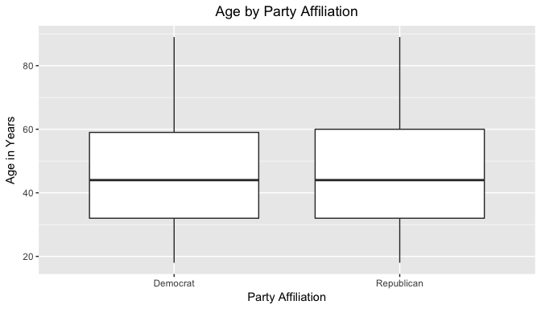
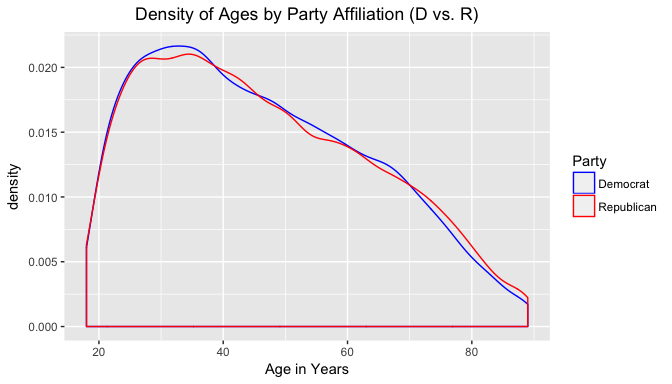
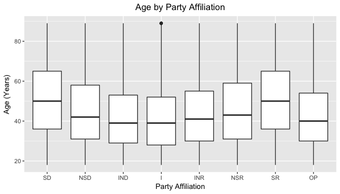
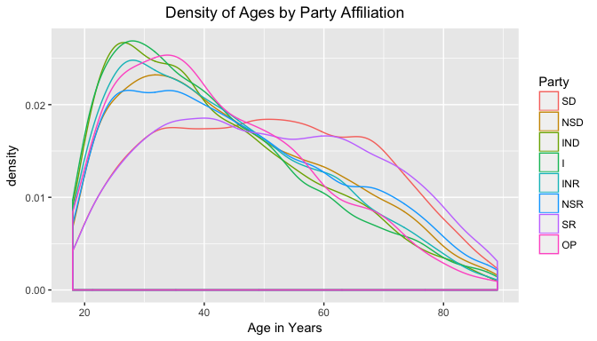
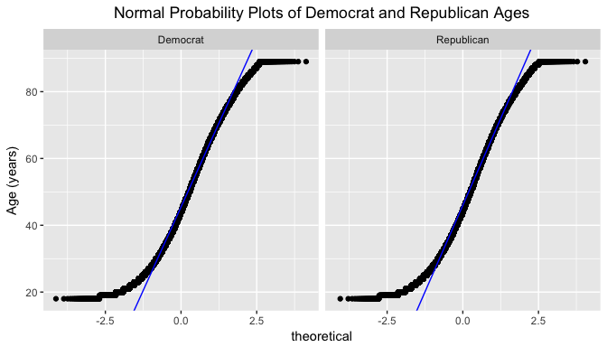
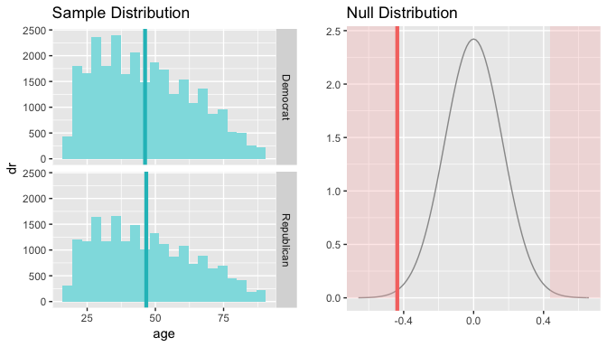
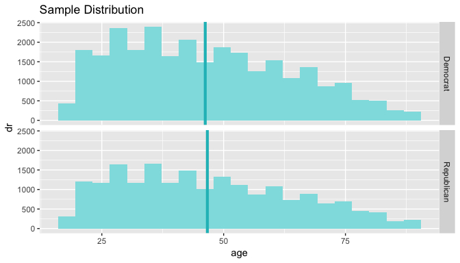
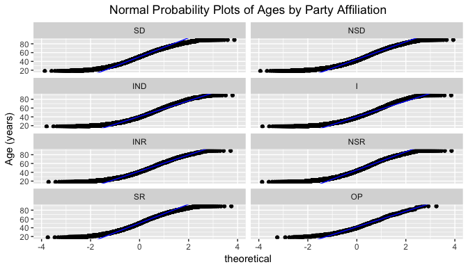
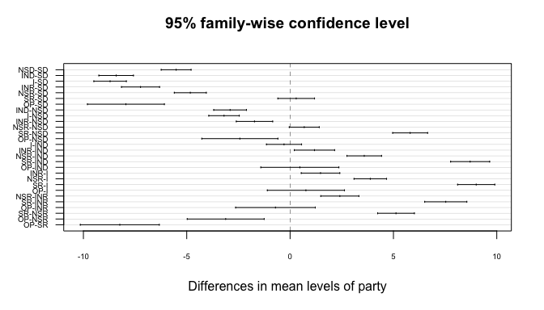

# Statistical inference with the GSS data
2017-10-13  

## Setup


### Load packages


```r
library(ggplot2)
library(dplyr)
library(statsr)
library(forcats)
library(nortest)
library(statsr)
library(effsize)
library(heplots)
```

### Load data


```r
if (!file.exists("gss.Rdata")) {
    url <- "https://d3c33hcgiwev3.cloudfront.net/_5db435f06000e694f6050a2d43fc7be3_gss.Rdata?Expires=1504224000&Signature=cyOUvpVuSCr5QW6IkbblQphqS5M~bwT5V~rB6iS7N1VBtxPfxungbu9NJE7A-Z5YWUV2ZWr0Z5Wve72mas101Ypwnm5yR7NPCDtH~Hpxgf7BV2o99ijgv8nkfFX06EKurG0VKc0slQmo4IiRgmRJejzQrDwepz35s9hmOmKfpeM_&Key-Pair-Id=APKAJLTNE6QMUY6HBC5A"
    download.file(url, dest = "gss.Rdata", mode = "wb") 
}
load("gss.Rdata")
```


* * *

## Part 1: Data

The data used to investigate the questions below come from an extract of the General Social Survey (GSS) Cumulative File 1972-2012.

The GSS is an observational study. The population it is concerned with is "American society", or more specifically, US residents between the ages of 18 and 89. The data was collected via responses to a standard questionnaire completed through personal interviews.

Because this is an observational study with random sampling rather than an experiment with random assignment, we are not able to infer causality. Random sampling does however allow us to attempt to generalize findings from the sample to the larger population, in this case the US adult population.

Potential biases in the sample could result from the nature of persons agreeing to complete a personal interview. On one hand, many people might not be willing to give time for such an interview. This could lead to nonresponse bias. The sample may also exclude disadvantaged individuals without a telephone or address who are unable to be contacted about potential participation. This could be seen as undercoverage bias. 

Nevertheless, given the efforts of the survey teams to overcome these potential sources of bias, neither is likely significant enough for concern that the sample is biased.

More information about the GSS, including the sample design, can be found [here](http://gss.norc.org/About-The-GSS).

* * *

## Part 2: Research question

If following political news in the US, one might get the impression that Republican voters tend to be older than Democratic voters, and the policies of these parties tend to reflect this age gap. This trend has important and wide-reaching consequences for the country as political leaders tend to craft policies for the base it perceives to have.

I'd like to use the GSS data to explore the extent to which this impression is reflected in the data.

*To what extent, if any, does political party affiliation differ by age?*

For example, do Democrats tend to be younger and Republicans older on average? 

One important note is that the party affiliation data is self-reported from the GSS rather than from actual voter registration or election data. However, given that the survey is anonymous, it is perhaps unlikely that a significant amount of people would choose to lie about their party affiliation when completing the GSS interview, instead of skipping the question, which is allowed. 


* * *

## Part 3: Exploratory data analysis

I explored the data in two ways to answer the research question. First, I aggregated party choices from the original eight categorical variables into simply Democrat and Republican to allow for two-sample statistical tests. This should allow us to answer the primary research question at the most basic level. Then, I prepared the data to investigate the research question using the original eight party categories given. This might lead to some more interesting conclusions.

### Democrat vs. Republican grouping

We can see that the GSS has eight different party categories.


```r
# party levels
levels(gss$partyid)
```

```
## [1] "Strong Democrat"    "Not Str Democrat"   "Ind,Near Dem"      
## [4] "Independent"        "Ind,Near Rep"       "Not Str Republican"
## [7] "Strong Republican"  "Other Party"
```

For simplicity, we can also group observations into Democrats and Republicans. This gets at our research question at a more basic level, and allows us to use a two sample t-test in the inference section below.


```r
# group into larger vectors
dem_vec <- c("Strong Democrat","Not Str Democrat","Ind,Near Dem")
repub_vec <- c("Strong Republican","Not Str Republican","Ind,Near Rep")

# create new column with grouped factor levels
gss$dr <- fct_collapse(gss$partyid,
    Democrat = dem_vec,
    Republican = repub_vec)

# remove independents, other party, and missing ages
party <- gss %>%
    filter(dr == "Democrat" | dr == "Republican",
           !is.na(gss$age))

party$dr <- droplevels(party$dr)
levels(party$dr)
```

```
## [1] "Democrat"   "Republican"
```

Now we have gotten rid of the "Strong (Party)", "Not Str (Party)", and "Ind, Near (Party)" designations in favor of one umbrella category for each party. We also needed to remove the remaining observations that were missing age data.


```r
table(party$dr)
```

```
## 
##   Democrat Republican 
##      27818      19419
```

We can produce a side-by-side boxplot of our two party categories. We see that the distributions appear nearly identical.


```r
# Democrat vs Republican age boxplot
ggplot(party, aes(x = dr, y = age)) +
    geom_boxplot() +
    ylab("Age in Years") +
    xlab("Party Affiliation") +
    ggtitle("Age by Party Affiliation") +
    theme(plot.title = element_text(hjust = 0.5))
```

<!-- -->

Our calculations however for Q1-Q3, mean, and standard deviation show that Democrats do have a slightly younger mean, but it is very close.


```r
# summary calculations for Democrats and Republicans
party_sum <- party %>% 
    group_by(dr) %>%
    summarize(n = n(),
              q1 = quantile(age, 0.25),
              median = median(age),
              mean = mean(age),
              q3 = quantile(age, 0.75),
              s = sd(age))
party_sum
```

```
## # A tibble: 2 x 7
##           dr     n    q1 median     mean    q3        s
##       <fctr> <int> <dbl>  <dbl>    <dbl> <dbl>    <dbl>
## 1   Democrat 27818    32     44 46.22529    59 17.41425
## 2 Republican 19419    32     44 46.66188    60 17.75739
```

Comparing densities reveals a very similar age distribution for each party, but Democrats have a slightly higher youth peak and Republicans have slightly more concentration above the age of 70. Overall, the data is right skewed.

We also see the artificial boundaries at 18 and 89, as imposed by the survey. This is not a problem for us because one cannot vote below the age of 18 and the sample of voters over the age of 89 is likely no different than the trends already seen.


```r
# Density of Ages by Party Affiliation (D vs. R)
ggplot(party, aes(x = age, color = dr)) +
    geom_density() +
    xlab("Age in Years") +
    ggtitle("Density of Ages by Party Affiliation (D vs. R)") +
    theme(plot.title = element_text(hjust = 0.5)) +
    labs(color = "Party") +
    scale_color_manual(values = c("blue", "red"))
```

<!-- -->

It is also important to note that the age data is not normally distributed. This is not surprising since the GSS survey is capped between 18 and 89, as well as what we know generally about age demographics.

However, our sample size is very large, and this ensures that the sampling distribution of the mean is nearly normal and our standard error estimate will be reliable. This will be important when we perform inference tests.

### Party Spectrum

We can also look for finer details using the GSS original party categories.

First we must remove observations missing party affiliation or age data. I'll also abbreviate the party names for greater simplicity in reading plots and tables.


```r
# remove observations missing partyid or age data
gss1 <- gss %>%
    filter(!is.na(gss$partyid),
           !is.na(gss$age))

# create a new column
gss1$party <- NA

# copy the data from the existing column into the new one
gss1$party <- gss1$partyid

# recode data to shorter labels, keeping factor order
gss1$party <- recode_factor(gss1$party, 'Strong Democrat' = 'SD',
                            'Not Str Democrat' = 'NSD',
                            'Ind,Near Dem' = 'IND',
                            'Independent' = 'I',
                            'Ind,Near Rep' = 'INR',
                            'Not Str Republican' = 'NSR',
                            'Strong Republican' = 'SR',
                            'Other Party' = 'OP')
```

The side-by-side boxplot yields a very interesting result. Excluding the small number of those identifying as "Other Party", (which presumably would be mostly Libertarian or Green Party voters), we see a U-shaped pattern. On average, Independents tend to be the youngest group, and age increases almost in parallel as one moves left or right across the political spectrum, making "Strong Democrats" and "Strong Republicans" being the oldest on average.


```r
# side-by-side boxplot of age by party
ggplot(gss1, aes(x = party, y = age)) + 
    geom_boxplot() +
    ggtitle("Age by Party Affiliation") +
    theme(plot.title = element_text(hjust = 0.5)) +
    ylab("Age (Years)") +
    xlab("Party Affiliation")
```

<!-- -->

This U-shape is confirmed in a table of Q1-Q3, means, and standard deviation. The respective "tops" of the U, "Strong Democrat" and "Strong Republican", both have means close to 51. The bottom of the U is "Independent" at almost 42.


```r
# summary age calculations by political party
gss1 %>%
    group_by(party) %>%
    summarize(n = n(),
              q1 = quantile(age, 0.25),
              mean = mean(age),
              median = median(age),
              q3 = quantile(age, 0.75),
              s = sd(age))
```

```
## # A tibble: 8 x 7
##    party     n    q1     mean median    q3        s
##   <fctr> <int> <dbl>    <dbl>  <dbl> <dbl>    <dbl>
## 1     SD  9080    36 50.64086     50    65 17.47135
## 2    NSD 12009    31 45.12782     42    58 17.16899
## 3    IND  6729    29 42.22559     39    53 16.47222
## 4      I  8464    28 41.93242     39    52 16.53241
## 5    INR  4911    30 43.40521     41    55 16.63876
## 6    NSR  8983    31 45.81309     43    59 17.72455
## 7     SR  5525    36 50.93665     50    65 17.96264
## 8     OP   854    30 42.69789     40    54 15.87296
```

Comparing the densities of age by party is also interesting. Again we can see somewhat parallel trends. In particular the distributions of "Strong Democrat" and "Strong Republican" are much flatter than the curve for other affiliations.


```r
# density of ages by party affiliation
ggplot(gss1, aes(x = age, color = party)) +
    geom_density() +
    xlab("Age in Years") +
    ggtitle("Density of Ages by Party Affiliation") +
    theme(plot.title = element_text(hjust = 0.5)) +
    labs(color = "Party")
```

<!-- -->

In the inference section below, we can try to determine whether these apparent differences an be attributed due to random chance or something else may be going on by adopting ANOVA and multiple comparisons tests.


* * *

## Part 4: Inference

First, I'll perform inference tests for our two sample D vs R comparison. Then I'll look at test options for our full original sample of party affiliations.

### Democrat vs. Republican grouping

**Comparing Mean Ages of Democrats and Republicans**

1. State hypotheses

The null hypothesis is that the mean age of Democrats will be no different than the mean age of Republicans.

The alternative hypothesis is that the mean age of Democrats will be different than the mean age of Republicans.

In math notation,

Ho: mu_d = mu_r OR mu_d - mu_r = 0

Ha: mu_d != mu_r OR mu_d - mu_r != 0

Given my expectations that Democrats would be younger than Republicans (and having done EDA), it would be plausible to do a one-sided test with an alternative hypothesis that the mean age of Democrats will be less than the mean age of Republicans. However, I chose a two-sided test and will experiment with different confidence levels to make sense of the results.

2. Check conditions

The conditions for inference for comparing two independent means are the same as those underlying the Central Limit Theorem. 

First, it requires independence, (both between and within groups). Given the GSS data collection procedures, in particular regarding random sampling, it is fair to assume observations are independent. Our sample, while large, is far less than 10% of the population (US adults). One indvidual interviewed for the GSS could not impact another observation. More than one individual in the same household could not be interviewed for example.

Secondly, we require the population to be normally distributed. Or if the data is skewed, we require a sample size larger than 30. Given the cap on our ages between 18 and 89 and normal age demographics, our data is not perfectly normally distributed, as evidenced by the earlier density plots. We can also calculate this result with the Anderson-Darling normality test and reject the null hypothesis that the data is normally distributed.


```r
# check for normality with Anderson-Darling normality test
ad.test(gss1$age)
```

```
## 
## 	Anderson-Darling normality test
## 
## data:  gss1$age
## A = 626.87, p-value < 2.2e-16
```

We can also visualize the lack of normality in our data in the normal probability plots below. 


```r
# normal probability plot of democrat and republican ages
drqq <- party %>% group_by(dr) %>% 
       summarize(q25 = quantile(age, 0.25),
                 q75 = quantile(age, 0.75),
                 norm25 = qnorm(0.25),
                 norm75 = qnorm(0.75),
                 slope = (q25 - q75) / (norm25 - norm75),
                 int = q25 - slope * norm25) %>%
       select(dr, slope, int) 

ggplot(party, aes(sample = age)) + 
    stat_qq(distribution = qnorm) + 
    geom_abline(data = drqq, aes(intercept = int, slope = slope), col = "blue") +
    facet_wrap(~ dr, nrow = 1) +
    ylab("Age (years)") +
    ggtitle("Normal Probability Plots of Democrat and Republican Ages") +
    theme(plot.title = element_text(hjust = 0.5))
```

<!-- -->

However, despite these results, our sample size is very large, and this ensures that the sampling distribution of the mean is nearly normal and our standard error estimate will be reliable.

3. State the method(s) to be used and why and how

Our goal is to perform a t-test for two independent samples.

I chose this because an independent t-test is appropriate when you want to compare the the means for two independent groups, in this case, average ages of Democrats and Republicans. The t-test will be able to tell us if the small observed difference we saw between these mean ages is significant or not.

The t-test however is not robust to sample size. Because we have very large samples, even small differences might be calculated as statistically significant. Therefore, we will we will also calculate a measure of effect size. A common measure of effect size is Cohen's D, which provides a standardized difference between two means and is unbiased by sample size.

Before conducting the t-test, we will first need to conduct a test to determine if the population variances are equal. There are a number of tests that assess this assumption. One is Fisher's F-test, but this assumes the two samples come from populations that are normally distributed. Our samples, as the density plots show, are not normally distributed.

Instead we can use Levene's test, which tests the null hypothesis that the population variances are equal. If the resulting p-value is less than the significance level, then we can reject the null hypothesis and conclude there is a difference in variances among the population. We would then modify the t-test to remove the assumption of equal variances.

Of course, with such large sample sizes, the difference between assuming variances are equal and unequal will be mostly negligible.

4. Perform inference

First, we'll use Levene's test to assess the equality of variances amongst the mean ages of Democrats and Republicans.


```r
# Levene's Test for equal variance
leveneTest(age ~ dr, party)
```

```
## Levene's Test for Homogeneity of Variance (center = median)
##          Df F value   Pr(>F)   
## group     1  8.1078 0.004409 **
##       47235                    
## ---
## Signif. codes:  0 '***' 0.001 '**' 0.01 '*' 0.05 '.' 0.1 ' ' 1
```

The p-value far less than 0.05 means that the homogeneity of variance assumption fails. We should instead understand that there is a significant difference in variance and for our t-test we should run var.equal = FALSE.

I can now perform a two sample t-test for independent groups. I set var.equal = FALSE because of the result of Levene's test. I set paired = FALSE because these are independent samples rather than dependent paired observations (this is a default setting). I'll also maintain the default conf.level = 0.95. For a two sided test, we can keep the default "two.sided" setting.


```r
# assign ages to numeric vectors
demsV <- party$age[party$dr == "Democrat"]
repubsV <- party$age[party$dr == "Republican"]

# 2 sample t-test (independent)
dr_ttest <- t.test(demsV, repubsV, 
       alternative = "two.sided", 
       paired = FALSE, 
       var.equal = FALSE, 
       conf.level = 0.95)
dr_ttest
```

```
## 
## 	Welch Two Sample t-test
## 
## data:  demsV and repubsV
## t = -2.6502, df = 41261, p-value = 0.008048
## alternative hypothesis: true difference in means is not equal to 0
## 95 percent confidence interval:
##  -0.7594865 -0.1136971
## sample estimates:
## mean of x mean of y 
##  46.22529  46.66188
```

```r
# t-critical value for 95% confidence level
t_critical <- qt(0.05, df = 41261)
t_critical
```

```
## [1] -1.644891
```

We can conduct the same test using the inference function in the statsr package. These commands produce the same p-value, t-statistic, and 95% confidence interval.


```r
# hypothesis test
inference(y = age, x = dr, data = party, statistic = "mean", type = "ht", null = 0, alternative = "twosided", method = "theoretical")
```

```
## Response variable: numerical
## Explanatory variable: categorical (2 levels) 
## n_Democrat = 27818, y_bar_Democrat = 46.2253, s_Democrat = 17.4143
## n_Republican = 19419, y_bar_Republican = 46.6619, s_Republican = 17.7574
## H0: mu_Democrat =  mu_Republican
## HA: mu_Democrat != mu_Republican
## t = -2.6502, df = 19418
## p_value = 0.0081
```

<!-- -->


```r
# confidence interval
inference(y = age, x = dr, data = party, statistic = "mean", type = "ci", null = 0, alternative = "twosided", method = "theoretical")
```

```
## Response variable: numerical, Explanatory variable: categorical (2 levels)
## n_Democrat = 27818, y_bar_Democrat = 46.2253, s_Democrat = 17.4143
## n_Republican = 19419, y_bar_Republican = 46.6619, s_Republican = 17.7574
## 95% CI (Democrat - Republican): (-0.7595 , -0.1137)
```

<!-- -->

We can also check these results manually to be sure of the results.


```r
# Find the mean age for each group
mean_Dage <- mean(party$age[party$dr == "Democrat"])
mean_Rage <- mean(party$age[party$dr == "Republican"])

# Calculate mean difference
mean_diff <- mean_Dage - mean_Rage

# Determine the number of subjects in each sample
n_D <- nrow(party[party$dr == "Democrat",])
n_R <- nrow(party[party$dr == "Republican",])

# Calculate degrees of freedom
df <- n_D + n_R - 2

# Calculate variance for each group
var_D <- var(party$age[party$dr == "Democrat"])
var_R <- var(party$age[party$dr == "Republican"])

# Compute pooled standard error
se_pooled <- sqrt((var_D/n_D) + (var_R/n_R))

# Calculate the t-statistic
t_statistic <- mean_diff / se_pooled

# Calculate p-value
p_value <- 2 * pt(t_statistic, df = df)

t_statistic
```

```
## [1] -2.65018
```

```r
p_value
```

```
## [1] 0.008047558
```

5. Interpret results

From the t-test, we receive a t-statistic of -2.65, which is greater in absolute value than our t-critical value of -1.64. Our t-statistic is definitely in the critical region of the t-distribution.

The 95% confidence interval (-0.76, -0.11) also shows that we have a statistically significant result. By not including 0 (our expected value according to the null hypothesis), we can reject the null hypothesis.

In other words, *we are 95% confident that Democrats are, on overage, 0.76 to 0.11 years (277 to 41 days) younger than Republicans.*

Strictly speaking, we can say that if in fact, on average, there is no difference in age between Democrats and Republicans, there is a 0.8% chance that a random sample of 47237 US adults would yield a sample mean age difference of 0.44 years (160 days) or more.

This is a very unlikely probability so it is not likely to happen by chance or due to sampling error.

Our result is statistically significant, but it cannot be considered practically significant. It would be unlikely if political leaders found this difference large enough to shift policy based on this evidence. This is a case where because of a large sample size, the standard error is very small. This makes the test statistic large and accordingly the p-value small. 

We need to report effect size along with the p-value. A common measure of effect size is Cohen's d.


```r
# calcualte cohen's d
cohen.d(demsV, repubsV, pooled = TRUE, paired = FALSE)
```

```
## 
## Cohen's d
## 
## d estimate: -0.02486834 (negligible)
## 95 percent confidence interval:
##          inf          sup 
## -0.043197406 -0.006539282
```

We can also calculate Cohen's d manually.


```r
# Calculate standard deviations
sd_D <- sd(party$age[party$dr == "Democrat"])
sd_R <- sd(party$age[party$dr == "Republican"])

# Calculate the pooled stanard deviation
pooled_sd <- (sd_D + sd_R) / 2

# Calculate Cohen's d
cohens_d <- mean_diff / pooled_sd
cohens_d
```

```
## [1] -0.02482635
```

A Cohen's d of -0.025 suggests that Democrats on average are 0.025 standard deviations younger than Republicans. This is a very small, essentially negligible effect. So to summarize we are very confident in a very small (negligible) difference!

### Party Spectrum

In addition to comparing only Democrats and Republicans, we can also use inference tests to determine if there are significant mean differences between the smaller party groups we originally found in the GSS data.

**ANOVA and Multiple Comparisons**

1. State hypotheses

The null hypothesis for ANOVA is that the means of all groups are equal.

Ho: mu_sd = mu_nsd = mu_ind = mu_i = mu_inr = mu_nsr = mu_sr = mu_op

The alternative hypothesis is that at least one pair of means are different from each other. But it does not specify which means are different.

2. Check conditions

The conditions for ANOVA are similar to the conditions for the two sample t-test.

As before, we require independence. By having a random sample with each group less than 10% of the population, we can be confident of within group independence. Our data is non-paired so we also have between group independence.

We also should have approximate normality in each group. As we saw from the density plot above, our data is right skewed. The normal probability plots below confirm a lack of normality.  


```r
# normal probability plot of democrat and republican ages
gss1qq <- gss1 %>% group_by(party) %>% 
       summarize(q25 = quantile(age, 0.25),
                 q75 = quantile(age, 0.75),
                 norm25 = qnorm(0.25),
                 norm75 = qnorm(0.75),
                 slope = (q25 - q75) / (norm25 - norm75),
                 int = q25 - slope * norm25) %>%
       select(party, slope, int) 

ggplot(gss1, aes(sample = age)) + 
    stat_qq(distribution = qnorm) + 
    geom_abline(data = gss1qq, aes(intercept = int, slope = slope), col = "blue") +
    facet_wrap(~ party, nrow = 4) +
    ylab("Age (years)") +
    ggtitle("Normal Probability Plots of Ages by Party Affiliation") +
    theme(plot.title = element_text(hjust = 0.5))
```

<!-- -->

However, given the large sample size in each group, this condition is less important. ANOVA is also considered a robust test against the normality assumption.

Finally, each group should have roughly equal variance. This is especially important when the number of samples in each groups differs, like it does in this case. The side-by-side boxplot above showed that this condition holds. It is also clear from the table below that our assumption of homoscedastic groups holds true because the standard deviation of each group age is very similar.


```r
# n, sd of age by political party
gss1 %>%
    group_by(party) %>%
    summarize(n = n(),
              s = sd(age))
```

```
## # A tibble: 8 x 3
##    party     n        s
##   <fctr> <int>    <dbl>
## 1     SD  9080 17.47135
## 2    NSD 12009 17.16899
## 3    IND  6729 16.47222
## 4      I  8464 16.53241
## 5    INR  4911 16.63876
## 6    NSR  8983 17.72455
## 7     SR  5525 17.96264
## 8     OP   854 15.87296
```

3. State the method(s) to be used and why and how

Because we want to compare the means of more than two groups, one-way ANOVA is a sensible choice of test because it will be able to determine whether there are any statistically significant differences between the means of our independent groups.

The results of ANOVA will tell us if any means differ, but not which. Accordingly if we find a statistically significant result in ANOVA, we follow that test with a post-hoc test of multiple comparisons.

I will do two common post-hoc tests: pairwise t-tests using Bonferroni's corrected alpha level and Tukey's Honestly Significant Difference (HSD) test.

Lastly, I'll compute a measure of effect size as I did before. For the two sample t-test, the relevant measure of effect size was Cohen's d. For ANOVA, it is eta-squared.

4. Perform inference

First, I'll perform the one-way ANOVA test.


```r
# summary of one-way anova
anova_results <- aov(age ~ party, data = gss1)
summary(anova_results)
```

```
##                Df   Sum Sq Mean Sq F value Pr(>F)    
## party           7   612125   87446   297.4 <2e-16 ***
## Residuals   56547 16628016     294                   
## ---
## Signif. codes:  0 '***' 0.001 '**' 0.01 '*' 0.05 '.' 0.1 ' ' 1
```


```r
# f critical value at alpha 0.05
qf(0.05, 7, 56547, lower.tail = FALSE)
```

```
## [1] 2.009753
```

5. Interpret results

The p-value for our one-way ANOVA test was <2e-16 so this is very convincing evidence that at least one pair of population means are different from each other (but we can't tell which one from this test). With such a small p-value, we can definitely reject the null hypothesis that all group means are equal. 

Having found a statistically significant result from one-way ANOVA, I'll next do a pairwise t-test to compute pairwise comparisons between group means with corrections for multiple testing. I'll adopt the most conservative adjustment method, the Bonferroni correction.


```r
# Pairwise t-test with Bonferroni correction
pairwise.t.test(gss1$age, gss1$party, p.adjust = "bonferroni")
```

```
## 
## 	Pairwise comparisons using t tests with pooled SD 
## 
## data:  gss1$age and gss1$party 
## 
##     SD      NSD     IND     I       INR     NSR     SR     
## NSD < 2e-16 -       -       -       -       -       -      
## IND < 2e-16 < 2e-16 -       -       -       -       -      
## I   < 2e-16 < 2e-16 1.0000  -       -       -       -      
## INR < 2e-16 8.5e-08 0.0069  4.7e-05 -       -       -      
## NSR < 2e-16 0.1169  < 2e-16 < 2e-16 7.2e-14 -       -      
## SR  1.0000  < 2e-16 < 2e-16 < 2e-16 < 2e-16 < 2e-16 -      
## OP  < 2e-16 0.0018  1.0000  1.0000  1.0000  1.1e-05 < 2e-16
## 
## P value adjustment method: bonferroni
```

Under the Bonferroni correction, we see that 22 of the 28 pairs are statistically significantly different. 6 pairs are not statistically significantly different.

What is perhaps most interesting is that the list of pairs that are not statistically significantly different are not what I initially expected before seeing the data. "Strong Democrat" and "Strong Repbulican", which I thought might be among the most different if you believe that Democrats tend to be younger on average, is among the most similar groups. "Not Str Democrat" and "Not Str Republican" were also not statistically significantly different. 

Another multiple comparison procedure is Tukey's method or Tukey's Honest Significance Test. It similarly compares all possible pairs of means while controlling for the family-wise error rate. It is particularly appropriate when sample sizes are not equal.


```r
# conduct a tukey hsd
tukey <- TukeyHSD(anova_results)
tukey
```

```
##   Tukey multiple comparisons of means
##     95% family-wise confidence level
## 
## Fit: aov(formula = age ~ party, data = gss1)
## 
## $party
##               diff          lwr        upr     p adj
## NSD-SD  -5.5130382  -6.23583402 -4.7902424 0.0000000
## IND-SD  -8.4152683  -9.25129083 -7.5792458 0.0000000
## I-SD    -8.7084394  -9.49370669 -7.9231721 0.0000000
## INR-SD  -7.2356462  -8.15626634 -6.3150261 0.0000000
## NSR-SD  -4.8277676  -5.60120524 -4.0543300 0.0000000
## SR-SD    0.2957926  -0.59100744  1.1825925 0.9729720
## OP-SD   -7.9429668  -9.80322905 -6.0827045 0.0000000
## IND-NSD -2.9022301  -3.69366807 -2.1107921 0.0000000
## I-NSD   -3.1954011  -3.93302246 -2.4577798 0.0000000
## INR-NSD -1.7226080  -2.60293853 -0.8422775 0.0000001
## NSR-NSD  0.6852706  -0.03974401  1.4102852 0.0798750
## SR-NSD   5.8088308   4.96393157  6.6537300 0.0000000
## OP-NSD  -2.4299285  -4.27058500 -0.5892721 0.0016221
## I-IND   -0.2931711  -1.14204392  0.5557018 0.9671972
## INR-IND  1.1796221   0.20418282  2.1550613 0.0060354
## NSR-IND  3.5875007   2.74955910  4.4254422 0.0000000
## SR-IND   8.7110609   7.76747484  9.6546469 0.0000000
## OP-IND   0.4723015  -1.41569108  2.3602942 0.9950862
## INR-I    1.4727931   0.54048801  2.4050982 0.0000461
## NSR-I    3.8806717   3.09336164  4.6679818 0.0000000
## SR-I     9.0042319   8.10530719  9.9031567 0.0000000
## OP-I     0.7654726  -1.10060007  2.6315453 0.9189584
## NSR-INR  2.4078786   1.48551545  3.3302418 0.0000000
## SR-INR   7.5314388   6.51214380  8.5507338 0.0000000
## OP-INR  -0.7073205  -2.63426729  1.2196263 0.9543300
## SR-NSR   5.1235602   4.23495080  6.0121696 0.0000000
## OP-NSR  -3.1151991  -4.97632465 -1.2540736 0.0000108
## OP-SR   -8.2387593 -10.14977913 -6.3277395 0.0000000
```

We found the same 22 pairs to be statistically significantly different under this test.

Tukey's HSD has the advantage of creating a set of confidence
intervals on the differences between means with the specified family-wise
probability of coverage. In the plot below, the six non-statistically significantly different pairs have a confidence interval touching 0.


```r
# Tukey HSD confidence intervals
plot(tukey, las = 1, cex.axis = 0.6)
```

<!-- -->

Lastly, we need to calculate effect size. Having large sample sizes makes it easier to be sure of our results (low p-values), but these significance tests say nothing about the size of the effect.

We can calculate eta squared, which is the proportion of the total variability in the dependent variable that is accounted for by the variation in the independent variable. In our case, it gives the proportion of the variability in age that can be accounted for by knowledge of political party.

A drawback of this measure is that it is biased measure of population variance. However, this bias gets small as sample size increases. And we have a large sample size.


```r
# calculate eta sq
eta_sq <- etasq(aov(age ~ party, data = gss1), partial = FALSE)
eta_sq
```

```
##               eta^2
## party     0.0355058
## Residuals        NA
```

We can see that this is a very small effect size. Only 3.55% of the total variability in age can be explained by political party.

* * *

## Part 5: Conclusion

We set out to answer the question of how poltical party affiliation affects age in the US adult population.

Our initial assumption that Democrats on average would tend to be younger than Republicans was found to be incorrect. 

The mean age for our umbrella grouping of Democrats (46.23) was slightly younger than our respective calculation for Republicans (46.66). However, while this result was statistically significant (0.008), the effect size, a Cohen's d of -0.02, was essentially negligible. 

Given our large sample sizes (47237 for the Democrat-Republican comparison and 56555 for the full comparison), it was likely that any result would be statistically significant. And so ultimately we can be very very confident that the difference in age on average between Democrats and Republicans is very very small.

Using our smaller party affiliation categories was even more interesting. We noticed a U-shaped pattern of increasing ages as one moves away from the political center of independents towards either being a strong Democrat or a strong Republican. This was most evident in the boxplot.

The p-value calculated in one-way ANOVA (<2e-16) allowed us to reject the null hypothesis that all groups means were the same. Again, a large sample size played a key role in this result. 

The post-hoc pairwise t-tests with Bonferroni's correction and Tukey's HSD test both found 22 of 28 pairs of means that were statistically significantly different. But what was most interesting was perhaps the six that were not statistically significantly different. This list includes "Strong Democrats" and "Strong Republicans" as being among the most similar groups. 

Overall, with an eta squared value of only 3.55%, political party does a very poor job in providing any useful information about age.

Rather than the choice of party being affected by age, it seems that the strength of one's political beliefs, whether left or right, may have a stronger association with age, but more work would be needed to explore this separate question.
