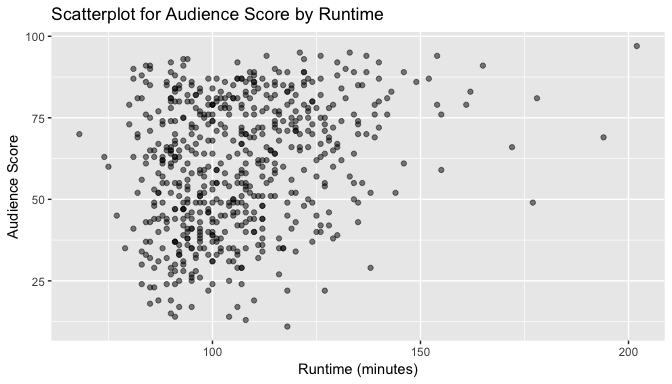
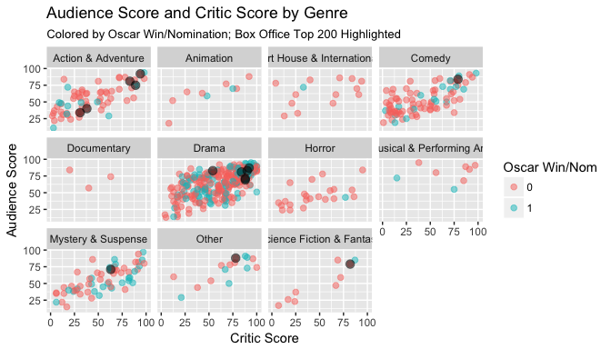
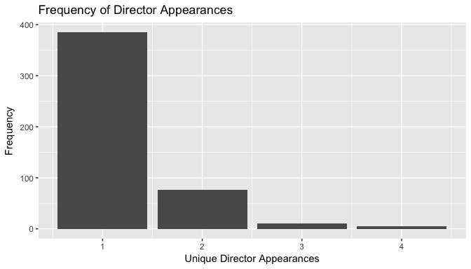

# Modeling and Prediction for Movies
2017-10-13  

## Setup

### Load packages


```r
library(statsr)
library(tidyverse)
library(lubridate)
library(scales)
library(forcats)
library(ggExtra)
library(broom)
```

### Load data


```r
# load the data
if (!file.exists("movies.Rdata")) {
    url <- "https://d3c33hcgiwev3.cloudfront.net/_e1fe0c85abec6f73c72d73926884eaca_movies.Rdata?Expires=1504137600&Signature=SBRZ0CfeUcGItpNcIWTzHkmLQrU3sPGugl7uOUOZbyxze9kBLctsy0HpUj77uuwjr-Up6f58JBU0tX4VYbRc~fFJKbZ-yMM3u5zMpUPV3NX4oRQOyG~mxCv4TGDoVOCctkrtFyu5ToHb6Lw0~rLKq7abUjiMwPgw2WPS5lY770g_&Key-Pair-Id=APKAJLTNE6QMUY6HBC5A"
    download.file(url, dest = "movies.Rdata", mode = "wb") 
}
load("movies.Rdata")
```


* * *

## Part 1: Data

The given data set is comprised of 651 randomly sampled movies produced and released before 2016. The data was obtained from Rotten Tomatoes and IMDB APIs. We do not have any further details on how the random sampling was done, and so we will assume that it is a truly random sample.

We can understand the population this sample represents to be contemporary Hollywood movies. The earliest movie is from 1970 and the most recent is 2014. The histogram below shows the data is left skewed with a mean release year of 2000. We do not have any data on the films' country of origin, but they appear to be mostly, if not exclusively, Hollywood productions.


```r
# distribution of theatrical release years
summary(movies$thtr_rel_year)
```

```
##    Min. 1st Qu.  Median    Mean 3rd Qu.    Max. 
##    1970    1990    2000    1998    2007    2014
```

We can visualize the distribution of theatrical release years in the histogram below. The median is plotted by the red vertical line.


```r
# histogram of theatrical release years
ggplot(movies, aes(x = thtr_rel_year)) + 
    geom_histogram(binwidth = 3) + 
    geom_vline(xintercept = summary(movies$thtr_rel_year)[[3]], 
               color = "red") +
    labs(x = "Theatre Release Year", y = "Frequency") +
    ggtitle("Year of Theatrical Release for `movies` Dataset")
```

<!-- -->

Because this is an observational study with random sampling rather than an experiment with random assignment, we are not able to infer causality. Random sampling does however allow us to attempt to generalize findings from the sample to the larger population, in this case Hollywood movies.

We do not have any details on how the random sampling was done, and so it is difficult to assess potential biases in the sample. It would also be worth thinking closely about biases in certain variables in the data itself, particularly audience scores in comparison to critic's scores, how they may inherently differ and why.

Given our assignment is to produce a data analysis for Paramount Pictures, it would be wise to consider only the types of titles that Paramount is interested in producing. 


```r
# filter for title type of Paramount titles
paramount <- movies[grep("Paramount", movies$studio),]
table(paramount$title_type)
```

```
## 
##  Documentary Feature Film     TV Movie 
##            0           60            0
```

Based on the dataset, it's fair to conclude that Paramount Pictures is only interested in Feature Films. Accordingly, I will remove documentaries and TV movies from consideration. Under this logic, we can also remove the two remaining films rated "NC-17". 


```r
# filter a revised dataset
films <- filter(movies, title_type == "Feature Film",
                mpaa_rating != "NC-17")
```

I'll also take care of a few data cleaning issues here. We can create single date objects for theatrical and DVD release dates instead of having separate columns for year, month and day. It's ok for now that a few fail to parse.


```r
# mutate single theater and dvd release date objects
films <- films %>%
    mutate(thtr_rel = ymd(paste(films$thtr_rel_year,
                                films$thtr_rel_month,
                                films$thtr_rel_day)),
           dvd_rel = ymd(paste(films$dvd_rel_year,
                               films$dvd_rel_month,
                               films$dvd_rel_day)))
```

```
## Warning: 6 failed to parse.
```

I also want to make `mpaa_rating` an ordered factor for clearer plotting later.


```r
# created ordered factor
films$mpaa_rating <- factor(films$mpaa_rating, 
                            levels = c("G", "PG", "PG-13", "R", 
                                       "Unrated"), 
                            ordered = TRUE)
```

I am also going to create a single binary variable to represent any Oscar win or nomination to simplify the five different Oscar categories given.


```r
# create oscar factor variable
films$oscar <- ifelse(films$best_pic_nom == "yes" |
                films$best_pic_win == "yes" |
                films$best_actor_win == "yes" |
                films$best_actress_win == "yes" |
                films$best_dir_win == "yes", 1, 0)
films$oscar <- factor(films$oscar)
```

Lastly, we have 211 different levels in the studio variable. But a great many of them are repeats of essentially the same studio. For example, "The Weinstein Company", "Weinstein Company", and "The Weinstein Co." are all counted separately. Grouping these terms into larger categories will help simplify matters.


```r
# define vectors for larger studios
weinstein <- unique(grep(c("Weinstein"), films$studio, value = TRUE))
wb <- c("Warner", "WARNER")
warner <- unique(grep(paste(wb, collapse = "|"), films$studio, value = TRUE))
sony <- unique(grep(c("Sony"), films$studio, value = TRUE))
universal <- unique(grep(c("Universal"), films$studio, value = TRUE))
disney <- unique(grep(c("Disney"), films$studio, value = TRUE))
paramount <- unique(grep(c("Paramount"), films$studio, value = TRUE))
fox <- unique(grep(c("Fox"), films$studio, value = TRUE))
columbia <- unique(grep(c("Columbia"), films$studio, value = TRUE))
metrog <- c("MGM", "Metro")
mgm <- unique(grep(paste(metrog, collapse = "|"), films$studio, value = TRUE))
anchor_bay <- unique(grep(c("Anchor"), films$studio, value = TRUE))
ifc <- unique(grep(c("IFC"), films$studio, value = TRUE))
lionsgate <- unique(grep(c("Lions"), films$studio, value = TRUE))
new_line <- unique(grep(c("New Line"), films$studio, value = TRUE))
a24 <- unique(grep(c("A24"), films$studio, value = TRUE))
buena_vista <- unique(grep(c("Buena Vista"), films$studio, value = TRUE))
miramax <- unique(grep(c("Miramax"), films$studio, value = TRUE))
orion <- unique(grep(c("Orion"), films$studio, value = TRUE))
touchstone <- unique(grep(c("Touchstone"), films$studio, value = TRUE))
dreamworks <- unique(grep(c("Dreamworks"), films$studio, value = TRUE))
gravitas <- unique(grep(c("Gravitas"), films$studio, value = TRUE))
magnet <-  unique(grep(c("Magnet"), films$studio, value = TRUE))
new_world <- unique(grep(c("New World"), films$studio, value = TRUE))
nordisk <-  unique(grep(c("Nordisk"), films$studio, value = TRUE))
roadside <-  unique(grep(c("Roadside"), films$studio, value = TRUE))
samuel <-  unique(grep(c("Samuel"), films$studio, value = TRUE))
trimark <-  unique(grep(c("Trimark"), films$studio, value = TRUE))
tristar <-  unique(grep(c("Tristar"), films$studio, value = TRUE))

library(forcats)
# create new column with grouped factor levels
films$studio1 <- fct_collapse(films$studio,
                              Weinstein = weinstein,
                              Warner = warner,
                              Sony = sony,
                              Universal = universal,
                              Disney = disney,
                              Paramount = paramount,
                              Fox = fox,
                              Columbia = columbia,
                              MGM = mgm,
                              Anchor_Bay = anchor_bay,
                              IFC = ifc,
                              Lionsgate = lionsgate,
                              New_Line = new_line,
                              A24 = a24,
                              Buena_Vista = buena_vista,
                              Miramax = miramax,
                              Orion = orion,
                              Touchstone = touchstone,
                              Dreamworks = dreamworks,
                              Gravitas = gravitas,
                              Magnet = magnet,
                              New_World = new_world,
                              Nordisk = nordisk,
                              Roadside = roadside,
                              Samuel_Goldwyn = samuel,
                              Trimark = trimark,
                              Tristar = tristar)
```

We are now down to 120 different studios. Of course that is still a lot, but is still more useful, even if not a perfect solution.

* * *

## Part 2: Research question

Our overlords at Paramount would most likely be interested in what factors are associated with higher revenues. Unfortunately, the only revenue data we have is a categorical variable `top200_box`, which tells us if the title made it into the top 200 of the box office. Moreover, only 2.55 percent of our dataset is from the top 200 box office so this might not be that useful.

Rather than create a model to predict a binary categorical variable ("What titles are more likely to be associated with the box office top 200?"), we can instead try to build a model to predict a numeric variable that we might think is positively correlated with box office figures.

Our dataset has three numeric variables for the rating of a film. Two are audience scores from IMDB and Rotten Tomatoes; the third is a critic's score from Rotten Tomatoes.

I am going to make the assumption that the Rotten Tomatoes audience score (`audience_score`) is most closely associated with box office revenue and should be the variable we try to predict in our model. 

I chose an audience score because they are the ones paying to see films, and Rotten Tomatoes because it is the newer ranking and is causing more consternation among studio executives-- even if the data on this is [lacking](https://medium.com/vantage/cognitive-hollywood-part-1-data-shows-box-office-economics-in-turmoil-411a4b22f858).

Accordingly, my research question is:
*What variables are associated with a higher audience score on Rotten Tomatoes?*

With this question in mind, I will try to construct a model that can predict `audience_score` based upon a number of variables in our dataset in the hopes of understanding what factors make a film more or less popular.

* * *

## Part 3: Exploratory Data Analysis

### Exploratory Questions
To begin our EDA, we can come up with a number of questions that might frame what influences `audience_score`.

* `imdb_rating` and `critics_score` are two numeric variables where we would expect to see a positive correlation with `audience_score`.

* We would expect a film making it into the `top200_box` office would tend to have high `audience_score`; likewise, for any Oscar wins or nominations. 

`audience_score` could also be affected by variables we might not normally consider to be important.

* Take `genre` for example. Perhaps one type of genre (e.g. comedies) tend to receive higher audience scores.

* Or `runtime`. Perhaps films that are too long or too short tend to be penalized in audience score.

* `mpaa_rating` could also be an important variable. Maybe audience reactions for children's films tend to poll differently than those for films intended for a mature audience.

* As I'm sure Paramount is aware, `studio`, we would think, could also play a role in the popularity of a film as some studios may be better at making popular films than others.

* It might also be important to examine `thtr_rel`. Since we have films dating as far back as 1970, we should be careful about identifying any longitudinal effects. `dvd_rel` is closely related to `thtr_rel`, and so not necessary for consideration.

* Actors and directors also would be expected to contribute heavily to a film's popularity, but for reasons described in the sections below, I have removed them from consideration for possible inclusion in any models.

### Univariate Analysis

I first wanted to look at the distribution of `audience_score` by itself. It appears to be bimodal. It is flat in the sense that most of the distribution's mass is close to the center.


```r
# histogram of audience score
ggplot(films, aes(x = audience_score)) +
    geom_histogram(bins = 20) +
    geom_vline(xintercept = median(films$audience_score), 
               color = "red") +
    labs(x = "Audience Score", y = "Frequency", 
         title = "Audience Score Histogram")
```

<!-- -->

The same trend can be seen if we look at the box and dotplot.


```r
# box+dotplot of audience score
ggplot(films, aes(x = "audience_score", y = audience_score)) + 
    geom_boxplot() +
    theme(axis.text.x = element_blank(),
          axis.ticks.x = element_blank()) + 
    geom_dotplot(binaxis = 'y',
                 stackdir = 'center',
                 dotsize = 0.5,
                 fill = 'red',
                 binwidth = 3) +
    labs(x = "Count of Films", y = "Audience Score", 
         title = "Box+Dotplot of Audience Score")
```

<!-- -->

We can also take a look at the summary statistics.


```r
# audience score summary statistics
films %>%
    summarize(n = n(),
              min = min(audience_score),
              q1 = quantile(audience_score, 0.25),
              median = median(audience_score),
              mean = mean(audience_score),
              q3 = quantile(audience_score, 0.75),
              max = max(audience_score),
              sd = sd(audience_score))
```

```
## # A tibble: 1 x 8
##       n   min    q1 median     mean    q3   max       sd
##   <int> <dbl> <dbl>  <dbl>    <dbl> <dbl> <dbl>    <dbl>
## 1   589    11    44     62 60.45501    78    97 19.85209
```

### Bivariate Analysis

With a better idea of our variable of interest, we should look to understand how it varies with other variables.

#### Audience Score and IMDB Rating

We can first try the variable we'd most expect to be closely associated with `audience_score`: `imdb_rating`, which is essentially another form of audience-polled rating, only on another platform.


```r
# audience score vs imdb_rating
g <- ggplot(films, aes(y = audience_score, x = imdb_rating)) +
    geom_jitter(alpha = 0.5) +
    geom_vline(xintercept = median(films$imdb_rating), color = "red") +
    geom_hline(yintercept = median(films$audience_score), color = "blue") +
    labs(x = "IMDB Rating", y = "Audience Score", 
         title = "Scatterplot with Median Lines for Audience Score and IMDB Rating")
g
```

<!-- -->

There definitely appears to be a close relationship. In general, we could describe it as linear, but it does appear to almost have a slight S-shape, curving for low and high scores. This could be perhaps due to difference in scales. Rotten Tomatoes' users apparently can rate movies on a 0-10 scale, whereas IMDB users have a 1-10 scale.

We can place the respective histograms in the margins of our scatterplot to see how the histogram for `audience_score` is much flatter than the one for `imdb_rating`.


```r
ggMarginal(g, type = "histogram")
```

<!-- -->

The scatterplot also makes it easy to see outliers (very good and very bad films). But there's nothing wrong with the data or any reason to remove them.

```r
outliers <- filter(films, audience_score > 95 | audience_score < 12)
outliers[,1:4]
```

```
## # A tibble: 2 x 4
##                    title   title_type              genre runtime
##                    <chr>       <fctr>             <fctr>   <dbl>
## 1      Battlefield Earth Feature Film Action & Adventure     118
## 2 The Godfather, Part II Feature Film Mystery & Suspense     202
```


#### Audience Score and Critic Score

Plotting with `critics_score` as the explanatory variable looks more linear, but with greater spread. We might expect this given that critics and audiences often disagree, but do tend to agree in many cases.

The critic score histogram shows how discerning critics can be. It looks almost entirely flat. This weakens the relationship and adds to the spread.


```r
h <- ggplot(films, aes(y = audience_score, x = critics_score)) +
    geom_jitter(alpha = 0.5) +
    geom_vline(xintercept = median(films$critics_score), color = "red") +
    geom_hline(yintercept = median(films$audience_score), color = "blue") +
    labs(x = "Critic Score", y = "Audience Score", 
         title = "Scatterplot with Median Lines for Audience Score and Critic Score")

ggMarginal(h, type = "histogram")
```

<!-- -->


#### Audience Score and Top 200 Box Office

Being in the box office top 200 seems to clearly have a positive association with a higher audience score, as we would expect. Laying a dotplot over the boxplot helps to show this relationship. Although we have relatively few samples in the top 200, they do tend to have a higher audience score, whereas films not in the top 200 are found at almost any audience score.


```r
# Box+Dotplot of Audience Score by Top 200 Box Office
ggplot(films, aes(x = top200_box, y = audience_score)) + 
    geom_boxplot() +
    geom_dotplot(binaxis = 'y',
                 stackdir = 'center',
                 dotsize = 0.5,
                 fill = 'red',
                 binwidth = 3) +
    labs(x = "Top 200 Box Office", y = "Audience Score", 
         title = "Box+Dotplot of Audience Score by Top 200 Box Office")
```

<!-- -->

The violin highlights this difference, but it hides the discrepancy in sample size.


```r
# violin plot of audience score by top 200 box office
ggplot(films, aes(x = top200_box, y = audience_score)) +
    geom_violin(trim = FALSE) +
    labs(x = "Top 200 Box Office", y = "Audience Score", 
         title = "Violin Plot of Audience Score by Top 200 Box Office")
```

<!-- -->

We can also calculate the summary statistics across this dimension.


```r
# audience score by top 200 box office summary stats
films %>%
    group_by(top200_box) %>%
    summarize(n = n(),
              min = min(audience_score),
              q1 = quantile(audience_score, 0.25),
              median = median(audience_score),
              mean = mean(audience_score),
              q3 = quantile(audience_score, 0.75),
              max = max(audience_score),
              sd = sd(audience_score))
```

```
## # A tibble: 2 x 9
##   top200_box     n   min    q1 median     mean    q3   max       sd
##       <fctr> <int> <dbl> <dbl>  <dbl>    <dbl> <dbl> <dbl>    <dbl>
## 1         no   574    11    44     62 60.08711  77.0    97 19.80770
## 2        yes    15    34    71     81 74.53333  83.5    92 16.62557
```

#### Audience Score and Oscar Win/Nomination

Although I grouped the variables for simplicity, Oscar wins and nominations seem to have a positive effect on audience score, but smaller than we might expect. The boxplot shows that films being nominated or winning an Oscar in any of the five categories given raises Q1, Q2, and Q3, but there is still a wide amount of variance.


```r
# Box+Dotplot of Audience Score by Oscar Win/Nom
ggplot(films, aes(x = oscar, y = audience_score)) +
    geom_boxplot() +
    geom_dotplot(binaxis = 'y',
                 stackdir = 'center',
                 dotsize = 0.5,
                 fill = 'red',
                 binwidth = 3) +
    labs(x = "Oscar Win/Nomination", y = "Audience Score", 
         title = "Box+Dotplot of Audience Score by Oscar Win/Nomination")
```

<!-- -->

We can also calculate the summary statistics across this dimension.


```r
# audience score by oscar win/nomination summary stats
films %>%
    group_by(oscar) %>%
    summarize(n = n(),
              min = min(audience_score),
              q1 = quantile(audience_score, 0.25),
              median = median(audience_score),
              mean = mean(audience_score),
              q3 = quantile(audience_score, 0.75),
              max = max(audience_score),
              sd = sd(audience_score))
```

```
## # A tibble: 2 x 9
##    oscar     n   min    q1 median     mean    q3   max       sd
##   <fctr> <int> <dbl> <dbl>  <dbl>    <dbl> <dbl> <dbl>    <dbl>
## 1      0   418    13 43.25     61 59.09569    76    95 19.78531
## 2      1   171    11 49.00     68 63.77778    80    97 19.67913
```

#### Audience Score and MPAA Rating

MPAA rating seems to have no real relationship with audience score.


```r
# Box+Dotplot of Audience Score by MPAA Rating
ggplot(films, aes(x = mpaa_rating, y = audience_score)) + 
    geom_boxplot() + 
    geom_dotplot(binaxis = 'y',
                 stackdir = 'center',
                 dotsize = 0.2,
                 fill = 'red',
                 binwidth = 3) +
    labs(x = "MPAA Rating", y = "Audience Score", 
         title = "Box+Dotplot of Audience Score by MPAA Rating") +
    coord_flip()
```

<!-- -->

We can also calculate the summary statistics across this dimension.


```r
# audience score by MPAA rating summary stats
films %>%
    group_by(mpaa_rating) %>%
    summarize(n = n(),
              min = min(audience_score),
              q1 = quantile(audience_score, 0.25),
              median = median(audience_score),
              mean = mean(audience_score),
              q3 = quantile(audience_score, 0.75),
              max = max(audience_score),
              sd = sd(audience_score))
```

```
## # A tibble: 5 x 9
##   mpaa_rating     n   min    q1 median     mean    q3   max       sd
##         <ord> <int> <dbl> <dbl>  <dbl>    <dbl> <dbl> <dbl>    <dbl>
## 1           G    16    18 54.25   72.0 66.62500 82.25    92 20.65551
## 2          PG   110    13 44.25   61.5 60.41818 78.00    93 20.10951
## 3       PG-13   130    11 44.25   55.5 56.01538 69.75    94 19.00183
## 4           R   317    14 44.00   64.0 61.45426 79.00    97 19.98580
## 5     Unrated    16    40 63.50   76.0 70.81250 82.25    86 14.72512
```

#### Audience Score and Genre

Similar to MPAA Rating, genre also seems to have very little relationship with audience score.


```r
# audience score by genre
ggplot(films, aes(x = genre, y = audience_score)) + 
    geom_boxplot() + 
    geom_dotplot(binaxis = 'y',
                 stackdir = 'center',
                 dotsize = 0.1,
                 fill = 'red',
                 binwidth = 3) +
    labs(x = "Genre", y = "Audience Score",
         title = "Box+Dotplot of Audience Score by Genre") +
    coord_flip()
```

<!-- -->

We can also calculate the summary statistics across this dimension.


```r
# audience score by genre summary stats
films %>%
    group_by(genre) %>%
    summarize(n = n(),
              min = min(audience_score),
              q1 = quantile(audience_score, 0.25),
              median = median(audience_score),
              mean = mean(audience_score),
              q3 = quantile(audience_score, 0.75),
              max = max(audience_score),
              sd = sd(audience_score))
```

```
## # A tibble: 11 x 9
##                        genre     n   min    q1 median     mean    q3   max
##                       <fctr> <int> <dbl> <dbl>  <dbl>    <dbl> <dbl> <dbl>
##  1        Action & Adventure    65    11 37.00   52.0 53.78462 65.00    94
##  2                 Animation     9    18 59.00   65.0 62.44444 70.00    88
##  3 Art House & International    14    29 51.25   65.5 64.00000 80.25    86
##  4                    Comedy    85    19 37.00   49.0 51.81176 67.00    93
##  5               Documentary     3    57 65.50   74.0 71.66667 79.00    84
##  6                     Drama   299    13 52.00   70.0 65.35452 80.00    95
##  7                    Horror    23    24 36.00   43.0 45.82609 53.50    84
##  8 Musical & Performing Arts     8    55 71.00   82.5 79.37500 89.50    95
##  9        Mystery & Suspense    59    15 40.50   54.0 55.94915 70.50    97
## 10                     Other    15    29 57.00   74.0 69.73333 84.00    91
## 11 Science Fiction & Fantasy     9    17 26.00   47.0 50.88889 79.00    85
## # ... with 1 more variables: sd <dbl>
```

#### Audience Score and Runtime

We would expect `runtime` to have a very weak association with `audience_score`. This is borne out in the scatterplot. There does not seem to be any audience penalty for a film being too long. In fact, the longest title in the dataset, 'The Godfather, Part II', also has the highest `audience_score`.


```r
# audience score by runtime
ggplot(films, aes(x = runtime, y = audience_score)) + 
    geom_point(alpha = 0.5) +
    labs(x = "Runtime (minutes)", y = "Audience Score", title = "Scatterplot for Audience Score by Runtime")
```

<!-- -->

#### Audience Score and Theatre Release

There is a seasonal aspect to movie-viewing habits. Studios might count on a Christmas-time surge or summer blockbusters. So time of year could also impact audience scores. Or more broadly, scores could go up or down over time depending on audience expectations.

While box office figures likely have seasonal fluctuation, it is difficult to find any such pattern in `audience_score`. The random scatter in the plot below suggests that there is not a longitudinal effect.


```r
# audience score over time
ggplot(films, aes(x = thtr_rel, y = audience_score)) + 
    geom_point(alpha = 0.5) +
    labs(x = "Theatre Release", y = "Audience Score",
         title = "Scatterplot of Audience Score over Time")
```

<!-- -->

Moreover, the audience rating by month does not seem to have any discernible pattern, looking at the box and dotplot.


```r
# audience score by month
ggplot(films, aes(x = factor(thtr_rel_month), y = audience_score)) +
    geom_boxplot() +
    geom_dotplot(binaxis = 'y',
                 stackdir = 'center',
                 dotsize = 0.3,
                 fill = 'red',
                 binwidth = 3) +
    labs(x = "Month of Theatre Release", y = "Audience Score",
         title = "Audience Score by Month of Theatre Release")
```

<!-- -->

#### Audience Score and Studio

We can easily calculate summary statistics to compare `audience_score` by `studio`.


```r
# audience score by studio summary stats
films_by_studio <- films %>%
    group_by(studio1) %>%
    summarize(n = n(),
              min = min(audience_score),
              q1 = quantile(audience_score, 0.25),
              median = median(audience_score),
              mean = mean(audience_score),
              q3 = quantile(audience_score, 0.75),
              max = max(audience_score),
              sd = sd(audience_score)) %>%
    arrange(desc(n))
films_by_studio
```

```
## # A tibble: 120 x 9
##        studio1     n   min    q1 median     mean    q3   max       sd
##         <fctr> <int> <dbl> <dbl>  <dbl>    <dbl> <dbl> <dbl>    <dbl>
##  1      Warner    68    11 47.75   64.0 61.55882 78.25    94 19.24266
##  2   Paramount    60    15 42.25   58.0 57.80000 76.00    97 21.40315
##  3        Sony    52    19 44.75   61.0 58.69231 72.50    91 18.35012
##  4         Fox    50    19 37.50   62.5 60.34000 79.75    95 22.26978
##  5   Universal    39    29 49.50   69.0 64.48718 80.00    95 18.17006
##  6         MGM    28    17 40.00   56.0 54.78571 71.25    84 18.63362
##  7     Miramax    25    28 49.00   61.0 61.00000 73.00    94 20.11840
##  8   Lionsgate    19    19 50.00   70.0 62.89474 78.00    92 20.19872
##  9 Buena_Vista    18    22 41.00   71.0 63.61111 81.75    92 23.44741
## 10    New_Line    17    14 35.00   63.0 54.88235 74.00    85 24.55830
## # ... with 110 more rows
```

Because we have 120 different studios, it is more difficult to visualize them all at once. Instead, we can just plot the most prolific studios and compare their performance. And we don't seem much of a difference. Every big studio has their share of hits and misses.


```r
# find 10 studios with most films produced in dataset
big_studios <- head(films_by_studio, 10)
big_studio_df <- filter(films, studio1 %in% big_studios$studio1)

# plot audience score by most prolific studio
ggplot(big_studio_df, aes(x = studio1, y = audience_score)) +
    geom_boxplot() +
    geom_dotplot(binaxis = 'y',
                 stackdir = 'center',
                 dotsize = 0.2,
                 fill = 'red',
                 binwidth = 3) +
    labs(y = "Audience Score",
         title = "Audience Score of Big Studios") +
    theme(axis.title.y = element_blank()) +
    coord_flip()
```

<!-- -->

### Multivariate Analysis

Having closely examined all of the possible bivariate relationships, we can now try to visualize the important multivariate relationships.

In the scatterplot below, we see the positive and fairly weak to moderate relationship between `audience_score` and `critics_score`. The blue points for Oscar nominated or winning films seem to fall fairly close in line with this trend. The darker circles representing films in the box office top 200 do however seem to have much higher audience scores on average.


```r
# audience score by critics, oscar, and box office
ggplot(films, aes(x = critics_score, y = audience_score, 
                  color = oscar)) +
    geom_point(alpha = 0.5, size = 2) +
    geom_point(data = films[films$top200_box == "yes",], 
               color = "black", size = 3, alpha = 0.5) +
    labs(x = "Critic Score", y = "Audience Score", 
         title = "Audience Score by Critic Score",
         subtitle = "Colored by Oscar Win/Nomination; Box Office Top 200 Highlighted",
         color = "Oscar Win/Nom")
```

<!-- -->

We can facet out the previous plots by genre to see what effect that might have. The linear trend between `audience_score` and `critics_score` does not appear to be disturbed. It is easier to see, however, that the top 200 box office seems most likely to be either a drama or action/adventure film.


```r
# audience score and critic score by genre
ggplot(films, aes(x = critics_score, y = audience_score, 
                  color = oscar)) +
    geom_point(alpha = 0.5, size = 2) +
    geom_point(data = films[films$top200_box == "yes",], 
               color = "black", size = 3, alpha = 0.5) +
    facet_wrap(~ genre) +
    labs(x = "Critic Score", y = "Audience Score", 
         title = "Audience Score and Critic Score by Genre",
         subtitle = "Colored by Oscar Win/Nomination; Box Office Top 200 Highlighted",
         color = "Oscar Win/Nom")
```

<!-- -->

We can similarly facet by `mpaa_rating`. Again, the linear trend is strong across ratings. The box office and Oscar results also look well distributed.


```r
# audience score and critics_score by mpaa rating
ggplot(films, aes(x = critics_score, y = audience_score, 
                  color = oscar)) +
    geom_point(alpha = 0.5, size = 2) +
    geom_point(data = films[films$top200_box == "yes",], 
               color = "black", size = 3, alpha = 0.5) +
    facet_wrap(~ mpaa_rating) +
    labs(x = "Critic Score", y = "Audience Score", 
         title = "Audience Score and Critic Score by MPAA Rating",
         subtitle = "Colored by Oscar Win/Nomination; Box Office Top 200 Highlighted",
         color = "Oscar Win/Nom")
```

<!-- -->

If we substitute `critics_score` with `imdb_rating`, we observe similar trends, but with much less spread. Having a tighter relationship like this is nice, but may not actually be that useful or informative because they are essentially the same measurement (audience popularity) from different sources.


```r
# audience score by imdb, oscar, and box office
ggplot(films, aes(x = imdb_rating, y = audience_score, 
                  color = oscar)) +
    geom_point(alpha = 0.5, size = 2) +
    geom_point(data = films[films$top200_box == "yes",], 
               color = "black", size = 3, alpha = 0.5) +
    labs(x = "IMDB Rating", y = "Audience Score", 
         title = "Audience Score by IMDB Rating",
         subtitle = "Colored by Oscar Win/Nomination; Box Office Top 200 Highlighted",
         color = "Oscar Win/Nom")
```

<!-- -->


* * *

## Part 4: Modeling

Our task in the assignment is to construct a multivariable linear regression model using the techniques described in the course. I'll build up to that model by first creating a simple linear regression model, a parallel slopes model, and a simple interaction model.

### Simple Linear Regression Model

Having visually and statistically explored our variables, we can attempt to construct models that help us understand and even hopefully predict `audience_score`.

We saw that `imdb_rating` had a much closer relationship with `audience_score` than `critics_score`. This is reflected in our calculation of the correlation coefficients.


```r
# calculate correlation coefficient
m1_stats <- films %>%
    summarize(n = n(),
              r_imdb = cor(audience_score, imdb_rating),
              r2_imdb = r_imdb^2,
              r_crit = cor(audience_score, critics_score),
              r2_crit = r_crit^2)
m1_stats
```

```
## # A tibble: 1 x 5
##       n    r_imdb   r2_imdb    r_crit   r2_crit
##   <int>     <dbl>     <dbl>     <dbl>     <dbl>
## 1   589 0.8487175 0.7203214 0.6752352 0.4559426
```

The correlation coefficient of `r_imdb` between `audience_score` and `imdb_rating` is in fact higher than the same coefficient (`r_critic`) between `audience_score` and `critic_score`. However, `imdb_rating` is not very useful to us in this context. It is also an audience-polled popularity measurement. And so, at most we could try to callibrate differences between the two scales, but that might not be useful information for Paramount, which would be more interested in data that could help them predict which films would be more successful.

For instance, if we could predict `audience_score`, within some degree of uncertainty, from `critics_score`, plus a host of categorical variables (genre, rating, runtime, etc.). That would be very useful because a small group of critics could evaluate a movie before a wide release in a way that the general public could not.


```r
# plot a simple linear regression model
g <- ggplot(films, aes(x = critics_score, y = audience_score)) +
    geom_point(alpha = 0.5) +
    labs(x = "Critic Score", y = "Audience Score")
g + geom_smooth(method = "lm", se = FALSE)
```

<!-- -->

This is the simplest way of letting R create and plot the model for us. We can also direct R in creating the model and then plot the parameters.


```r
# fit simple linear model
mod1 <- lm(audience_score ~ critics_score, data = films)

# manually fit linear regression line
g + geom_abline(intercept = coef(mod1)[1], 
                slope = coef(mod1)[2], color = "red")
```

<!-- -->

If we really want to do things manually, we can also calculate the slope by hand, and we'll see that we get the same result.


```r
# calculate slope by hand
mod1_stats <- films %>%
    summarize(r_crit = cor(audience_score, critics_score),
              sd_crit = sd(critics_score),
              sd_aud = sd(audience_score),
              mean_crit = mean(critics_score),
              mean_aud = mean(audience_score))

r_crit <- mod1_stats[[1,1]]
sd_crit <- mod1_stats[[1,2]]
sd_aud <- mod1_stats[[1,3]]

mod1_slope <- (r_crit * (sd_aud/sd_crit))
mod1_slope
```

```
## [1] 0.4834403
```

We can interpret the slope of the simple linear regression model accordingly: For each additional point added to critic score, the model predicts audience score will be 0.48 points higher.

Often the intercept is by itself not interesting because it is an extrapolation of the data or does not make sense out of context. However in this case, we do have critic scores close to 0. So our model predicts that a film with a critic score of 0 would have an audience score of 34.02.

One interesting thing we can do with this model is to find the largest residuals. These are the films where the critics and audience disagreed the most.


```r
# turn model into a dataframe
mod1_df <- augment(mod1)
```

```
## Warning: Deprecated: please use `purrr::possibly()` instead
```

```
## Warning: Deprecated: please use `purrr::possibly()` instead
```

```
## Warning: Deprecated: please use `purrr::possibly()` instead
```

```
## Warning: Deprecated: please use `purrr::possibly()` instead
```

```
## Warning: Deprecated: please use `purrr::possibly()` instead
```

```r
# find the largest residuals
big_resid <- mod1_df %>%
    arrange(desc(.resid)) %>%
    head(5)
big_resid[,1:3]
```

```
##   audience_score critics_score  .fitted
## 1             84            14 40.78580
## 2             95            38 52.38837
## 3             78             4 35.95140
## 4             84            20 43.68644
## 5             86            31 49.00428
```

To give the most egregious example, Rise of the Footsoldier received an audience score of 84 but only 14 from the critics. We can highlight the five largest residuals on our plot.


```r
# highlight large residuals
g + geom_smooth(method = "lm", se = FALSE) +
    geom_point(data = filter(films, 
                             audience_score %in% big_resid[[1]] & 
                                 critics_score %in% big_resid[[2]]),
                            color = "red")
```

<!-- -->

As these points in particular demonstrate, there is still considerable spread around the regression line. Our correlation coefficient between `audience_score` and `critics_score` was 0.68. This means our r^2 value, which evaluates the strength of the fit of a linear model, is 0.46. In other words, 45.59 percent of the variability in audience score can be explained by critic score. This is a good start, but we can try to explain more of the variability, and hence improve the model's predictive capability, by adding more variables to the model.

### Parallel Slopes Model

We can improve our simple linear regression model by adding one categorical variable. From our EDA above, the variable `top200_box` seemed to have an important role so let's add it to our previous model. In this case, our response variable remains `audience_score`, but we have two explanatory variables, one numeric (`critics_score`) and one categorical (`top200_box`).


```r
# fit parallel slopes model
mod2 <- lm(audience_score ~ critics_score + top200_box, data = films)
summary(mod2)
```

```
## 
## Call:
## lm(formula = audience_score ~ critics_score + top200_box, data = films)
## 
## Residuals:
##     Min      1Q  Median      3Q     Max 
## -36.111 -10.239   0.642  10.486  43.203 
## 
## Coefficients:
##               Estimate Std. Error t value Pr(>|t|)    
## (Intercept)   34.06913    1.33687  25.484   <2e-16 ***
## critics_score  0.48056    0.02196  21.887   <2e-16 ***
## top200_boxyes  4.16601    3.86128   1.079    0.281    
## ---
## Signif. codes:  0 '***' 0.001 '**' 0.01 '*' 0.05 '.' 0.1 ' ' 1
## 
## Residual standard error: 14.65 on 586 degrees of freedom
## Multiple R-squared:  0.457,	Adjusted R-squared:  0.4552 
## F-statistic: 246.6 on 2 and 586 DF,  p-value: < 2.2e-16
```

From the numbers in this table, we can construct the regression lines for both films in the box office top 200 and those outside it. Seeing `top200_boxyes` in the table makes it clear that `no` is the reference level in this model.

Accordingly, we can write the regression line equation for a film in the top 200 box office as:

$$\hat{audiencescore} = 34.07 + 0.48*criticsscore + 4.17 + \epsilon$$

And for a film outside of the box office top 200:

$$\hat{audiencescore} = 34.07 + 0.48*criticsscore + \epsilon$$

According to this parallel slopes model, 34.07 is the expected audience score for a film not in the box office top 200 with a critic's score of 0.

Each additional point in critic score is associated with an increase in expected audience score of 0.48 points, after controlling for whether the film was in the box office top 200.

We could say that this model's key finding would be that films in the box office top 200 are expected to score 4.17 points higher with audiences, after controlling for critic score.

This makes sense because we would expect that films that did well at the box office would score well with audiences, regardless of how critics rated them.

We can plot these two parallel lines onto our data. The blue-green line represents the model's predictions for `audience_score` at each possible `critics_score` given that the film was in the box office top 200. The red line, on the other hand, represents the same prediction for films not in the top 200.


```r
# plot parallel slopes model
g + geom_line(data = augment(mod2), aes(y = .fitted, 
                                        color = top200_box))
```

```
## Warning: Deprecated: please use `purrr::possibly()` instead
```

```
## Warning: Deprecated: please use `purrr::possibly()` instead
```

```
## Warning: Deprecated: please use `purrr::possibly()` instead
```

```
## Warning: Deprecated: please use `purrr::possibly()` instead
```

```
## Warning: Deprecated: please use `purrr::possibly()` instead
```

<!-- -->

Compared to our previous r^2 of 0.456, the r^2 of this model is only slightly better: 0.457. There are a number of better models we can consider.

### Interaction Model

A downside of the parallel slopes model is that it assumes no interaction between the two chosen explanatory variables, when in reality they likely interact. Critic score and box office results are likely not independent. Critic score often influences box office results because some people weigh critical opinion before buying tickets for a movie. We can fit an interaction model which assumes a dependent relationship between critic score and box office performance.


```r
# fit interaction model
mod3 <- lm(audience_score ~ critics_score + top200_box + 
               critics_score:top200_box, data = films)
summary(mod3)
```

```
## 
## Call:
## lm(formula = audience_score ~ critics_score + top200_box + critics_score:top200_box, 
##     data = films)
## 
## Residuals:
##     Min      1Q  Median      3Q     Max 
## -36.061 -10.279   0.461  10.498  43.107 
## 
## Coefficients:
##                              Estimate Std. Error t value Pr(>|t|)    
## (Intercept)                  34.19899    1.34354  25.454   <2e-16 ***
## critics_score                 0.47816    0.02209  21.641   <2e-16 ***
## top200_boxyes               -10.41727   15.43762  -0.675     0.50    
## critics_score:top200_boxyes   0.19375    0.19858   0.976     0.33    
## ---
## Signif. codes:  0 '***' 0.001 '**' 0.01 '*' 0.05 '.' 0.1 ' ' 1
## 
## Residual standard error: 14.65 on 585 degrees of freedom
## Multiple R-squared:  0.4579,	Adjusted R-squared:  0.4551 
## F-statistic: 164.7 on 3 and 585 DF,  p-value: < 2.2e-16
```

If we plot this model, we still see a positive relationships between critic score and audience score, regardless of box office results. However, the rate at which the model predicts an increase in`audience_score` for a 1 unit increase in `critics_score` is no longer the same. 

While the parallel slopes model predicted a 4.17 point increase in audience score for a film in the top 200 for any given critic score, in this interaction model, that value is not constant.


```r
# plot interaction model
ggplot(films, aes(x = critics_score, y = audience_score, 
                  color = top200_box)) +
    geom_point(alpha = 0.5) +
    geom_smooth(method = "lm", se = FALSE) +
    labs(x = "Critic Score", y = "Audience Score")
```

<!-- -->

Still again our r^2 value hasn't moved much. The r^2 of the interaction model is 0.4579, compared to 0.457 for the parallel slopes model and 0.4559 for the simple linear regression model. We'll have to try adding more variables.

### Multivariable Linear Regression Model

#### Reasoning for Excluding Certain Variables

Before constructing a multivariable linear regression model, I want to specify why certain variables in the original dataset were not considered for inclusion, even in the "full" model.

1. URLs

`imdb_url` and `rt_url` obviously could have no predictive ability, and so they should be excluded. 

2. Directors and Actors
 
Actors and directors certainly have an impact on the quality and popularity of a film. However, I decided to exclude them from the model for two reasons. The first is that in a sample set of 589, we have a fairly limited number of titles with the same director or actors. For 589, we have 477 unique directors. We can see this heavily skewed distribution in a barplot. Most directors appear only once. 


```r
# group and summarize to get counts of unique directors
films %>%
    group_by(director) %>%
    summarize(n = n()) %>%
    ggplot(aes(x = n)) + 
    geom_bar() + 
    labs(x = "Unique Director Appearances", y = "Frequency",
         title = "Frequency of Director Appearances")
```

<!-- -->

Actors show a similar picture. Even if we sum counts of all five ranks of actors, the most frequent actors appear in a maximum of 8 titles. This could be enough of a sample to discern a trend, but it's not useful for the vast majority of titles.


```r
# create one vector of all actors
actors <- c(films$actor1, films$actor2, 
            films$actor3, films$actor4, films$actor5)

# create a df of actors
actors_df <- as.data.frame(actors)

# summarize counts of actor appearances in dataset
actors_df_sum <- actors_df %>%
    group_by(actors) %>%
    summarize(n = n()) %>%
    filter(!is.na(actors)) %>%
    arrange(desc(n))
head(actors_df_sum, 10)
```

```
## # A tibble: 10 x 2
##               actors     n
##               <fctr> <int>
##  1      Richard Gere     8
##  2 Samuel L. Jackson     8
##  3      Diane Keaton     7
##  4        Helen Hunt     7
##  5        Jamie Foxx     7
##  6     John Travolta     7
##  7        Nick Nolte     7
##  8      Nicolas Cage     7
##  9         Al Pacino     6
## 10       Dan Aykroyd     6
```

We can also plot this data to show that most actors in the dataset appear only once, making it difficult to determine the impact of any particular actor on a film.


```r
# plot frequency of actor appearances
ggplot(actors_df_sum, aes(x = n)) + 
    geom_bar() + 
    labs(x = "Number of Appearances by an Actor", y = "Frequency",
         title = "Frequency of Actor Appearances")
```

<!-- -->

The second reason is that including actors or directors would add hundreds of values of a categorical variable to our model, which is something not properly addressed by the methods introduced in the course.

3. Revised Date Data

Theatrical and DVD release dates were originally each given as three separate variables. These were concatenated into two single objects, and so the previous variables would not be included in the model.

I also dropped `dvd_rel` because it is conditional on `thtr_rel`.

4. `imdb_num_votes`

`imdb_num_votes` and `imdb_rating` are two variables with an interesting relationship. There are a few ways to explain the plot below. On one end, some movies may be historically bad that they encourage people to rate the film. At the higher end of the trend, titles with more ratings tend to be more popular. The relationship looks almost logarithmic. Aside from these two ends, there is a huge mass of titles, close to a mean number of reviews, that could be any rating.     


```r
# plot imdb rating vs number of votes
ggplot(films, aes(x = imdb_num_votes, y = imdb_rating)) +
    geom_jitter(alpha = 0.5) +
    geom_vline(xintercept = median(films$imdb_num_votes), 
               color = "red") +
    labs(x = "Number of IMDB Votes", y = "IMDB Rating",
         title = "IMDB Rating by Number of Votes",
         subtitle = "Median number of votes in red")
```

<!-- -->

In view of this relationship, it seems reasonable to drop `imdb_num_votes` from the model. What we are really interested in is the rating itself rather than the number of ratings.

5. `critics_rating` and `audience_rating`

`critics_rating` and `audience_rating` are two very important categorical variables, but, in essence, their value is more accruately contained in the numeric variables `critics_score` and `audience_score`. 

You can see this distinction in comparative boxplot for audience scores and rating. The numeric `audience_score` completely determines the categorical variable `audience_rating`.


```r
# plot audience score and audience rating
ggplot(films, aes(y = audience_score, x = audience_rating)) +
    geom_boxplot() +
    geom_dotplot(binaxis = 'y',
                 stackdir = 'center',
                 dotsize = 0.4,
                 fill = 'red',
                 binwidth = 3) +
    labs(x = "Audience Rating", y = "Audience Score",
         title = "Rotten Tomatoes Audience Scores and Rating")
```

<!-- -->

Although the distinction between 'Fresh' and 'Certified Fresh' is more complicated, the same cutting of a numeric variable into a categorical variable is found with critic score, and so I'd prefer to work directly with the numeric variable rather than its bin.


```r
# plot critics score and critic rating
ggplot(movies, aes(y = critics_score, x = critics_rating)) +
    geom_boxplot() +
    geom_dotplot(binaxis = 'y',
                 stackdir = 'center',
                 dotsize = 0.4,
                 fill = 'red',
                 binwidth = 3) +
    labs(x = "Critics Rating", y = "Critics Score",
         title = "Rotten Tomatoes Critic Scores and Rating")
```

<!-- -->

6. `title` and `title_type`

`title_type` had already been removed because Paramount was found only to have made feature films.

7. `studio`

I'll use the grouped `studio1` that I created.

With that explanation, I'll remove those columns from the dataset. I'll also need complete cases for regression. This removes 5 more observations.

```r
# vector of columns to drop
drops <- c("title_type","thtr_rel_year", "thtr_rel_month",
                  "thtr_rel_day", "dvd_rel_year", "dvd_rel_month",
                  "dvd_rel_day", "imdb_num_votes", "critics_rating", 
                  "audience_rating", "best_pic_nom", "best_pic_win",
                  "best_actor_win", "best_actress_win","best_dir_win",
                  "director", "actor1", "actor2", "actor3", "actor4",
                  "actor5", "imdb_url", "rt_url", "title","dvd_rel", 
                  "studio")
films_mv <- films[ , !(names(films) %in% drops)]

# keep only complete cases
films_mv <- films_mv[complete.cases(films_mv),]
```

#### Fit the MLR Model

Mathematically, adding more variables to our model is simple. We just add more terms. Syntactically, it's the same. We just add more variables to the lm() function in R.

Visually however, we cannot really envision the model beyond three variables.

Each time we add an explanatory variable, we will expect r^2 to increase because it should help explain more of the variability. However, for a more honest measure of the model's effectiveness, we should look to adjusted r^2, which introduces a penalty for the addition of extra explanatory variables in relation to the sample size. 

Because we favor parsimonious models, we try to select models with the highest adjusted r^2.


```r
# fit full model
mod_full <- lm(audience_score ~ genre + runtime + mpaa_rating + 
                   studio1 + imdb_rating + critics_score + top200_box 
                   + thtr_rel + oscar, data = films_mv)
summary(mod_full)
```

```
## 
## Call:
## lm(formula = audience_score ~ genre + runtime + mpaa_rating + 
##     studio1 + imdb_rating + critics_score + top200_box + thtr_rel + 
##     oscar, data = films_mv)
## 
## Residuals:
##     Min      1Q  Median      3Q     Max 
## -25.091  -4.224   0.000   4.602  36.974 
## 
## Coefficients:
##                                           Estimate Std. Error t value
## (Intercept)                             -2.985e+01  4.859e+00  -6.144
## genreAnimation                           1.177e+01  4.212e+00   2.795
## genreArt House & International          -1.509e+00  3.981e+00  -0.379
## genreComedy                              1.096e+00  1.759e+00   0.623
## genreDocumentary                         1.044e+01  7.824e+00   1.334
## genreDrama                               7.791e-01  1.592e+00   0.489
## genreHorror                             -7.360e+00  2.866e+00  -2.568
## genreMusical & Performing Arts           7.545e+00  3.976e+00   1.898
## genreMystery & Suspense                 -5.475e+00  2.044e+00  -2.678
## genreOther                               8.625e-01  3.232e+00   0.267
## genreScience Fiction & Fantasy          -6.735e-01  4.006e+00  -0.168
## runtime                                 -6.144e-02  3.171e-02  -1.937
## mpaa_rating.L                            2.259e+00  3.715e+00   0.608
## mpaa_rating.Q                           -7.382e-02  3.003e+00  -0.025
## mpaa_rating.C                            1.585e+00  1.833e+00   0.865
## mpaa_rating^4                            1.767e-01  1.093e+00   0.162
## studio17-57 Releasing                   -1.408e+01  1.055e+01  -1.335
## studio1905 Corporation                   9.285e+00  9.946e+00   0.934
## studio1A24                              -5.063e+00  6.000e+00  -0.844
## studio1All Girl Productions             -5.093e+00  9.990e+00  -0.510
## studio1Alliance Atlantis Communications  2.992e+00  9.914e+00   0.302
## studio1American International Pictures  -2.488e+01  1.003e+01  -2.481
## studio1Analysis                         -7.454e+00  9.988e+00  -0.746
## studio1Anchor_Bay                       -1.088e+00  6.093e+00  -0.179
## studio1Arenas Entertainment              1.752e+01  1.058e+01   1.656
## studio1Artisan Entertainment             3.364e+00  7.135e+00   0.471
## studio1AVCO Embassy Pictures            -8.101e+00  1.010e+01  -0.802
## studio1Blumhouse                        -7.105e+00  9.939e+00  -0.715
## studio1BMG                              -1.365e+01  9.953e+00  -1.371
## studio1Brainstorm Media                  6.139e+00  1.101e+01   0.558
## studio1Buena_Vista                       1.237e+00  2.826e+00   0.438
## studio1Carnaby International             2.002e+01  1.008e+01   1.987
## studio1Chloe Productions                 2.942e+01  1.008e+01   2.918
## studio1Cine-Source                      -4.138e+00  9.936e+00  -0.416
## studio1Cinema Libre Studio               5.462e+00  1.126e+01   0.485
## studio1Cinema Seven Productions Ltd     -1.769e+01  1.004e+01  -1.763
## studio1Code Red                          3.678e+00  1.116e+01   0.329
## studio1Columbia                         -2.236e+00  3.793e+00  -0.590
## studio1Tristar                           3.976e+00  1.000e+01   0.398
## studio1Concorde/New Horizons Home Video  1.682e+01  1.024e+01   1.643
## studio1Cowboy Pictures                  -1.389e+01  9.938e+00  -1.398
## studio1Crown International Pictures      1.119e+01  1.071e+01   1.044
## studio1Destination Films                -3.650e+00  1.003e+01  -0.364
## studio1Dimension Films                  -7.791e+00  1.000e+01  -0.779
## studio1Disney                           -3.708e-01  4.175e+00  -0.089
## studio1Dreamworks                       -1.169e+00  9.999e+00  -0.117
## studio1DreamWorks Studios                4.551e+00  1.001e+01   0.454
## studio1Echo Bridge Home Entertainment    8.252e-01  9.921e+00   0.083
## studio1Embassy                           3.307e+00  1.005e+01   0.329
## studio1Empire Pictures                  -7.336e+00  1.089e+01  -0.674
## studio1eRealBiz                         -6.482e+00  9.998e+00  -0.648
## studio1Fabrication Films                 1.663e+00  9.946e+00   0.167
## studio1Fathom Events                     1.660e+00  9.981e+00   0.166
## studio1Film Movement                    -1.339e+01  1.331e+01  -1.006
## studio1FilmDistrict                     -7.445e+00  7.143e+00  -1.042
## studio1Fireworks Pictures                4.582e+00  9.923e+00   0.462
## studio1First Look                        5.205e+01  1.003e+01   5.191
## studio1Focus Features                    1.217e-01  5.158e+00   0.024
## studio1Freestyle Releasing               5.418e+00  1.009e+01   0.537
## studio1Gener8Xion Entertainment          2.152e+01  1.005e+01   2.142
## studio1Genius Productions               -2.766e+01  9.986e+00  -2.770
## studio1Good Machine                      4.978e+00  9.946e+00   0.500
## studio1Gramercy Pictures                 1.797e+00  9.927e+00   0.181
## studio1Gravitas                         -2.416e+00  7.489e+00  -0.323
## studio1Grindhouse Entertainment         -3.538e+00  1.005e+01  -0.352
## studio1Group 1                          -9.420e+00  1.065e+01  -0.885
## studio1Hatchet Films                    -5.702e+00  9.994e+00  -0.571
## studio1HBO Video                        -3.064e+00  5.166e+00  -0.593
## studio1Hemdale                           6.202e+00  9.944e+00   0.624
## studio1HK Film Corporation              -3.657e+00  9.952e+00  -0.367
## studio1Hollywood Pictures               -1.129e+01  5.906e+00  -1.912
## studio1IFC                              -2.283e+00  3.494e+00  -0.654
## studio1Image Entertainment              -6.690e+00  6.431e+00  -1.040
## studio1Indomina Media Inc.               2.530e+01  9.977e+00   2.535
## studio1Innovation Film Group             8.965e+00  1.068e+01   0.839
## studio1Island                           -2.158e-01  9.936e+00  -0.022
## studio1Laurel Entertainment             -2.019e+00  1.004e+01  -0.201
## studio1Levitt-Pickman Film Corporation   4.352e+00  1.051e+01   0.414
## studio1Lionsgate                         8.742e+00  2.722e+00   3.212
## studio1Live Home Video                  -1.471e+01  7.110e+00  -2.069
## studio1Lorimar Home Video                2.481e+00  9.976e+00   0.249
## studio1Magic Lamp Releasing             -7.392e+00  9.928e+00  -0.745
## studio1Magnet                           -4.518e+00  7.130e+00  -0.634
## studio1Magnolia Pictures                -2.490e+00  4.360e+00  -0.571
## studio1Universal                         1.258e+00  2.155e+00   0.584
## studio1Media Home Entertainment          1.737e+01  1.005e+01   1.729
## studio1MGM                              -3.881e-01  2.355e+00  -0.165
## studio1Millenium Entertainment          -1.771e+01  9.988e+00  -1.773
## studio1Miramax                          -1.498e+00  2.444e+00  -0.613
## studio1Music Box Films                  -9.352e-02  7.480e+00  -0.013
## studio1National General Pictures        -1.683e+00  1.002e+01  -0.168
## studio1Nelson Entertainment             -1.377e+01  7.304e+00  -1.886
## studio1New Concorde Home Entertainment  -7.362e-02  1.019e+01  -0.007
## studio1New_Line                          4.971e+00  2.789e+00   1.783
## studio1New_World                        -9.299e+00  7.116e+00  -1.307
## studio1New Yorker Films                 -1.430e+00  7.188e+00  -0.199
## studio1Newmarket Film Group              5.706e+00  9.935e+00   0.574
## studio1Newmarket Films                   4.702e+00  1.005e+01   0.468
## studio1Nordisk                           4.032e+00  7.474e+00   0.539
## studio1October Films                     2.715e+00  1.003e+01   0.271
## studio1Open Road Films                   1.117e+01  1.000e+01   1.117
## studio1Orion                            -2.281e+00  3.335e+00  -0.684
## studio1Outsider Films                    9.135e+00  1.003e+01   0.910
## studio1Overture Films                   -9.970e+00  7.127e+00  -1.399
## studio1Paramount                        -1.725e+00  1.941e+00  -0.889
## studio1Picturehouse                     -1.513e+00  9.953e+00  -0.152
## studio1PolyGram Video                   -4.455e+00  9.978e+00  -0.446
## studio1Relativity Media                 -5.636e+00  1.004e+01  -0.561
## studio1Republic Pictures Home Video      6.130e+00  7.138e+00   0.859
## studio1Roadside                         -1.975e+00  5.981e+00  -0.330
## studio1Samuel_Goldwyn                   -1.044e+01  5.878e+00  -1.775
## studio1Screen Gems                      -3.546e+00  5.879e+00  -0.603
## studio1Sony                             -1.548e+00  1.975e+00  -0.784
## studio1Strand Releasing                  7.805e+00  1.115e+01   0.700
## studio1Summit Entertainment             -1.843e+00  5.939e+00  -0.310
## studio1Tango Entertainment               7.576e+00  9.991e+00   0.758
## studio1The Film Arcade                  -3.190e+00  1.004e+01  -0.318
## studio1The Jerry Gross Organization      7.019e+00  1.022e+01   0.687
## studio1The Shooting Gallery              8.690e+00  1.004e+01   0.865
## studio1Weinstein                        -2.121e+00  3.501e+00  -0.606
## studio1ThinkFilm                        -4.377e+00  5.972e+00  -0.733
## studio1Touchstone                        3.368e+00  4.667e+00   0.722
## studio1Tribeca Films                    -2.989e+00  1.095e+01  -0.273
## studio1Trimark                           1.116e-01  5.872e+00   0.019
## studio1TriStar                           7.295e+00  9.938e+00   0.734
## studio1TriStar Pictures                  4.346e+00  7.099e+00   0.612
## studio1United Artists                    2.275e+00  4.816e+00   0.472
## studio1Urban Vision Entertainment        2.713e+00  1.002e+01   0.271
## studio1USA Films                        -8.111e+00  7.102e+00  -1.142
## studio1Vestron Video                     7.546e-01  1.003e+01   0.075
## studio1Virgin Vision                    -8.406e+00  9.922e+00  -0.847
## studio1Warner                            1.529e-01  1.854e+00   0.082
## studio1Winstar                           2.133e+00  9.941e+00   0.215
## studio1Yari Film Group Releasing        -7.503e+00  9.945e+00  -0.754
## imdb_rating                              1.509e+01  7.130e-01  21.170
## critics_score                            7.172e-02  2.617e-02   2.741
## top200_boxyes                            1.572e+00  2.771e+00   0.567
## thtr_rel                                -2.656e-04  1.485e-04  -1.789
## oscar1                                  -1.350e+00  1.106e+00  -1.221
##                                         Pr(>|t|)    
## (Intercept)                             1.79e-09 ***
## genreAnimation                           0.00542 ** 
## genreArt House & International           0.70481    
## genreComedy                              0.53347    
## genreDocumentary                         0.18288    
## genreDrama                               0.62474    
## genreHorror                              0.01056 *  
## genreMusical & Performing Arts           0.05838 .  
## genreMystery & Suspense                  0.00767 ** 
## genreOther                               0.78972    
## genreScience Fiction & Fantasy           0.86656    
## runtime                                  0.05334 .  
## mpaa_rating.L                            0.54351    
## mpaa_rating.Q                            0.98040    
## mpaa_rating.C                            0.38758    
## mpaa_rating^4                            0.87167    
## studio17-57 Releasing                    0.18266    
## studio1905 Corporation                   0.35100    
## studio1A24                               0.39927    
## studio1All Girl Productions              0.61042    
## studio1Alliance Atlantis Communications  0.76297    
## studio1American International Pictures   0.01347 *  
## studio1Analysis                          0.45588    
## studio1Anchor_Bay                        0.85832    
## studio1Arenas Entertainment              0.09843 .  
## studio1Artisan Entertainment             0.63752    
## studio1AVCO Embassy Pictures             0.42315    
## studio1Blumhouse                         0.47507    
## studio1BMG                               0.17106    
## studio1Brainstorm Media                  0.57726    
## studio1Buena_Vista                       0.66166    
## studio1Carnaby International             0.04756 *  
## studio1Chloe Productions                 0.00370 ** 
## studio1Cine-Source                       0.67726    
## studio1Cinema Libre Studio               0.62797    
## studio1Cinema Seven Productions Ltd      0.07866 .  
## studio1Code Red                          0.74197    
## studio1Columbia                          0.55574    
## studio1Tristar                           0.69118    
## studio1Concorde/New Horizons Home Video  0.10111    
## studio1Cowboy Pictures                   0.16276    
## studio1Crown International Pictures      0.29689    
## studio1Destination Films                 0.71612    
## studio1Dimension Films                   0.43636    
## studio1Disney                            0.92927    
## studio1Dreamworks                        0.90698    
## studio1DreamWorks Studios                0.64971    
## studio1Echo Bridge Home Entertainment    0.93375    
## studio1Embassy                           0.74221    
## studio1Empire Pictures                   0.50073    
## studio1eRealBiz                          0.51711    
## studio1Fabrication Films                 0.86726    
## studio1Fathom Events                     0.86797    
## studio1Film Movement                     0.31497    
## studio1FilmDistrict                      0.29783    
## studio1Fireworks Pictures                0.64448    
## studio1First Look                       3.18e-07 ***
## studio1Focus Features                    0.98118    
## studio1Freestyle Releasing               0.59142    
## studio1Gener8Xion Entertainment          0.03274 *  
## studio1Genius Productions                0.00584 ** 
## studio1Good Machine                      0.61701    
## studio1Gramercy Pictures                 0.85642    
## studio1Gravitas                          0.74719    
## studio1Grindhouse Entertainment          0.72495    
## studio1Group 1                           0.37686    
## studio1Hatchet Films                     0.56862    
## studio1HBO Video                         0.55335    
## studio1Hemdale                           0.53317    
## studio1HK Film Corporation               0.71345    
## studio1Hollywood Pictures                0.05655 .  
## studio1IFC                               0.51376    
## studio1Image Entertainment               0.29874    
## studio1Indomina Media Inc.               0.01157 *  
## studio1Innovation Film Group             0.40188    
## studio1Island                            0.98268    
## studio1Laurel Entertainment              0.84069    
## studio1Levitt-Pickman Film Corporation   0.67898    
## studio1Lionsgate                         0.00141 ** 
## studio1Live Home Video                   0.03908 *  
## studio1Lorimar Home Video                0.80368    
## studio1Magic Lamp Releasing              0.45696    
## studio1Magnet                            0.52663    
## studio1Magnolia Pictures                 0.56827    
## studio1Universal                         0.55954    
## studio1Media Home Entertainment          0.08458 .  
## studio1MGM                               0.86917    
## studio1Millenium Entertainment           0.07695 .  
## studio1Miramax                           0.54007    
## studio1Music Box Films                   0.99003    
## studio1National General Pictures         0.86668    
## studio1Nelson Entertainment              0.05996 .  
## studio1New Concorde Home Entertainment   0.99424    
## studio1New_Line                          0.07532 .  
## studio1New_World                         0.19201    
## studio1New Yorker Films                  0.84238    
## studio1Newmarket Film Group              0.56603    
## studio1Newmarket Films                   0.64009    
## studio1Nordisk                           0.58985    
## studio1October Films                     0.78669    
## studio1Open Road Films                   0.26446    
## studio1Orion                             0.49427    
## studio1Outsider Films                    0.36306    
## studio1Overture Films                    0.16259    
## studio1Paramount                         0.37461    
## studio1Picturehouse                      0.87922    
## studio1PolyGram Video                    0.65549    
## studio1Relativity Media                  0.57500    
## studio1Republic Pictures Home Video      0.39090    
## studio1Roadside                          0.74135    
## studio1Samuel_Goldwyn                    0.07655 .  
## studio1Screen Gems                       0.54669    
## studio1Sony                              0.43356    
## studio1Strand Releasing                  0.48416    
## studio1Summit Entertainment              0.75640    
## studio1Tango Entertainment               0.44867    
## studio1The Film Arcade                   0.75088    
## studio1The Jerry Gross Organization      0.49243    
## studio1The Shooting Gallery              0.38732    
## studio1Weinstein                         0.54486    
## studio1ThinkFilm                         0.46394    
## studio1Touchstone                        0.47082    
## studio1Tribeca Films                     0.78505    
## studio1Trimark                           0.98484    
## studio1TriStar                           0.46331    
## studio1TriStar Pictures                  0.54071    
## studio1United Artists                    0.63681    
## studio1Urban Vision Entertainment        0.78673    
## studio1USA Films                         0.25404    
## studio1Vestron Video                     0.94009    
## studio1Virgin Vision                     0.39734    
## studio1Warner                            0.93429    
## studio1Winstar                           0.83023    
## studio1Yari Film Group Releasing         0.45097    
## imdb_rating                              < 2e-16 ***
## critics_score                            0.00638 ** 
## top200_boxyes                            0.57078    
## thtr_rel                                 0.07434 .  
## oscar1                                   0.22283    
## ---
## Signif. codes:  0 '***' 0.001 '**' 0.01 '*' 0.05 '.' 0.1 ' ' 1
## 
## Residual standard error: 9.775 on 445 degrees of freedom
## Multiple R-squared:  0.8155,	Adjusted R-squared:  0.7583 
## F-statistic: 14.25 on 138 and 445 DF,  p-value: < 2.2e-16
```

In this model with 9 explanatory variables, our p-value is far less than 0.05 (which we can see with the summary function), so the model as a whole is significant. Therefore, we can reject the null hypothesis that all slope coefficients of our explanatory variables are 0. We know there is at least something interesting to look for amongst these variables. 

However, this F-test doesn't mean the model fits the data well. Rather, we just know that at least one slope coefficient for one variable is non-zero. 

From this full model, I'll employ the backwards elimination method demosntrated in the course to arrive at the most parsimonious model. I'll check the result using both p-value and adjusted r^2 as the decision criteria.

#### Backwards Elimination: p-value

Using the backwards elimination method, with p-value as the decision criteria, I'll remove the explanatory variable with the greatest non-significant p-value from the full model. Then I'll refit the model and again remove the variable with the greatest non-significant p-value. I'll repeat until all remaining variables are significant.


```r
# see p-values for each variable
expl_var <- c("genre","runtime","mpaa_rating","studio1","imdb_rating",
              "critics_score","top200_box","thtr_rel","oscar", NA)
p_values <- anova(mod_full)$'Pr(>F)'
data.frame(expl_var, p_values)
```

```
##         expl_var      p_values
## 1          genre  2.103320e-43
## 2        runtime  4.923090e-17
## 3    mpaa_rating  4.260375e-13
## 4        studio1  2.764374e-24
## 5    imdb_rating 3.246337e-120
## 6  critics_score  2.453998e-03
## 7     top200_box  5.633791e-01
## 8       thtr_rel  7.133934e-02
## 9          oscar  2.228255e-01
## 10          <NA>            NA
```

Surprisingly, `top200_box` was the least significant p-value so I will remove it from the model.


```r
# drop top200_box
mod1 <- lm(audience_score ~ 
                   genre +
                   runtime + 
                   mpaa_rating + 
                   studio1 + 
                   imdb_rating + 
                   critics_score + 
                   thtr_rel +
                   oscar, data = films_mv)
expl_var <- c("genre","runtime","mpaa_rating","studio","imdb_rating",
              "critics_score","thtr_rel","oscar", NA)
p_values <- anova(mod1)$'Pr(>F)'
data.frame(expl_var, p_values)
```

```
##        expl_var      p_values
## 1         genre  1.751885e-43
## 2       runtime  4.653359e-17
## 3   mpaa_rating  4.058247e-13
## 4        studio  2.326254e-24
## 5   imdb_rating 1.971813e-120
## 6 critics_score  2.435216e-03
## 7      thtr_rel  7.133757e-02
## 8         oscar  2.197829e-01
## 9          <NA>            NA
```

The next variable with the greatest non-significant p-value is `oscar`, so it is also removed.


```r
# drop oscar
mod2 <- lm(audience_score ~ 
                   genre +
                   runtime + 
                   mpaa_rating + 
                   studio1 + 
                   imdb_rating + 
                   critics_score + 
                   thtr_rel, data = films_mv)
expl_var <- c("genre","runtime","mpaa_rating","studio","imdb_rating",
              "critics_score","thtr_rel", NA)
p_values <- anova(mod2)$'Pr(>F)'
data.frame(expl_var, p_values)
```

```
##        expl_var      p_values
## 1         genre  1.836799e-43
## 2       runtime  4.802685e-17
## 3   mpaa_rating  4.175119e-13
## 4        studio  2.441448e-24
## 5   imdb_rating 1.821914e-120
## 6 critics_score  2.448734e-03
## 7      thtr_rel  7.149697e-02
## 8          <NA>            NA
```

Next, I'll drop `thtr_rel`.


```r
# drop thtr_rel
mod3 <- lm(audience_score ~ 
                   genre +
                   runtime + 
                   mpaa_rating + 
                   studio1 + 
                   imdb_rating + 
                   critics_score, data = films_mv)
expl_var <- c("genre","runtime","mpaa_rating","studio","imdb_rating",
              "critics_score", NA)
p_values <- anova(mod3)$'Pr(>F)'
data.frame(expl_var, p_values)
```

```
##        expl_var      p_values
## 1         genre  2.697894e-43
## 2       runtime  5.636551e-17
## 3   mpaa_rating  4.806813e-13
## 4        studio  3.540994e-24
## 5   imdb_rating 3.117761e-120
## 6 critics_score  2.510314e-03
## 7          <NA>            NA
```

After having dropped `top200_box`, `oscar`, and `thtr_rel`, all p-values now below 0.05.


```r
# final model for backwards p-value
mod_pv <- lm(audience_score ~ 
                   genre +
                   runtime + 
                   mpaa_rating + 
                   studio1 + 
                   imdb_rating + 
                   critics_score, data = films_mv)
```


#### Backwards Elimination: adjusted r^2

Now I'll use adjusted r^2 values as the decision criteria, instead of p-values. Using backward selection, I'll start with the full model and remove variables, looking to see whether adjusted r^2 increases each time.

Our full model has an adjusted r^2 of 0.758 so we need to see if removing variables raises this score.


```r
# initial adjusted r squared
summary(mod_full)$adj.r.squared
```

```
## [1] 0.7582567
```

In each of the model scenarios below, I remove one variable.


```r
# step1a: drop genre
mod_full <- lm(audience_score ~ 
                   runtime + 
                   mpaa_rating + 
                   studio1 + 
                   imdb_rating + 
                   critics_score + 
                   top200_box + 
                   thtr_rel +
                   oscar, data = films_mv)
summary(mod_full)$adj.r.squared
```

```
## [1] 0.7432195
```

```r
# step1b: drop runtime
mod_full <- lm(audience_score ~ 
                   genre +
                   mpaa_rating + 
                   studio1 + 
                   imdb_rating + 
                   critics_score + 
                   top200_box + 
                   thtr_rel +
                   oscar, data = films_mv)
summary(mod_full)$adj.r.squared
```

```
## [1] 0.7567644
```

```r
# step1c: drop mpaa_rating
mod_full <- lm(audience_score ~ 
                   genre +
                   runtime + 
                   studio1 + 
                   imdb_rating + 
                   critics_score + 
                   top200_box + 
                   thtr_rel +
                   oscar, data = films_mv)
summary(mod_full)$adj.r.squared
```

```
## [1] 0.7599049
```

```r
# step1d: drop studio
mod_full <- lm(audience_score ~ 
                   genre +
                   runtime + 
                   mpaa_rating + 
                   imdb_rating + 
                   critics_score + 
                   top200_box + 
                   thtr_rel +
                   oscar, data = films_mv)
summary(mod_full)$adj.r.squared
```

```
## [1] 0.739408
```

```r
# step1e: drop imdb_rating
mod_full <- lm(audience_score ~ 
                   genre +
                   runtime + 
                   mpaa_rating + 
                   studio1 + 
                   critics_score + 
                   top200_box + 
                   thtr_rel +
                   oscar, data = films_mv)
summary(mod_full)$adj.r.squared
```

```
## [1] 0.5158887
```

```r
# step1f: drop critics_score
mod_full <- lm(audience_score ~ 
                   genre +
                   runtime + 
                   mpaa_rating + 
                   studio1 + 
                   imdb_rating + 
                   top200_box + 
                   thtr_rel +
                   oscar, data = films_mv)
summary(mod_full)$adj.r.squared
```

```
## [1] 0.7547275
```

```r
# step1g: drop top200_box
mod_full <- lm(audience_score ~ 
                   genre +
                   runtime + 
                   mpaa_rating + 
                   studio1 + 
                   imdb_rating + 
                   critics_score + 
                   thtr_rel +
                   oscar, data = films_mv)
summary(mod_full)$adj.r.squared
```

```
## [1] 0.7586242
```

```r
# step1h: drop thtr_rel
mod_full <- lm(audience_score ~ 
                   genre +
                   runtime + 
                   mpaa_rating + 
                   studio1 + 
                   imdb_rating + 
                   critics_score + 
                   top200_box + 
                   oscar, data = films_mv)
summary(mod_full)$adj.r.squared
```

```
## [1] 0.7570645
```

```r
# step1i: drop oscar
mod_full <- lm(audience_score ~ 
                   genre +
                   runtime + 
                   mpaa_rating + 
                   studio1 + 
                   imdb_rating + 
                   critics_score + 
                   top200_box + 
                   thtr_rel, data = films_mv)
summary(mod_full)$adj.r.squared
```

```
## [1] 0.7579909
```

The largest adjusted r^2 increase came from dropping `mpaa_rating`. Now having dropped `mpaa_rating` from each scenario, I'll try all possible models dropping another variable.


```r
# step2a: drop genre
mod_full <- lm(audience_score ~ 
                   runtime + 
                   studio1 + 
                   imdb_rating + 
                   critics_score + 
                   top200_box + 
                   thtr_rel +
                   oscar, data = films_mv)
summary(mod_full)$adj.r.squared
```

```
## [1] 0.7436311
```

```r
# step2b: drop runtime
mod_full <- lm(audience_score ~ 
                   genre +
                   studio1 + 
                   imdb_rating + 
                   critics_score + 
                   top200_box + 
                   thtr_rel +
                   oscar, data = films_mv)
summary(mod_full)$adj.r.squared
```

```
## [1] 0.758535
```

```r
# step2c: drop mpaa_rating
mod_full <- lm(audience_score ~ 
                   genre +
                   runtime + 
                   studio1 + 
                   imdb_rating + 
                   critics_score + 
                   top200_box + 
                   thtr_rel +
                   oscar, data = films_mv)
summary(mod_full)$adj.r.squared
```

```
## [1] 0.7599049
```

```r
# step2d: drop studio
mod_full <- lm(audience_score ~ 
                   genre +
                   runtime + 
                   imdb_rating + 
                   critics_score + 
                   top200_box + 
                   thtr_rel +
                   oscar, data = films_mv)
summary(mod_full)$adj.r.squared
```

```
## [1] 0.7410118
```

```r
# step2e: drop imdb_rating
mod_full <- lm(audience_score ~ 
                   genre +
                   runtime + 
                   studio1 + 
                   critics_score + 
                   top200_box + 
                   thtr_rel +
                   oscar, data = films_mv)
summary(mod_full)$adj.r.squared
```

```
## [1] 0.5179842
```

```r
# step2f: drop critics_score
mod_full <- lm(audience_score ~ 
                   genre +
                   runtime + 
                   studio1 + 
                   imdb_rating + 
                   top200_box + 
                   thtr_rel +
                   oscar, data = films_mv)
summary(mod_full)$adj.r.squared
```

```
## [1] 0.7562736
```

```r
# step2g: drop top200_box
mod_full <- lm(audience_score ~ 
                   genre +
                   runtime + 
                   studio1 + 
                   imdb_rating + 
                   critics_score + 
                   thtr_rel +
                   oscar, data = films_mv)
summary(mod_full)$adj.r.squared
```

```
## [1] 0.7602709
```

```r
# step2h: drop thtr_rel
mod_full <- lm(audience_score ~ 
                   genre +
                   runtime + 
                   studio1 + 
                   imdb_rating + 
                   critics_score + 
                   top200_box + 
                   oscar, data = films_mv)
summary(mod_full)$adj.r.squared
```

```
## [1] 0.7586227
```

```r
# step2i: drop oscar
mod_full <- lm(audience_score ~ 
                   genre +
                   runtime + 
                   studio1 + 
                   imdb_rating + 
                   critics_score + 
                   top200_box + 
                   thtr_rel, data = films_mv)
summary(mod_full)$adj.r.squared
```

```
## [1] 0.7596203
```

After having dropped `mpaa_rating`, now dropping `top200_box` yielded the highest adjusted r^2 increase. I'll repeat this process again.


```r
# step3a: drop genre
mod_full <- lm(audience_score ~ 
                   runtime + 
                   studio1 + 
                   imdb_rating + 
                   critics_score + 
                   thtr_rel +
                   oscar, data = films_mv)
summary(mod_full)$adj.r.squared
```

```
## [1] 0.7440987
```

```r
# step3b: drop runtime
mod_full <- lm(audience_score ~ 
                   genre +
                   studio1 + 
                   imdb_rating + 
                   critics_score + 
                   thtr_rel +
                   oscar, data = films_mv)
summary(mod_full)$adj.r.squared
```

```
## [1] 0.7590047
```

```r
# step3d: drop studio
mod_full <- lm(audience_score ~ 
                   genre +
                   runtime + 
                   imdb_rating + 
                   critics_score + 
                   thtr_rel +
                   oscar, data = films_mv)
summary(mod_full)$adj.r.squared
```

```
## [1] 0.7412222
```

```r
# step3e: drop imdb_rating
mod_full <- lm(audience_score ~ 
                   genre +
                   runtime + 
                   studio1 + 
                   critics_score + 
                   thtr_rel +
                   oscar, data = films_mv)
summary(mod_full)$adj.r.squared
```

```
## [1] 0.517988
```

```r
# step3f: drop critics_score
mod_full <- lm(audience_score ~ 
                   genre +
                   runtime + 
                   studio1 + 
                   imdb_rating + 
                   thtr_rel +
                   oscar, data = films_mv)
summary(mod_full)$adj.r.squared
```

```
## [1] 0.7564953
```

```r
# step3h: drop thtr_rel
mod_full <- lm(audience_score ~ 
                   genre +
                   runtime + 
                   studio1 + 
                   imdb_rating + 
                   critics_score + 
                   oscar, data = films_mv)
summary(mod_full)$adj.r.squared
```

```
## [1] 0.7589535
```

```r
# step3i: drop oscar
mod_full <- lm(audience_score ~ 
                   genre +
                   runtime + 
                   studio1 + 
                   imdb_rating + 
                   critics_score + 
                   thtr_rel, data = films_mv)
summary(mod_full)$adj.r.squared
```

```
## [1] 0.7599774
```

No combination increased our previous adjusted r^2 so we are finished.   

#### Comparison and Coefficient Interpretation

To recap, our final models were:

```r
# final model backwards p-value
mod_pv <- lm(audience_score ~ 
                   genre +
                   runtime + 
                   mpaa_rating + 
                   studio1 + 
                   imdb_rating + 
                   critics_score, data = films_mv)

# final model backwards adj.r.squared
mod_ars <- lm(audience_score ~ 
                   genre +
                   runtime +
                   studio1 + 
                   imdb_rating + 
                   critics_score + 
                   thtr_rel +
                   oscar, data = films_mv)
```

Our final model using adjusted r^2 as the decision criteria removed `mpaa_rating` and `top200_box`. This is different than our previous result, which removed `top200_box`, `oscar`, and `thtr_rel`.

The adjusted r^2 criteria yieled a higher adjusted r^2 (0.7602709) than that for the p-value criteria (0.7571277).

However, while all variables had significant p-values using the p-value criteria, using the adjusted r^2 criteria, two variables (`thtr_rel` and `oscar`) remain with non-significant p-values.

The coefficients we get from the summary function applied to each model are very similar, and so I'll report them for `mod_ars`.

All else held constant, the model predicts a film's audience score to increase 0.073 points for every 1 point increase in critic score, or increase 15.035 points for every 1 point increase in imdb_rating, or decrease 0.056 points for every minute added to runtime.

Some coefficients in this model don't communicate any valuable information. For example, our `thtr_rel` coefficient suggests that for each additional day, audience score should decrease 0 points (all else held equal). This makes sense, but perhaps suggests including this variable in the model was not the right decision.

The coefficient for `oscar` was surprising. It suggests that, all else held equal, the model predicts an audience score 1.371 points *lower* if it has won or been nominated for an Oscar. Looking back to our EDA, an Oscar win or nomination was a small effect, but it was positive.

These are of course the model's best estimates, but do not take into account the uncertainty around them.

#### Model Diagnostics

There are four conditions for multivariable linear regression models to be valid:

1. We must find a linear relationship between numeric explanatory x variables and the response y variable. We can check this condition with a residuals plot, looking to see random scatter around 0.


```r
# residual plot for numeric variables in mod_pv
par(mfrow = c(2,2))
plot(mod_pv$residuals ~ films_mv$critics_score)
plot(mod_pv$residuals ~ films_mv$imdb_rating)
plot(mod_pv$residuals ~ films_mv$runtime)
```

<!-- -->


```r
# residual plot for numeric variables in mod_ars
par(mfrow = c(2,2))
plot(mod_ars$residuals ~ films_mv$critics_score)
plot(mod_ars$residuals ~ films_mv$imdb_rating)
plot(mod_ars$residuals ~ films_mv$runtime)
plot(mod_ars$residuals ~ films_mv$thtr_rel)
```

<!-- -->

The residuals plots above generally show random scatter around 0 so I think these variables meet the linearity condition.

2. We require nearly normal residuals.

We can check this conditon with a histogram or normal probability plot.


```r
# histograms of mod_pv and mod_ars residuals
par(mfrow = c(1,2))
hist(mod_pv$residuals)
hist(mod_ars$residuals)
```

<!-- -->

The histograms look close to normal.


```r
# qq plots for mod_pv and mod_ars residuals
par(mfrow = c(1,2))
qqnorm(mod_pv$residuals)
qqline(mod_pv$residuals)
qqnorm(mod_ars$residuals)
qqline(mod_ars$residuals)
```

<!-- -->

There is definitely deviation at the tails, so we can say this condition is fairly satisfied.

3. We should have constant variability of residuals.

In other words, residuals should be equally variable for low and high values of the predicted response variable.

We can check this condition using residuals plots of residuals vs predicted (e vs y_hat). This allows for considering the entire model (with all explanatory variables) at once. We are hoping to see residuals randomly scattered in a band with a constant width around 0 (no fan shape).


```r
# residuals vs fitted plot
par(mfrow = c(1,2))
plot(mod_pv$residuals ~ mod_pv$fitted)
plot(mod_ars$residuals ~ mod_ars$fitted)
```

<!-- -->

We can also plot the absolute value of residuals, which in effect, folds the plot in above along y = 0.

```r
# absolute value of residuals vs fitted
par(mfrow = c(1,2))
plot(abs(mod_ars$residuals) ~ mod_ars$fitted)
plot(abs(mod_pv$residuals) ~ mod_pv$fitted)
```

<!-- -->

We do see somewhat of a triangle shape, but overall this condition looks to be satisfied.

4. We require independence of residuals, or in other words independent observations. 

We do not know too much about how the data was sampled, but we are told it is a random sample, and so it is fair to assume that our observations, and thus residuals, are independent.


* * *

## Part 5: Prediction

We can use the models to predict the audience score of films not in our dataset. According to the instructions, we've been asked to use a movie from 2016. In a way, this year falls outside of our dataset (1970-2014), but given we saw no linear relationship with time, it should not be too dangerous of an extrapolation.

I gathered data on two 2016 films from Rotten Tomatoes and IMDB: 'Zootopia' and 'Alice Through the Looking Glass'.


```r
# new observations
zootopia <- data.frame(genre = "Animation",
                      runtime = 110,
                      mpaa_rating = "PG",
                      studio1 = "Disney",
                      imdb_rating = 8.0,
                      critics_score = 98,
                      audience_score = 92,
                      top200_box = "yes",
                      thtr_rel = as.Date("2016-03-04"),
                      oscar = '1')

alice <- data.frame(genre = "Action & Adventure",
                      runtime = 108,
                      mpaa_rating = "PG",
                      studio1 = "Disney",
                      imdb_rating = 6.2,
                      critics_score = 30,
                      audience_score = 49,
                      top200_box = "yes",
                      thtr_rel = as.Date("2016-10-18"),
                      oscar = '0')
```

The predictions of the two models for each film can be found below. The estimates seem accurate, but note that while the model's estimate is quite close to the actual value in these two cases, the models' 95% confidence interval is quite wide.


```r
new_films <- c("Zootopia", "Alice Through the Looking Glass")
films_added <- rep(new_films, each = 2)

pred <- c(predict(mod_pv, newdata = zootopia, interval="confidence"),
    predict(mod_ars, newdata = zootopia, interval = "confidence"),
    predict(mod_pv, newdata = alice, interval = "confidence"),
    predict(mod_ars, newdata = alice, interval = "confidence"))

predict_df <- data.frame(film = films_added,
                         model = c("mod_pv", "mod_ars"),
                         actual = c(92,92,49,49),
                         fit = pred[c(1,4,7,10)],
                         lower = pred[c(2,5,8,11)],
                         upper = pred[c(3,6,9,12)])
predict_df
```

```
##                              film   model actual      fit    lower
## 1                        Zootopia  mod_pv     92 98.85900 87.73227
## 2                        Zootopia mod_ars     92 95.29260 85.41001
## 3 Alice Through the Looking Glass  mod_pv     49 56.88493 48.73745
## 4 Alice Through the Looking Glass mod_ars     49 53.90001 45.84661
##       upper
## 1 109.98573
## 2 105.17518
## 3  65.03242
## 4  61.95340
```

For example, Zootopia had an actual audience score of 92. `mod_ars` predicted a score of 95.29. So this was close, but the 95% confidence interval is from 85.41 to 105.18, which of course is too high for a 100 point scale.

`mod_pv` predicted a score of 56.88 for Alice Through the Looking Glass, compared to its actual 49. The 95% confidence interval is from 48.74 to 65.03. 

So in these two cases, both models overestimated the actual value, but `mod_ars` was closer.

* * *

## Part 6: Conclusion

This report set out to shed light upon the research question:
*What variables are associated with a higher audience score on Rotten Tomatoes?*

EDA demonstrated that the most closely associated variable was a film's IMDB rating. However, this was not particularly insightful given that it is another form of audience-polled popularity. Our models confirmed the importance of this variable. Removing it substantially dropped our r^2 value.

Rotten Tomatoes' critic score was positively associated with audience score, but with much more spread, as expected.

EDA indicated that a film's presence in the box office top 200, and to a lesser degree an Oscar win or nomination, tended to improve a film's audience score. However, the multivariable model arrived at through the backwards elimination method, with p-value as the decision criteria, removed `top200_box` and `oscar` (as well as `thtr_rel`) as non-significant variables. The model setting adjusted r^2 as the decision criteria also removed `top200_box`, as well as `mpaa_rating`. It is hard to fully understand why this happened at this point. 

Our final models reported high adjusted r^2 values (0.76 for `mod_ars`), suggesting that it did a good job of explaining the variability in the data. However, `imdb_rating` seems to be doing a lot of the heavy lifting. This might suggest that film executives are better off doing extensive screen testing with the general public, rather than advance showing for critics.

### Discussion of Shortcomings

Despite the model showing some usefulness, this brief study has a number of shortcomings.

Starting with the data, given the data available on the Rotten Tomatoes and IMDB APIs, I see no reason why the size of the sample could not increase, particularly among films in the box office top 200.

We could also have benefitted from having a numeric box office revenue figure instead of a binary categorical top 200 box office variable. This presumably is available from the APIs.

Particularly if the sample size increases, actor and director data should be included for analysis. Intuitively, we know this somehow makes a difference, and so we should include it.

Rather than using a simplified Oscar award category, we could have used the more detailed format. Other award information should also be available from the APIs.

Future research could also examine the budget of films and how that affects not just audience score but also film revenue.
