# Bayesian Modeling and Prediction for Movies

## Setup


### Load packages


```r
library(ggplot2)
library(dplyr)
library(statsr)
library(BAS)
library(GGally)
library(knitr)
```

### Load data


```r
if (!file.exists("movies.Rdata")) {
    url <- "https://d3c33hcgiwev3.cloudfront.net/_e1fe0c85abec6f73c72d73926884eaca_movies.Rdata?Expires=1504224000&Signature=LaWgAXetq-RnlqSzSP4NXpFPMb2WMHzEZPP91F8B85RC-7DCOFpscfYhIBXqEqYPQXh06s69LtnXhKR0XcL7WuhLZlNJ33lPtma7096827SwzowWliRGg6dQ33DTC4~KuilcHGJWq~GG7chFj81-fElIED-MQdcDgvsryqAE2MI_&Key-Pair-Id=APKAJLTNE6QMUY6HBC5A"
    download.file(url, dest = "movies.Rdata", mode = "wb") 
}
load("movies.Rdata")
```

* * *

## Part 1: Data

This project starts with the sample dataset as the previous project on linear regression and modelling. 

This given data set is comprised of 651 randomly sampled movies produced and released before 2016. The data was obtained from Rotten Tomatoes and IMDB APIs. We do not have any further details on how the random sampling was done, and so we will assume that it is a truly random sample.

We can understand the population this sample represents to be contemporary Hollywood movies. We do not have any data on the films' country of origin, but they appear to be mostly, if not exclusively, Hollywood productions.

Because this is an observational study with random sampling rather than an experiment with random assignment, we are not able to infer causality. Random sampling does however allow us to attempt to generalize findings from the sample to the larger population, in this case Hollywood movies.

We do not have any details on how the random sampling was done, and so it is difficult to assess potential biases in the sample. It would also be worth thinking closely about biases in certain variables in the data itself, particularly audience scores in comparison to critic's scores, how they may inherently differ and why.

* * *

## Part 2: Data Manipulation

We have been given a more specific task in this assignment: Develop a Bayesian regression model to predict `audience_score` from the explanatory variables below, five of which needed to be mutated.


```r
# create new variables
oscar_months <- c(10:12)
summer_months <- c(5:8)

# mutate new variables
movies <- movies %>%
    mutate(feature_film = factor(ifelse(title_type == "Feature Film", 
                                 "yes", "no")),
           drama = factor(ifelse(genre == "Drama", 
                                 "yes", "no")),
           mpaa_rating_R = factor(ifelse(mpaa_rating == "R", 
                                 "yes", "no")),
           oscar_season = factor(ifelse(
               thtr_rel_month %in% oscar_months, "yes", "no")),
           summer_season = factor(ifelse(
               thtr_rel_month %in% summer_months, "yes", "no")))

# remove unwanted variables
drops <- c("title","title_type","genre","mpaa_rating","studio",
           "thtr_rel_month","thtr_rel_day", "dvd_rel_year", 
           "dvd_rel_month","dvd_rel_day", "critics_rating",
           "audience_rating","director", "actor1", "actor2", "actor3", 
           "actor4","actor5", "imdb_url", "rt_url","dvd_rel")
films <- movies[ , !(names(movies) %in% drops)]

# remove one incomplete case
films <- films[complete.cases(films),]
```

Our dataset now has the 16 explanatory variables and 1 predictor variable `audience_score`.

```r
names(films)
```

```
##  [1] "runtime"          "thtr_rel_year"    "imdb_rating"     
##  [4] "imdb_num_votes"   "critics_score"    "audience_score"  
##  [7] "best_pic_nom"     "best_pic_win"     "best_actor_win"  
## [10] "best_actress_win" "best_dir_win"     "top200_box"      
## [13] "feature_film"     "drama"            "mpaa_rating_R"   
## [16] "oscar_season"     "summer_season"
```

* * *

## Part 3: Exploratory Data Analysis

We are now asked to perform EDA specifically for the newly created variables and their relationship with `audience_score`. In the previous assignment, EDA was done comparing `audience_score` and the given variables.

### feature_film

Most of the films in our dataset are in fact feature films. Non-feature films do have higher audience scores, but I think the important point here is to remove data points that may be unlike. 


```r
# Box+Dotplot of Audience Score by Feature Film
ggplot(films, aes(x = feature_film, y = audience_score)) + 
    geom_boxplot() +
    geom_dotplot(binaxis = 'y',
                 stackdir = 'center',
                 dotsize = 0.5,
                 fill = 'red',
                 binwidth = 3) +
    labs(x = "Feature Films", y = "Audience Score", 
         title = "Box+Dotplot of Audience Score by Feature Films")
```

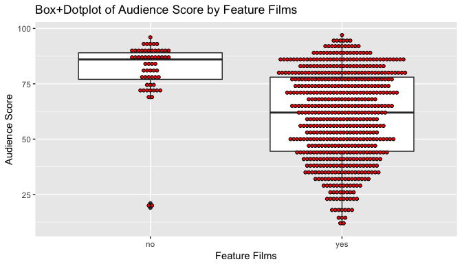<!-- -->

We can see the exact summary statistics in the table below.


```r
# audience score by feature film summary stats
films %>%
    group_by(feature_film) %>%
    summarize(n = n(),
              min = min(audience_score),
              q1 = quantile(audience_score, 0.25),
              median = median(audience_score),
              mean = mean(audience_score),
              q3 = quantile(audience_score, 0.75),
              max = max(audience_score),
              sd = sd(audience_score))
```

```
## # A tibble: 2 x 9
##   feature_film     n   min    q1 median     mean    q3   max       sd
##         <fctr> <int> <dbl> <dbl>  <dbl>    <dbl> <dbl> <dbl>    <dbl>
## 1           no    59    19  77.0     86 81.20339    89    96 13.64043
## 2          yes   591    11  44.5     62 60.46531    78    97 19.82402
```

### drama

Our dataset is fairly evenly split between dramas and non-dramas. Dramas do have slightly higher audience scores on average. Like `feature_film`, this variable will help us further define our dataset into like objects.


```r
# Box+Dotplot of Audience Score by Drama
ggplot(films, aes(x = drama, y = audience_score)) + 
    geom_boxplot() +
    geom_dotplot(binaxis = 'y',
                 stackdir = 'center',
                 dotsize = 0.5,
                 fill = 'red',
                 binwidth = 3) +
    labs(x = "Drama", y = "Audience Score", 
         title = "Box+Dotplot of Audience Score by Drama")
```

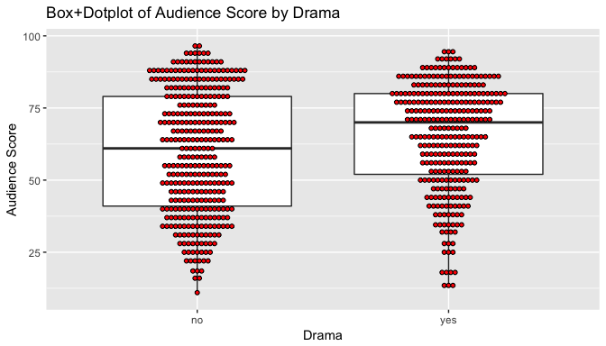<!-- -->

We can see the exact summary statistics in the table below.


```r
# audience score by feature film summary stats
films %>%
    group_by(drama) %>%
    summarize(n = n(),
              min = min(audience_score),
              q1 = quantile(audience_score, 0.25),
              median = median(audience_score),
              mean = mean(audience_score),
              q3 = quantile(audience_score, 0.75),
              max = max(audience_score),
              sd = sd(audience_score))
```

```
## # A tibble: 2 x 9
##    drama     n   min    q1 median     mean    q3   max       sd
##   <fctr> <int> <dbl> <dbl>  <dbl>    <dbl> <dbl> <dbl>    <dbl>
## 1     no   345    11    41     61 59.69565    79    97 21.29807
## 2    yes   305    13    52     70 65.34754    80    95 18.54184
```

### mpaa_rating_R

`mpaa_rating_R` serves a similar purpose. Our dataset is fairly evenly divided between 'R' and 'non-R' rated films. The distributions are very similar.


```r
# Box+Dotplot of Audience Score by mpaa_rating_R
ggplot(films, aes(x = mpaa_rating_R, y = audience_score)) + 
    geom_boxplot() +
    geom_dotplot(binaxis = 'y',
                 stackdir = 'center',
                 dotsize = 0.5,
                 fill = 'red',
                 binwidth = 3) +
    labs(x = "MPAA Rating R", y = "Audience Score", 
         title = "Box+Dotplot of Audience Score by MPAA Rating R")
```

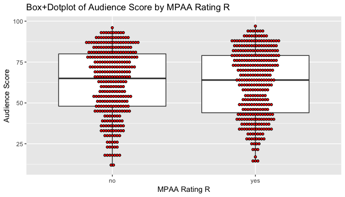<!-- -->

We can see the exact summary statistics in the table below.


```r
# audience score by mpaa_rating_R summary stats
films %>%
    group_by(mpaa_rating_R) %>%
    summarize(n = n(),
              min = min(audience_score),
              q1 = quantile(audience_score, 0.25),
              median = median(audience_score),
              mean = mean(audience_score),
              q3 = quantile(audience_score, 0.75),
              max = max(audience_score),
              sd = sd(audience_score))
```

```
## # A tibble: 2 x 9
##   mpaa_rating_R     n   min    q1 median     mean    q3   max       sd
##          <fctr> <int> <dbl> <dbl>  <dbl>    <dbl> <dbl> <dbl>    <dbl>
## 1            no   321    11    48     65 62.66044    80    96 20.34177
## 2           yes   329    14    44     64 62.04255    79    97 20.15590
```

### oscar_season

As we would expect, most films in our dataset are not released in Oscar season (defined as October, November or December theater release). The distribution of audience scores for Oscar and non-Oscar season films is fairly similar.


```r
# Box+Dotplot of Audience Score by Oscar Season
ggplot(films, aes(x = oscar_season, y = audience_score)) + 
    geom_boxplot() +
    geom_dotplot(binaxis = 'y',
                 stackdir = 'center',
                 dotsize = 0.5,
                 fill = 'red',
                 binwidth = 3) +
    labs(x = "Oscar Season", y = "Audience Score", 
         title = "Box+Dotplot of Audience Score by Oscar Season")
```

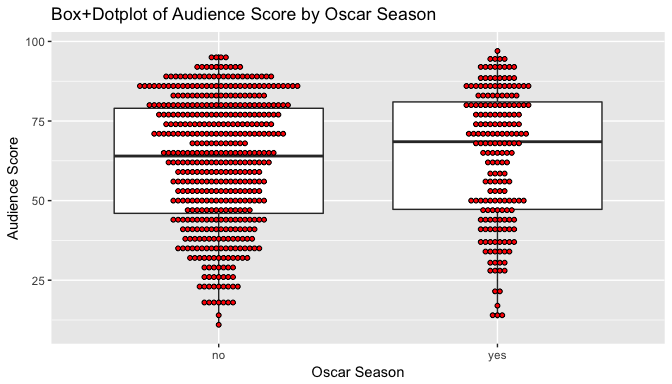<!-- -->

We can see the exact summary statistics in the table below.


```r
# audience score by oscar_season summary stats
films %>%
    group_by(oscar_season) %>%
    summarize(n = n(),
              min = min(audience_score),
              q1 = quantile(audience_score, 0.25),
              median = median(audience_score),
              mean = mean(audience_score),
              q3 = quantile(audience_score, 0.75),
              max = max(audience_score),
              sd = sd(audience_score))
```

```
## # A tibble: 2 x 9
##   oscar_season     n   min    q1 median     mean    q3   max       sd
##         <fctr> <int> <dbl> <dbl>  <dbl>    <dbl> <dbl> <dbl>    <dbl>
## 1           no   460    11 46.00   64.0 61.81304    79    96 20.11957
## 2          yes   190    13 47.25   68.5 63.64211    81    97 20.50625
```

### summer_season

Comparing `summer_season`, defined as a May through August theater release, to `audience_score` yields a similar result to `oscar_season`. It does not appear to have a profound impact on `audience_score`.


```r
# Box+Dotplot of Audience Score by Summer Season
ggplot(films, aes(x = summer_season, y = audience_score)) + 
    geom_boxplot() +
    geom_dotplot(binaxis = 'y',
                 stackdir = 'center',
                 dotsize = 0.5,
                 fill = 'red',
                 binwidth = 3) +
    labs(x = "Summer Season", y = "Audience Score", 
         title = "Box+Dotplot of Audience Score by Summer Season")
```

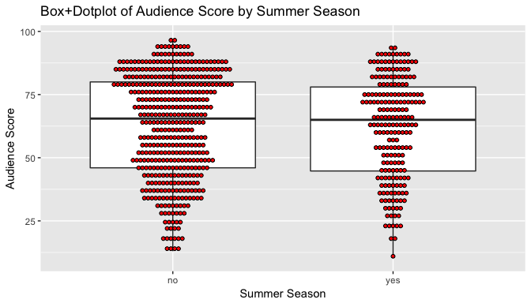<!-- -->

We can see the exact summary statistics in the table below.


```r
# audience score by summer_season summary stats
films %>%
    group_by(summer_season) %>%
    summarize(n = n(),
              min = min(audience_score),
              q1 = quantile(audience_score, 0.25),
              median = median(audience_score),
              mean = mean(audience_score),
              q3 = quantile(audience_score, 0.75),
              max = max(audience_score),
              sd = sd(audience_score))
```

```
## # A tibble: 2 x 9
##   summer_season     n   min    q1 median     mean    q3   max       sd
##          <fctr> <int> <dbl> <dbl>  <dbl>    <dbl> <dbl> <dbl>    <dbl>
## 1            no   442    13 46.00   65.5 62.60181    80    97 20.40385
## 2           yes   208    11 44.75   65.0 61.80769    78    94 19.90828
```

### Multivariable EDA

We can try plotting many of these variables at once. But honestly, I think viewing the above plots makes it easier to get a sense of where the data lies.


```r
films$season <- ifelse(films$oscar_season == 'no' &
                       films$summer_season == 'no', 'None',
                       ifelse(films$summer_season == 'yes', 'Summer', 'Oscar'))
films$season <- as.factor(films$season)

# multivariable plot
ggplot(films, aes(x = runtime, y = audience_score, 
                  color = drama, 
                  shape = feature_film)) +
    geom_point(alpha = 0.8) +
    facet_wrap(~ season)
```

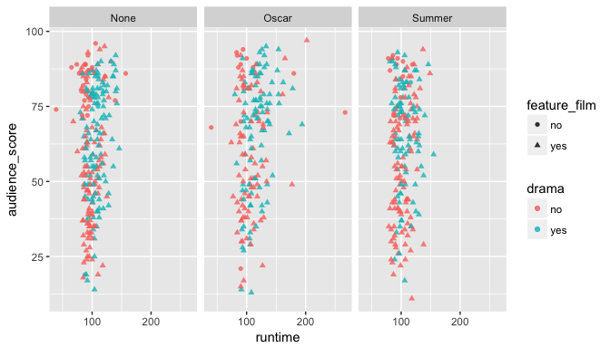<!-- -->

I created a `season` variable to make this plot, but will now remove it as it is not called for in the requirements. Although it should not affect any calculations as it represents no new information, it is unnecessary.

```r
# drop season column
films <- select(films, -season)
names(films)
```

```
##  [1] "runtime"          "thtr_rel_year"    "imdb_rating"     
##  [4] "imdb_num_votes"   "critics_score"    "audience_score"  
##  [7] "best_pic_nom"     "best_pic_win"     "best_actor_win"  
## [10] "best_actress_win" "best_dir_win"     "top200_box"      
## [13] "feature_film"     "drama"            "mpaa_rating_R"   
## [16] "oscar_season"     "summer_season"
```

* * *

## Part 4: Modeling

### Model selection

#### Simple Linear Regression Model

Before building the requested multivariable Bayesian linear regression model, I'll start with a simple linear regression model, but in a Bayesian framework. I'll use `imdb_rating` to predict `audience_score` since they are the most correlated variables in the dataset.

I will use a reference prior distribution that provides a connection between the frequentist solution and Bayesian answers. This provides a baseline analysis for comparison with more informative prior distributions. Under the reference prior, the posterior mean and standard deviation is equal to the OLS estimate and standard error respectively.


```r
# simple linear regression model, reference prior
slr <- lm(audience_score ~ imdb_rating, data = films)
summary(slr)
```

```
## 
## Call:
## lm(formula = audience_score ~ imdb_rating, data = films)
## 
## Residuals:
##     Min      1Q  Median      3Q     Max 
## -26.805  -6.550   0.676   5.676  52.912 
## 
## Coefficients:
##             Estimate Std. Error t value Pr(>|t|)    
## (Intercept) -42.3748     2.4205  -17.51   <2e-16 ***
## imdb_rating  16.1321     0.3678   43.87   <2e-16 ***
## ---
## Signif. codes:  0 '***' 0.001 '**' 0.01 '*' 0.05 '.' 0.1 ' ' 1
## 
## Residual standard error: 10.16 on 648 degrees of freedom
## Multiple R-squared:  0.7481,	Adjusted R-squared:  0.7477 
## F-statistic:  1924 on 1 and 648 DF,  p-value: < 2.2e-16
```

```r
# slr added to plot
ggplot(films, aes(x = imdb_rating, y = audience_score)) + 
    geom_point(alpha = 0.5) +
    geom_smooth(method = "lm", se = FALSE)
```

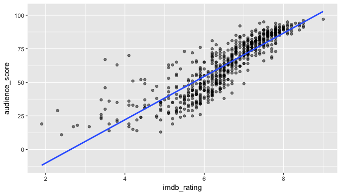<!-- -->

Under a reference prior, point estimates and Bayesian credible intervals are equivalent to Frequentist estimates and confidence intervals. The key difference is in the Bayesian interpretation of credible intervals. We can see these figures calculated in the table below.


```r
out = summary(slr)$coef[, 1:2]
out = cbind(out, confint(slr))
colnames(out) = c("posterior mean", "sd", "2.5", "97.5")
round(out, 2)
```

```
##             posterior mean   sd    2.5   97.5
## (Intercept)         -42.37 2.42 -47.13 -37.62
## imdb_rating          16.13 0.37  15.41  16.85
```

I'll save coefficient interpretation for the models below.

#### Bayesian Model Selection: Stepwise

We can now try to fit Bayesian multiple regression models using the techniques provided for in the `BAS` package.

Using the `BAS` package, I'll use a stepwise selection method based on minimizing BIC (Bayesian Information Criteria). 


```r
n = nrow(films)
films.lm = lm(audience_score ~ ., data = films)
films.step = step(films.lm, k = log(n)) # penalty for BIC rather than AIC
```

```
## Start:  AIC=3083.05
## audience_score ~ runtime + thtr_rel_year + imdb_rating + imdb_num_votes + 
##     critics_score + best_pic_nom + best_pic_win + best_actor_win + 
##     best_actress_win + best_dir_win + top200_box + feature_film + 
##     drama + mpaa_rating_R + oscar_season + summer_season
## 
##                    Df Sum of Sq    RSS    AIC
## - top200_box        1         9  62999 3076.7
## - oscar_season      1        28  63018 3076.9
## - best_pic_win      1        48  63038 3077.1
## - best_dir_win      1        51  63040 3077.1
## - summer_season     1        92  63081 3077.5
## - best_actor_win    1       171  63160 3078.3
## - feature_film      1       177  63166 3078.4
## - drama             1       216  63206 3078.8
## - imdb_num_votes    1       255  63244 3079.2
## - best_actress_win  1       283  63273 3079.5
## - mpaa_rating_R     1       314  63304 3079.8
## - thtr_rel_year     1       397  63386 3080.7
## - best_pic_nom      1       408  63398 3080.8
## - runtime           1       538  63527 3082.1
## <none>                           62990 3083.0
## - critics_score     1       669  63659 3083.4
## - imdb_rating       1     58556 121545 3503.8
## 
## Step:  AIC=3076.67
## audience_score ~ runtime + thtr_rel_year + imdb_rating + imdb_num_votes + 
##     critics_score + best_pic_nom + best_pic_win + best_actor_win + 
##     best_actress_win + best_dir_win + feature_film + drama + 
##     mpaa_rating_R + oscar_season + summer_season
## 
##                    Df Sum of Sq    RSS    AIC
## - oscar_season      1        26  63025 3070.5
## - best_pic_win      1        49  63047 3070.7
## - best_dir_win      1        52  63051 3070.7
## - summer_season     1        94  63093 3071.2
## - best_actor_win    1       169  63168 3071.9
## - feature_film      1       176  63175 3072.0
## - drama             1       214  63213 3072.4
## - best_actress_win  1       279  63278 3073.1
## - imdb_num_votes    1       302  63301 3073.3
## - mpaa_rating_R     1       330  63329 3073.6
## - best_pic_nom      1       404  63403 3074.3
## - thtr_rel_year     1       415  63414 3074.5
## - runtime           1       535  63534 3075.7
## <none>                           62999 3076.7
## - critics_score     1       681  63680 3077.2
## - imdb_rating       1     58606 121604 3497.7
## 
## Step:  AIC=3070.46
## audience_score ~ runtime + thtr_rel_year + imdb_rating + imdb_num_votes + 
##     critics_score + best_pic_nom + best_pic_win + best_actor_win + 
##     best_actress_win + best_dir_win + feature_film + drama + 
##     mpaa_rating_R + summer_season
## 
##                    Df Sum of Sq    RSS    AIC
## - best_pic_win      1        46  63071 3064.5
## - best_dir_win      1        56  63081 3064.6
## - best_actor_win    1       174  63200 3065.8
## - summer_season     1       177  63202 3065.8
## - feature_film      1       182  63207 3065.9
## - drama             1       222  63247 3066.3
## - best_actress_win  1       281  63307 3066.9
## - imdb_num_votes    1       302  63328 3067.1
## - mpaa_rating_R     1       329  63354 3067.4
## - best_pic_nom      1       387  63412 3068.0
## - thtr_rel_year     1       410  63436 3068.2
## - runtime           1       587  63613 3070.0
## <none>                           63025 3070.5
## - critics_score     1       679  63704 3071.0
## - imdb_rating       1     58603 121628 3491.3
## 
## Step:  AIC=3064.46
## audience_score ~ runtime + thtr_rel_year + imdb_rating + imdb_num_votes + 
##     critics_score + best_pic_nom + best_actor_win + best_actress_win + 
##     best_dir_win + feature_film + drama + mpaa_rating_R + summer_season
## 
##                    Df Sum of Sq    RSS    AIC
## - best_dir_win      1        94  63165 3058.9
## - best_actor_win    1       163  63234 3059.7
## - feature_film      1       171  63242 3059.7
## - summer_season     1       174  63245 3059.8
## - drama             1       220  63291 3060.2
## - imdb_num_votes    1       271  63342 3060.8
## - best_actress_win  1       294  63365 3061.0
## - mpaa_rating_R     1       330  63401 3061.4
## - best_pic_nom      1       342  63414 3061.5
## - thtr_rel_year     1       397  63468 3062.1
## - runtime           1       586  63657 3064.0
## <none>                           63071 3064.5
## - critics_score     1       680  63751 3065.0
## - imdb_rating       1     58858 121929 3486.4
## 
## Step:  AIC=3058.95
## audience_score ~ runtime + thtr_rel_year + imdb_rating + imdb_num_votes + 
##     critics_score + best_pic_nom + best_actor_win + best_actress_win + 
##     feature_film + drama + mpaa_rating_R + summer_season
## 
##                    Df Sum of Sq    RSS    AIC
## - summer_season     1       167  63332 3054.2
## - best_actor_win    1       171  63336 3054.2
## - feature_film      1       183  63348 3054.4
## - drama             1       228  63394 3054.8
## - imdb_num_votes    1       247  63412 3055.0
## - best_actress_win  1       299  63464 3055.5
## - best_pic_nom      1       326  63491 3055.8
## - mpaa_rating_R     1       345  63510 3056.0
## - thtr_rel_year     1       368  63533 3056.2
## <none>                           63165 3058.9
## - critics_score     1       651  63816 3059.1
## - runtime           1       673  63839 3059.4
## - imdb_rating       1     58895 122061 3480.7
## 
## Step:  AIC=3054.19
## audience_score ~ runtime + thtr_rel_year + imdb_rating + imdb_num_votes + 
##     critics_score + best_pic_nom + best_actor_win + best_actress_win + 
##     feature_film + drama + mpaa_rating_R
## 
##                    Df Sum of Sq    RSS    AIC
## - feature_film      1       156  63488 3049.3
## - best_actor_win    1       195  63527 3049.7
## - drama             1       204  63536 3049.8
## - imdb_num_votes    1       260  63592 3050.4
## - best_pic_nom      1       297  63629 3050.8
## - best_actress_win  1       297  63629 3050.8
## - mpaa_rating_R     1       356  63688 3051.4
## - thtr_rel_year     1       361  63693 3051.4
## <none>                           63332 3054.2
## - runtime           1       690  64022 3054.7
## - critics_score     1       732  64064 3055.2
## - imdb_rating       1     58763 122095 3474.4
## 
## Step:  AIC=3049.31
## audience_score ~ runtime + thtr_rel_year + imdb_rating + imdb_num_votes + 
##     critics_score + best_pic_nom + best_actor_win + best_actress_win + 
##     drama + mpaa_rating_R
## 
##                    Df Sum of Sq    RSS    AIC
## - drama             1       121  63609 3044.1
## - imdb_num_votes    1       173  63661 3044.6
## - best_actor_win    1       219  63706 3045.1
## - thtr_rel_year     1       277  63765 3045.7
## - best_pic_nom      1       291  63778 3045.8
## - best_actress_win  1       306  63794 3046.0
## - mpaa_rating_R     1       453  63941 3047.5
## <none>                           63488 3049.3
## - runtime           1       715  64203 3050.1
## - critics_score     1       875  64363 3051.7
## - imdb_rating       1     63189 126677 3491.8
## 
## Step:  AIC=3044.07
## audience_score ~ runtime + thtr_rel_year + imdb_rating + imdb_num_votes + 
##     critics_score + best_pic_nom + best_actor_win + best_actress_win + 
##     mpaa_rating_R
## 
##                    Df Sum of Sq    RSS    AIC
## - imdb_num_votes    1       148  63757 3039.1
## - best_actor_win    1       209  63818 3039.7
## - thtr_rel_year     1       272  63881 3040.4
## - best_actress_win  1       274  63883 3040.4
## - best_pic_nom      1       307  63916 3040.7
## - mpaa_rating_R     1       391  64000 3041.6
## - runtime           1       631  64240 3044.0
## <none>                           63609 3044.1
## - critics_score     1       916  64525 3046.9
## - imdb_rating       1     63434 127043 3487.2
## 
## Step:  AIC=3039.1
## audience_score ~ runtime + thtr_rel_year + imdb_rating + critics_score + 
##     best_pic_nom + best_actor_win + best_actress_win + mpaa_rating_R
## 
##                    Df Sum of Sq    RSS    AIC
## - thtr_rel_year     1       201  63958 3034.7
## - best_actor_win    1       219  63976 3034.9
## - best_actress_win  1       266  64023 3035.3
## - mpaa_rating_R     1       367  64124 3036.4
## - best_pic_nom      1       442  64199 3037.1
## - runtime           1       519  64276 3037.9
## <none>                           63757 3039.1
## - critics_score     1       879  64635 3041.5
## - imdb_rating       1     67356 131113 3501.3
## 
## Step:  AIC=3034.67
## audience_score ~ runtime + imdb_rating + critics_score + best_pic_nom + 
##     best_actor_win + best_actress_win + mpaa_rating_R
## 
##                    Df Sum of Sq    RSS    AIC
## - best_actor_win    1       207  64165 3030.3
## - best_actress_win  1       261  64219 3030.8
## - mpaa_rating_R     1       373  64331 3032.0
## - best_pic_nom      1       447  64405 3032.7
## - runtime           1       468  64425 3032.9
## <none>                           63958 3034.7
## - critics_score     1       968  64926 3038.0
## - imdb_rating       1     67172 131129 3494.9
## 
## Step:  AIC=3030.29
## audience_score ~ runtime + imdb_rating + critics_score + best_pic_nom + 
##     best_actress_win + mpaa_rating_R
## 
##                    Df Sum of Sq    RSS    AIC
## - best_actress_win  1       296  64461 3026.8
## - mpaa_rating_R     1       366  64531 3027.5
## - best_pic_nom      1       396  64561 3027.8
## <none>                           64165 3030.3
## - runtime           1       643  64808 3030.3
## - critics_score     1       968  65133 3033.5
## - imdb_rating       1     67296 131461 3490.0
## 
## Step:  AIC=3026.81
## audience_score ~ runtime + imdb_rating + critics_score + best_pic_nom + 
##     mpaa_rating_R
## 
##                 Df Sum of Sq    RSS    AIC
## - best_pic_nom   1       303  64765 3023.4
## - mpaa_rating_R  1       354  64815 3023.9
## <none>                        64461 3026.8
## - runtime        1       814  65275 3028.5
## - critics_score  1       957  65418 3029.9
## - imdb_rating    1     67424 131885 3485.6
## 
## Step:  AIC=3023.39
## audience_score ~ runtime + imdb_rating + critics_score + mpaa_rating_R
## 
##                 Df Sum of Sq    RSS    AIC
## - mpaa_rating_R  1       361  65126 3020.5
## - runtime        1       638  65403 3023.3
## <none>                        64765 3023.4
## - critics_score  1      1027  65792 3027.1
## - imdb_rating    1     68173 132937 3484.3
## 
## Step:  AIC=3020.53
## audience_score ~ runtime + imdb_rating + critics_score
## 
##                 Df Sum of Sq    RSS    AIC
## <none>                        65126 3020.5
## - runtime        1       653  65779 3020.5
## - critics_score  1      1073  66199 3024.7
## - imdb_rating    1     67874 133000 3478.2
```

From the intial full model that had sixteen explanatory variables, we've gone down to three variables, reducing BIC (labeled AIC) from 3083.05 to 3020.53.

We can calculate BIC directly with the `BIC` function. Comparing the full model to the best model shows a reduction, although I'm not sure why the values are quite different.

```r
best <- lm(audience_score ~ runtime + critics_score + imdb_rating, data = films)
BIC(best)
```

```
## [1] 4871.623
```

```r
full <- lm(audience_score ~ . - audience_score, data = films)
BIC(full)
```

```
## [1] 4934.145
```

#### Bayesian Model Selection: The Best Model

We can also use the `BAS` package to enumerate all 2^16 possible models and determine what single model yields the lowest BIC. Setting `modelprior` to uniform assigns equal probabilities to all possible models.


```r
# use the BAS package to fit all possible BIC models
films.bic = bas.lm(audience_score ~ ., data = films, 
                 prior = "BIC", 
                 modelprior = uniform())

# find the best BIC model with BAS
best = which.max(films.bic$logmarg)  # this is the best BIC model

# indices of the best model where 0 is the intercept
bestmodel =  films.bic$which[[best]]

bestgamma = rep(0, films.bic$n.vars)
# convert to a binary  vector where 1 means the variable was selected
# use this to fit the best BIC model
bestgamma[bestmodel + 1] = 1  

films.bestbic = bas.lm(audience_score ~ ., data = films,
                     prior = "BIC", n.models = 1,
                     bestmodel = bestgamma, 
                     modelprior = uniform())
```

Having selected the best model according to BIC (the same model we reached in the stepwise process above), we can then extract posterior means and standard deviations using the `coef` function.


```r
films.coef = coef(films.bestbic)

out = confint(films.coef)
names = c("post mean", "post sd", colnames(out))
coef.bic = cbind(films.coef$postmean, films.coef$postsd, out)
colnames(coef.bic) = names
coef.bic
```

```
##                       post mean    post sd        2.5%       97.5%
## Intercept           62.34769231 0.39382552 61.57435957 63.12102504
## runtime             -0.05361506 0.02106909 -0.09498723 -0.01224288
## thtr_rel_year        0.00000000 0.00000000  0.00000000  0.00000000
## imdb_rating         14.98076157 0.57735288 13.84704662 16.11447651
## imdb_num_votes       0.00000000 0.00000000  0.00000000  0.00000000
## critics_score        0.07035672 0.02156098  0.02801866  0.11269479
## best_pic_nomyes      0.00000000 0.00000000  0.00000000  0.00000000
## best_pic_winyes      0.00000000 0.00000000  0.00000000  0.00000000
## best_actor_winyes    0.00000000 0.00000000  0.00000000  0.00000000
## best_actress_winyes  0.00000000 0.00000000  0.00000000  0.00000000
## best_dir_winyes      0.00000000 0.00000000  0.00000000  0.00000000
## top200_boxyes        0.00000000 0.00000000  0.00000000  0.00000000
## feature_filmyes      0.00000000 0.00000000  0.00000000  0.00000000
## dramayes             0.00000000 0.00000000  0.00000000  0.00000000
## mpaa_rating_Ryes     0.00000000 0.00000000  0.00000000  0.00000000
## oscar_seasonyes      0.00000000 0.00000000  0.00000000  0.00000000
## summer_seasonyes     0.00000000 0.00000000  0.00000000  0.00000000
##                            beta
## Intercept           62.34769231
## runtime             -0.05361506
## thtr_rel_year        0.00000000
## imdb_rating         14.98076157
## imdb_num_votes       0.00000000
## critics_score        0.07035672
## best_pic_nomyes      0.00000000
## best_pic_winyes      0.00000000
## best_actor_winyes    0.00000000
## best_actress_winyes  0.00000000
## best_dir_winyes      0.00000000
## top200_boxyes        0.00000000
## feature_filmyes      0.00000000
## dramayes             0.00000000
## mpaa_rating_Ryes     0.00000000
## oscar_seasonyes      0.00000000
## summer_seasonyes     0.00000000
```

The posterior estimates and intervals for all coefficients except the intercept are the same using either `lm` or `BAS` and have the same Bayesian interpretation whether or not the predictor variables have been centered. We can see this below if we create the same model reached through the stepwise selection with the `lm` function.


```r
# create the same model with lm
best.bic =  lm(audience_score ~ runtime + imdb_rating + critics_score, data = films)
out = summary(best.bic)$coef[, 1:2]
colnames(out) = c("posterior mean", "sd")
out = cbind(out, confint(best.bic))
out
```

```
##               posterior mean         sd        2.5 %       97.5 %
## (Intercept)     -33.28320569 3.21938684 -39.60493213 -26.96147926
## runtime          -0.05361506 0.02106909  -0.09498723  -0.01224288
## imdb_rating      14.98076157 0.57735288  13.84704662  16.11447651
## critics_score     0.07035672 0.02156098   0.02801866   0.11269479
```

#### Bayesian Model Averaging

While we have determined a single best model according to BIC, there is often uncertainty around which is definitively the best model. We can take an ensemble approach and use it to compare models.

Instead of mandating the `bas.lm` function to find only the best model, it can look at all possible models. The `summary` function will report results from the top five models.


```r
# summary of top five models
films_bas = bas.lm(audience_score ~ ., 
                 prior = "BIC", 
                 modelprior = uniform(),
                 data = films)
summary(films_bas)
```

```
##                     P(B != 0 | Y)    model 1       model 2       model 3
## Intercept              1.00000000     1.0000     1.0000000     1.0000000
## runtime                0.46971477     1.0000     0.0000000     0.0000000
## thtr_rel_year          0.09068970     0.0000     0.0000000     0.0000000
## imdb_rating            1.00000000     1.0000     1.0000000     1.0000000
## imdb_num_votes         0.05773502     0.0000     0.0000000     0.0000000
## critics_score          0.88855056     1.0000     1.0000000     1.0000000
## best_pic_nomyes        0.13119140     0.0000     0.0000000     0.0000000
## best_pic_winyes        0.03984766     0.0000     0.0000000     0.0000000
## best_actor_winyes      0.14434896     0.0000     0.0000000     1.0000000
## best_actress_winyes    0.14128087     0.0000     0.0000000     0.0000000
## best_dir_winyes        0.06693898     0.0000     0.0000000     0.0000000
## top200_boxyes          0.04762234     0.0000     0.0000000     0.0000000
## feature_filmyes        0.06536947     0.0000     0.0000000     0.0000000
## dramayes               0.04319833     0.0000     0.0000000     0.0000000
## mpaa_rating_Ryes       0.19984016     0.0000     0.0000000     0.0000000
## oscar_seasonyes        0.07505684     0.0000     0.0000000     0.0000000
## summer_seasonyes       0.08042023     0.0000     0.0000000     0.0000000
## BF                             NA     1.0000     0.9968489     0.2543185
## PostProbs                      NA     0.1297     0.1293000     0.0330000
## R2                             NA     0.7549     0.7525000     0.7539000
## dim                            NA     4.0000     3.0000000     4.0000000
## logmarg                        NA -3615.2791 -3615.2822108 -3616.6482224
##                           model 4       model 5
## Intercept               1.0000000     1.0000000
## runtime                 0.0000000     1.0000000
## thtr_rel_year           0.0000000     0.0000000
## imdb_rating             1.0000000     1.0000000
## imdb_num_votes          0.0000000     0.0000000
## critics_score           1.0000000     1.0000000
## best_pic_nomyes         0.0000000     0.0000000
## best_pic_winyes         0.0000000     0.0000000
## best_actor_winyes       0.0000000     0.0000000
## best_actress_winyes     0.0000000     0.0000000
## best_dir_winyes         0.0000000     0.0000000
## top200_boxyes           0.0000000     0.0000000
## feature_filmyes         0.0000000     0.0000000
## dramayes                0.0000000     0.0000000
## mpaa_rating_Ryes        1.0000000     1.0000000
## oscar_seasonyes         0.0000000     0.0000000
## summer_seasonyes        0.0000000     0.0000000
## BF                      0.2521327     0.2391994
## PostProbs               0.0327000     0.0310000
## R2                      0.7539000     0.7563000
## dim                     4.0000000     5.0000000
## logmarg             -3616.6568544 -3616.7095127
```

Here we learn the posterior probabilities, Bayes Factors, and R^2 among other statistics for the top five models. We can see that model 1 has the three explanatory variables we saw included in the 'best' model above. An advantage of not looking at just the best model though is that we can see, in this case, that model 2 is very similar. Although it excludes `runtime`, its posterior probability and R^2 are nearly the same.

The posterior probability of model 1 is only 12.97%. This is much higher than the probability of any given model under a uniform prior (1/2^16).

The print method returns the call and the marginal posterior inclusions probabilites of the variables. For example, `runtime` is included in about 47% of models.


```r
print(films_bas)
```

```
## 
## Call:
## bas.lm(formula = audience_score ~ ., data = films, prior = "BIC",     modelprior = uniform())
## 
## 
##  Marginal Posterior Inclusion Probabilities: 
##           Intercept              runtime        thtr_rel_year  
##             1.00000              0.46971              0.09069  
##         imdb_rating       imdb_num_votes        critics_score  
##             1.00000              0.05774              0.88855  
##     best_pic_nomyes      best_pic_winyes    best_actor_winyes  
##             0.13119              0.03985              0.14435  
## best_actress_winyes      best_dir_winyes        top200_boxyes  
##             0.14128              0.06694              0.04762  
##     feature_filmyes             dramayes     mpaa_rating_Ryes  
##             0.06537              0.04320              0.19984  
##     oscar_seasonyes     summer_seasonyes  
##             0.07506              0.08042
```

The `image` function helps us visualize the model space under this ensemble approach.


```r
image(films_bas, rotate = F)
```

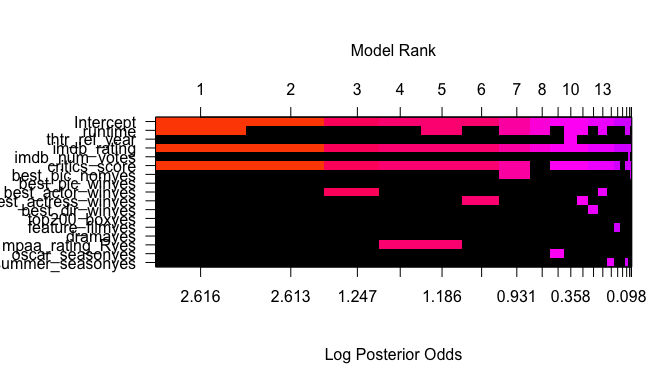<!-- -->

Here we can see the inclusion of predictor variables on the left hand side in various models ranked from left to right, with area reflecting the log posterior odds. The color black represents the variable is not included in the model, while a color means it is. 

We can see for example that `imdb_rating` is included in all of the most likely models, while `drama` was not included in any of the most likely models. The red coloring shared by models 1 and 2 reflect that they have very similar posterior probabilities-- this was confirmed in the above table. Models 3, 4, 5, 6 -- colored in pink -- all had posterior probabilities around 3%. The differences between color groups suggest that the differences between models are "not worth a bare mention".

To calculate the posterior distributions of the coefficients, we use the `coef` function create an object with posterior means, standard deviations, and posterior inclusion probabilities obtained by BMA. This table below is the analog to the frequentist summary table, with the posterior inclusion probability replacing the role of the p-value.

Importantly, the values calculated below take into account not just one model, but all possible models generated from having 16 predictor variables (2^16).


```r
films_coef = coef(films_bas)
films_coef
```

```
## 
##  Marginal Posterior Summaries of Coefficients: 
## 
##  Using  BMA 
## 
##  Based on the top  65536 models 
##                      post mean   post SD     post p(B != 0)
## Intercept             6.235e+01   3.946e-01   1.000e+00    
## runtime              -2.568e-02   3.118e-02   4.697e-01    
## thtr_rel_year        -4.533e-03   1.819e-02   9.069e-02    
## imdb_rating           1.498e+01   7.310e-01   1.000e+00    
## imdb_num_votes        2.081e-07   1.313e-06   5.774e-02    
## critics_score         6.297e-02   3.028e-02   8.886e-01    
## best_pic_nomyes       5.068e-01   1.568e+00   1.312e-01    
## best_pic_winyes      -8.503e-03   8.479e-01   3.985e-02    
## best_actor_winyes    -2.877e-01   8.318e-01   1.443e-01    
## best_actress_winyes  -3.088e-01   9.057e-01   1.413e-01    
## best_dir_winyes      -1.195e-01   6.227e-01   6.694e-02    
## top200_boxyes         8.648e-02   7.050e-01   4.762e-02    
## feature_filmyes      -1.047e-01   5.643e-01   6.537e-02    
## dramayes              1.604e-02   1.939e-01   4.320e-02    
## mpaa_rating_Ryes     -3.036e-01   7.032e-01   1.998e-01    
## oscar_seasonyes      -8.035e-02   3.773e-01   7.506e-02    
## summer_seasonyes      8.705e-02   3.831e-01   8.042e-02
```

We can also extract credible intervals using the `confint` function.


```r
confint(films_coef, nsim = 10000)
```

```
##                              2.5%        97.5%          beta
## Intercept            6.158284e+01 6.311357e+01  6.234769e+01
## runtime             -8.325178e-02 0.000000e+00 -2.567772e-02
## thtr_rel_year       -5.195513e-02 0.000000e+00 -4.532635e-03
## imdb_rating          1.376040e+01 1.665042e+01  1.498203e+01
## imdb_num_votes      -1.984552e-07 1.200717e-06  2.080713e-07
## critics_score        0.000000e+00 1.054848e-01  6.296648e-02
## best_pic_nomyes      0.000000e+00 5.042301e+00  5.068035e-01
## best_pic_winyes      0.000000e+00 0.000000e+00 -8.502836e-03
## best_actor_winyes   -2.606063e+00 0.000000e+00 -2.876695e-01
## best_actress_winyes -2.835247e+00 0.000000e+00 -3.088382e-01
## best_dir_winyes     -1.289771e+00 0.000000e+00 -1.195011e-01
## top200_boxyes       -2.224055e-03 0.000000e+00  8.648185e-02
## feature_filmyes     -1.058943e+00 0.000000e+00 -1.046908e-01
## dramayes             0.000000e+00 0.000000e+00  1.604413e-02
## mpaa_rating_Ryes    -2.144140e+00 0.000000e+00 -3.036174e-01
## oscar_seasonyes     -1.002937e+00 1.127791e-02 -8.034940e-02
## summer_seasonyes     0.000000e+00 1.020070e+00  8.704545e-02
## attr(,"Probability")
## [1] 0.95
## attr(,"class")
## [1] "confint.bas"
```

Lastly, we can plot the posterior distributions under BMA of each regression coefficient. The height of the vertical bar represents the posterior probability that the coefficient is 0. The bell-shaped curve represents the density of plausible values from all the models where the coefficient was non-zero. This is scaled so that the height of the density for non-zero values is the probability that the coefficient is non-zero. 

For example, `imdb_rating` has no bar since it is essentially certain that it should be included. Most other variables have spikes close to 1. In these cases where the variable is forced into the model, the distribution overlaps 0.


```r
par(mar = c(1,1,1,1))
par(mfrow = c(8,2))
plot(films_coef, subset = c(2:16), ask = F)
title("Posterior Distributions of Regression Coefficients under BMA",
      outer = TRUE)
```

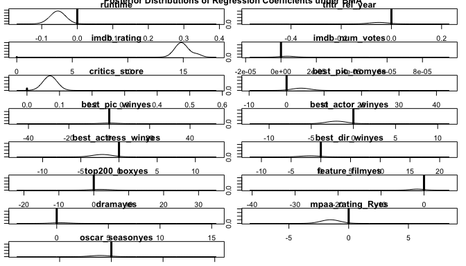<!-- -->

#### Bayesian Model Coefficient and Interval Interpretation

Here I'll interpret the coefficients we just calculated through BMA.

The mean estimate interpretation, as I understand it, is largely the same. For example, holding all else constant, a one unit increase in `imdb_rating` is associated with, on average, a 14.98 point increase in `audience_score`. 

There is an important difference however in the interpretation of the credible interval in the Bayesian paradigm vs. the confidence interval in the Frequentist paradigm.

The frequentist definition of probability allows us to define a probability for the confidence interval procedure but not for specific fixed sample. (For example, 95% of similarly constructed intervals will contain the true mean).

The Bayesian definition is a bit more flexible-- and direct. Since it is a measure of belief it allows us to describe the unknown true parameter not as a fixed value but with a probability distribution. We can say that the probability that the true mean of a sample is within a given interval is 0.95.

And so in the case of `imdb_rating`, we can say that the probability that the slope coefficient lies between 13.66 and 16.52 is 95%.

Our second most included variable was `critics_score`. Holding all else constant, a one unit increase in `critics_score` is associated with, on average, a 0.063 point increase in `audience_score`. And we can say that the probability that this slope coefficient lies between 0 and 0.11 is 95%. 

This would strongly suggest to us that `critics_score` might play some role in predicting `audience_score` but ultimately a broad popularity rating is much more closely associated.

Most other predictor variables have a negative lower bound and a positive upper bound, close to 0, suggesting these variables have very little impact.

#### Priors for Bayesian Model Uncertainty

Above anaylsis used BIC to determine Bayes factors, but there are other prior distributions we can use running `BAS`.


```r
n <- nrow(films)

films.g = bas.lm(audience_score ~ ., data = films, prior = "g-prior", 
               a = n, modelprior = uniform())
# a is the hyperparameter in this case g=a
films.ZS = bas.lm(audience_score ~ ., data = films, prior = "ZS-null", 
                a = n, modelprior = uniform())
films.BIC = bas.lm(audience_score ~ ., data = films, prior = "BIC", 
                 a = n, modelprior = uniform())
films.AIC = bas.lm(audience_score ~ ., data = films, prior = "AIC", 
                 modelprior = uniform())
films.HG = bas.lm(audience_score ~ ., data = films, prior =
                      "hyper-g-n", a = 3, modelprior = uniform()) 
# hyperparameter a=3
films.EB = bas.lm(audience_score ~ ., data = films, prior = "EB-local",
                a = n, modelprior = uniform())
```

We can plot the marginal inclusion probabilities for each method (BIC, g, Zellner-Siow-Cauchy, hyper g, Empirical Bayes, and AIC). All methods agree we should include `imdb_rating`. `critics_score` has a probability of inclusion greater than 0.8 for all methods. Most methods place `runtime` slightly more than 0.4. Most methods look quite similar with AIC being less conservative, which is not surprusing because AIC is designed to find good predictive models.


```r
probne0 = cbind(films.BIC$probne0, films.g$probne0, films.ZS$probne0,  
                films.HG$probne0, films.EB$probne0, films.AIC$probne0)
colnames(probne0) = c("BIC","g", "ZS", "HG", "EB", "AIC")
rownames(probne0) = c(films.BIC$namesx)

myblue = rgb(86,155,189, name = "myblue", max = 256)
mydarkgrey = rgb(.5,.5,.5, name = "mydarkgrey", max = 1)

par(mar = c(1,1,1,1))
par(mfrow = c(6,3))
for (i in 2:16) {
  barplot(height = probne0[i,], ylim = c(0,1), main =
              films.g$namesx[i], col.main = mydarkgrey, col = myblue)
}
title("Marginal Inclusion Probabilities", outer = TRUE)
```

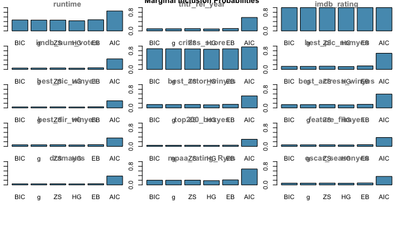<!-- -->

#### Bayesian Model Diagnostics

We should always check model diagnostics.

##### Residuals versus fitted values using BMA

As with `lm` we would like to see a uniform spread of points for each fitted value indicating that the constant variance assumption is acceptable. This doesn't seem to entirely be the case for lower rated films. We saw this in our basic scatterplot.


```r
# residual plot
plot(films_bas, which = 1,add.smooth = F, ask = F, pch = 16,
     sub.caption = "", caption = "")
```

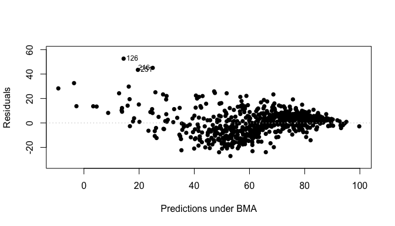<!-- -->

##### Cumulative sampled probability

This is a plot of the cumulative probability of the unique models that were sampled where every time a new model is discovered there is a jump in the cumulative probability. Ideally this levels off suggesting that each additional model has a very small probabilty and does not contribute substantially to the posterior distribution.

This does not appear to be the case here but our cumulative probability definitely tailed off even after five models according to the tables above.


```r
# cumulative sampled probability
plot(films_bas, which = 2, add.smooth = F)
```

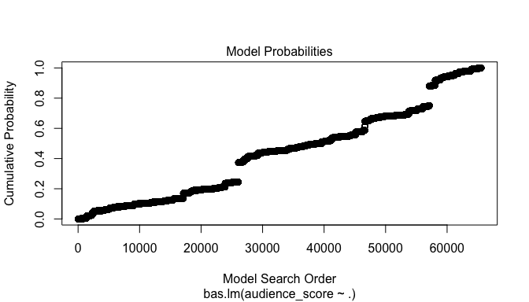<!-- -->

##### Model complexity

Next is the plot of model size vs the log of the marginal likelihood to compare each model to null model. We get a plot with three horizontal bands of points. The band with the highest marginal likelihood, I believe, would likely represent models with `imdb_rating` included. At the top left you see the model with the highest log marginal likelihood only has 2 predictors. Then it slightly trails off as more variables are added.


```r
# model complexity
plot(films_bas, which = 3, ask = F, caption = "", sub.caption = "")
```

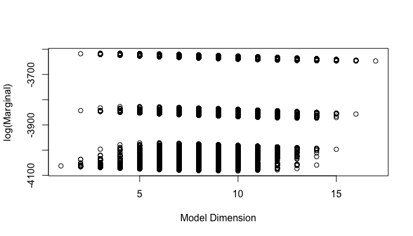<!-- -->

##### Marginal Inclusion probabilities

The lines in blue correspond to the variables where the marginal posterior inclusion probability, or PIP, is greater than 0.5 suggesting that these variables are important for predicting `audience_score`. `runtime` is just below the 0.5 mark.


```r
# Marginal Inclusion probabilities
plot(films_bas, which = 4, ask = F, caption = "", sub.caption = "", 
     col.in = myblue, col.ex = mydarkgrey, lwd = 3)
```

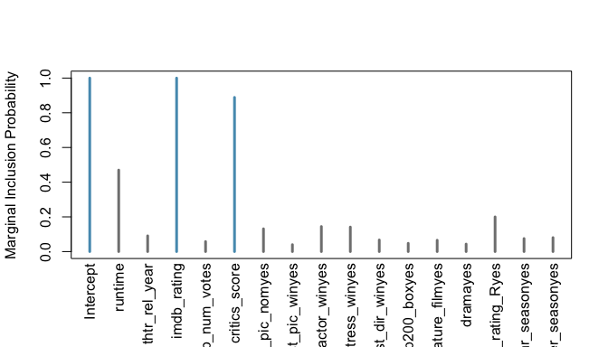<!-- -->

#### Frequentist Paradigm Comparison

Although not required here I wanted to quickly check how the best model under the Bayesian paradigm compared to the model we would arrive at in the frequentist paradigm. I've adopted the backwards elimination method, taking p-value as the decision criteria.


```r
# start with the full model
mod_full <- lm(audience_score ~ runtime + thtr_rel_year + imdb_rating +
              imdb_num_votes + critics_score + best_pic_nom +
              best_pic_win + best_actor_win + best_actress_win +
              best_dir_win + top200_box + feature_film + drama +
              mpaa_rating_R + oscar_season + summer_season, data =
              films)
summary(mod_full)
```

```
## 
## Call:
## lm(formula = audience_score ~ runtime + thtr_rel_year + imdb_rating + 
##     imdb_num_votes + critics_score + best_pic_nom + best_pic_win + 
##     best_actor_win + best_actress_win + best_dir_win + top200_box + 
##     feature_film + drama + mpaa_rating_R + oscar_season + summer_season, 
##     data = films)
## 
## Residuals:
##     Min      1Q  Median      3Q     Max 
## -28.594  -6.156   0.157   5.909  53.125 
## 
## Coefficients:
##                       Estimate Std. Error t value Pr(>|t|)    
## (Intercept)          1.244e+02  7.749e+01   1.606  0.10886    
## runtime             -5.614e-02  2.415e-02  -2.324  0.02042 *  
## thtr_rel_year       -7.657e-02  3.835e-02  -1.997  0.04628 *  
## imdb_rating          1.472e+01  6.067e-01  24.258  < 2e-16 ***
## imdb_num_votes       7.234e-06  4.523e-06   1.600  0.11019    
## critics_score        5.748e-02  2.217e-02   2.593  0.00973 ** 
## best_pic_nomyes      5.321e+00  2.628e+00   2.025  0.04330 *  
## best_pic_winyes     -3.212e+00  4.610e+00  -0.697  0.48624    
## best_actor_winyes   -1.544e+00  1.179e+00  -1.310  0.19068    
## best_actress_winyes -2.198e+00  1.304e+00  -1.686  0.09229 .  
## best_dir_winyes     -1.231e+00  1.728e+00  -0.713  0.47630    
## top200_boxyes        8.478e-01  2.782e+00   0.305  0.76067    
## feature_filmyes     -2.248e+00  1.687e+00  -1.332  0.18323    
## dramayes             1.292e+00  8.766e-01   1.474  0.14087    
## mpaa_rating_Ryes    -1.444e+00  8.127e-01  -1.777  0.07598 .  
## oscar_seasonyes     -5.333e-01  9.967e-01  -0.535  0.59280    
## summer_seasonyes     9.106e-01  9.493e-01   0.959  0.33778    
## ---
## Signif. codes:  0 '***' 0.001 '**' 0.01 '*' 0.05 '.' 0.1 ' ' 1
## 
## Residual standard error: 9.975 on 633 degrees of freedom
## Multiple R-squared:  0.763,	Adjusted R-squared:  0.757 
## F-statistic: 127.3 on 16 and 633 DF,  p-value: < 2.2e-16
```

Now remove variables one at a time, starting with the highest p-value, until no variable has a p-value greater than 0.05.


```r
# least significant variable
tail(cbind(sort(summary(mod_full)$coefficients[,4])),1)
```

```
##                    [,1]
## top200_boxyes 0.7606681
```

```r
# drop least significant variable
mod1 <- lm(audience_score ~ runtime + thtr_rel_year + imdb_rating +
              imdb_num_votes + critics_score + best_pic_nom +
              best_pic_win + best_actor_win + best_actress_win +
              best_dir_win + feature_film + drama +
              mpaa_rating_R + oscar_season + summer_season, data =
              films)
# least significant variable
tail(cbind(sort(summary(mod1)$coefficients[,4])),1)
```

```
##                      [,1]
## oscar_seasonyes 0.6060077
```


```r
# drop least significant variable
mod2 <- lm(audience_score ~ runtime + thtr_rel_year + imdb_rating +
              imdb_num_votes + critics_score + best_pic_nom +
              best_pic_win + best_actor_win + best_actress_win +
              best_dir_win + feature_film + drama +
              mpaa_rating_R + summer_season, data =
              films)
# least significant variable
tail(cbind(sort(summary(mod2)$coefficients[,4])),1)
```

```
##                      [,1]
## best_pic_winyes 0.4974575
```

```r
# drop least significant variable
mod3 <- lm(audience_score ~ runtime + thtr_rel_year + imdb_rating +
              imdb_num_votes + critics_score + best_pic_nom +
               best_actor_win + best_actress_win +
              best_dir_win + feature_film + drama +
              mpaa_rating_R + summer_season, data =
              films)
# least significant variable
tail(cbind(sort(summary(mod3)$coefficients[,4])),1)
```

```
##                      [,1]
## best_dir_winyes 0.3306316
```

```r
# drop least significant variable
mod4 <- lm(audience_score ~ runtime + thtr_rel_year + imdb_rating +
              imdb_num_votes + critics_score + best_pic_nom +
               best_actor_win + best_actress_win + feature_film + drama
           + mpaa_rating_R + summer_season, data = films)
# least significant variable
tail(cbind(sort(summary(mod4)$coefficients[,4])),1)
```

```
##                       [,1]
## summer_seasonyes 0.1950152
```

```r
# drop least significant variable
mod5 <- lm(audience_score ~ runtime + thtr_rel_year + imdb_rating +
              imdb_num_votes + critics_score + best_pic_nom +
               best_actor_win + best_actress_win + feature_film + drama
           + mpaa_rating_R + summer_season, data = films)
# least significant variable
tail(cbind(sort(summary(mod5)$coefficients[,4])),1)
```

```
##                       [,1]
## summer_seasonyes 0.1950152
```

```r
# drop least significant variable
mod6 <- lm(audience_score ~ runtime + thtr_rel_year + imdb_rating +
              imdb_num_votes + critics_score + best_pic_nom +
               best_actor_win + best_actress_win + feature_film + drama
           + mpaa_rating_R, data = films)
# least significant variable
tail(cbind(sort(summary(mod6)$coefficients[,4])),1)
```

```
##                     [,1]
## feature_filmyes 0.210839
```

```r
# drop least significant variable
mod7 <- lm(audience_score ~ runtime + thtr_rel_year + imdb_rating +
              imdb_num_votes + critics_score + best_pic_nom +
               best_actor_win + best_actress_win + feature_film + drama
           + mpaa_rating_R, data = films)
# least significant variable
tail(cbind(sort(summary(mod7)$coefficients[,4])),1)
```

```
##                     [,1]
## feature_filmyes 0.210839
```

```r
# drop least significant variable
mod8 <- lm(audience_score ~ runtime + thtr_rel_year + imdb_rating +
              imdb_num_votes + critics_score + best_pic_nom +
               best_actor_win + best_actress_win + drama
           + mpaa_rating_R, data = films)
# least significant variable
tail(cbind(sort(summary(mod8)$coefficients[,4])),1)
```

```
##               [,1]
## dramayes 0.2694948
```

```r
# drop least significant variable
mod9 <- lm(audience_score ~ runtime + thtr_rel_year + imdb_rating +
              imdb_num_votes + critics_score + best_pic_nom +
               best_actor_win + best_actress_win + mpaa_rating_R, data 
           = films)
# least significant variable
tail(cbind(sort(summary(mod9)$coefficients[,4])),1)
```

```
##                     [,1]
## imdb_num_votes 0.2230732
```

```r
# drop least significant variable
mod10 <- lm(audience_score ~ runtime + thtr_rel_year + imdb_rating +
                critics_score + best_pic_nom + best_actor_win +
                best_actress_win + mpaa_rating_R, data = films)
# least significant variable
tail(cbind(sort(summary(mod10)$coefficients[,4])),2)
```

```
##                    [,1]
## thtr_rel_year 0.1558658
## (Intercept)   0.3317465
```

```r
# drop least significant variable
mod11 <- lm(audience_score ~ runtime + imdb_rating +
                critics_score + best_pic_nom + best_actor_win +
                best_actress_win + mpaa_rating_R, data = films)
# least significant variable
tail(cbind(sort(summary(mod11)$coefficients[,4])),1)
```

```
##                        [,1]
## best_actor_winyes 0.1498143
```

```r
# drop least significant variable
mod12 <- lm(audience_score ~ runtime + imdb_rating +
                critics_score + best_pic_nom +
                best_actress_win + mpaa_rating_R, data = films)
# least significant variable
tail(cbind(sort(summary(mod12)$coefficients[,4])),1)
```

```
##                           [,1]
## best_actress_winyes 0.08528687
```

```r
# drop least significant variable
mod13 <- lm(audience_score ~ runtime + imdb_rating +
                critics_score + best_pic_nom + mpaa_rating_R, data =
                films)
# least significant variable
tail(cbind(sort(summary(mod13)$coefficients[,4])),1)
```

```
##                       [,1]
## best_pic_nomyes 0.08217373
```

```r
# drop least significant variable
mod14 <- lm(audience_score ~ runtime + imdb_rating +
                critics_score + mpaa_rating_R, data =
                films)
# least significant variable
tail(cbind(sort(summary(mod14)$coefficients[,4])),1)
```

```
##                        [,1]
## mpaa_rating_Ryes 0.05828723
```

```r
# drop least significant variable
mod15 <- lm(audience_score ~ runtime + imdb_rating +
                critics_score, data = films)
# all variables now significant p-values
cbind(sort(summary(mod15)$coefficients[,4]))
```

```
##                        [,1]
## imdb_rating   3.020617e-102
## (Intercept)    2.747540e-23
## critics_score  1.159878e-03
## runtime        1.116788e-02
```

You'll notice this is the same model we arrived at by minimizing BIC.

After removing thirteen variables, our parsimonious model retains only the variables `runtime`, `imdb_rating`, and `critics_score`. Our R^2 has hardly changed. R^2 for the full model was 0.763, compared to 0.755 with only three explanatory variables.


```r
summary(mod15)
```

```
## 
## Call:
## lm(formula = audience_score ~ runtime + imdb_rating + critics_score, 
##     data = films)
## 
## Residuals:
##     Min      1Q  Median      3Q     Max 
## -26.998  -6.565   0.557   5.475  52.448 
## 
## Coefficients:
##                Estimate Std. Error t value Pr(>|t|)    
## (Intercept)   -33.28321    3.21939 -10.338  < 2e-16 ***
## runtime        -0.05362    0.02107  -2.545  0.01117 *  
## imdb_rating    14.98076    0.57735  25.947  < 2e-16 ***
## critics_score   0.07036    0.02156   3.263  0.00116 ** 
## ---
## Signif. codes:  0 '***' 0.001 '**' 0.01 '*' 0.05 '.' 0.1 ' ' 1
## 
## Residual standard error: 10.04 on 646 degrees of freedom
## Multiple R-squared:  0.7549,	Adjusted R-squared:  0.7538 
## F-statistic: 663.3 on 3 and 646 DF,  p-value: < 2.2e-16
```

But of course this model gives us way less information than we got through the BMA approach. The Bayesian credible intervals also allow us to speak more directly about our results.

* * *

## Part 5: Prediction

### Decision Making Under Uncertainty

There is no single way to choose the best model. Rather it depends on the context of the situation. Selecting a model should be based on some decision process that takes into account the purpose of the analysis and cost and losses associated with selection.

Given that we are primarily interested in predicting `audience_score`, we might favor a model that generates predictions most similar to BMA and the corresponding posterior standard deviations. This is BPM.

Other choices includes the Median Probability Model (MPM), which choose a model in which all variables have posterior inclusion probabilities greater than 0.5, or Highest Probability Model (HPM), which chooses the model with the highest posterior probability.

#### HPM


```r
HPM = predict(films_bas, estimator = "HPM",  se.fit = TRUE)
(films_bas$namesx[HPM$bestmodel + 1])[-1]
```

```
## [1] "runtime"       "imdb_rating"   "critics_score"
```

#### MPM


```r
MPM = predict(films_bas, estimator = "MPM", se.fit = TRUE)
films_bas$namesx[MPM$bestmodel + 1]
```

```
## [1] "Intercept"     "imdb_rating"   "critics_score"
```

#### BPM


```r
BPM = predict(films_bas, estimator = "BPM", se.fit = TRUE)
films_bas$namesx[BPM$bestmodel + 1]
```

```
## [1] "Intercept"     "runtime"       "imdb_rating"   "critics_score"
```

#### Comparison


```r
BMA = predict(films_bas, estimator = "BMA",  se.fit = TRUE)

par(cex = 1.8, cex.axis = 1.8, cex.lab = 2, mfrow = c(2,2), mar = c(5,5, 3, 3), col.lab = mydarkgrey, col.axis = mydarkgrey, col = mydarkgrey)

ggpairs(data.frame(HPM = as.vector(HPM$fit),  #this used predict so we need to extract fitted values
                   MPM = as.vector(MPM$fit),  # this used fitted
                   BPM = as.vector(BPM$fit),  # this used fitted
                   BMA = as.vector(BMA$fit))) # this used predict
```

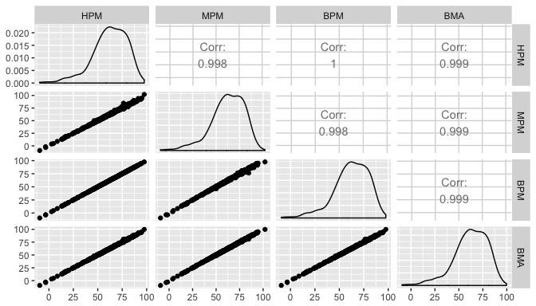<!-- -->

We see that these are highly correlated with BMA. In fact, they all round to 0.999.

Let’s turn to see what characteristics lead to the highest predicted `audience_score` with the BPM model.


```r
opt = which.max(BPM$fit)
t(films[opt, ])
```

```
##                  [,1]    
## runtime          "202"   
## thtr_rel_year    "1974"  
## imdb_rating      "9"     
## imdb_num_votes   "749783"
## critics_score    "97"    
## audience_score   "97"    
## best_pic_nom     "yes"   
## best_pic_win     "yes"   
## best_actor_win   "yes"   
## best_actress_win "yes"   
## best_dir_win     "yes"   
## top200_box       "no"    
## feature_film     "yes"   
## drama            "no"    
## mpaa_rating_R    "yes"   
## oscar_season     "yes"   
## summer_season    "no"
```

The results here are not too surprising. To get the highest predicted `audience_score` it inputs a theoretical R-rated feature film, released in Oscar season of 1974, with very high `imdb_rating` and `critics_score` and lots of Oscar wins. For some reason though, this theoretical film would not be in the box office top 200. 

We can onbtain a 95% credible interval for the predicted `audience_score` of a film with the covariates specified above.


```r
ci_audience_score = confint(BPM, parm = "pred")
ci_audience_score[opt,]
```

```
##      2.5%     97.5%      pred 
##  77.42084 117.65518  97.53801
```

### Out of Sample Predictions

Now let's test the model on some real movies out of our sample. We would expect variability to increase moving away from the center so, for out of sample predictions, I wanted to test predictions for a film highly-rated, poorly-rated, and mediocre: 12 Years a Slave, The Lone Ranger, and The Wolverine. The data for these films comes from IMDB and Rotten Tomatoes.


```r
# dataframes for three new movies

# 12 Years a Slave: audience_score = 91
twelve_years <- data.frame(runtime = 134, 
                                  thtr_rel_year = 2013,
                                  imdb_rating = 8.1,
                                  imdb_num_votes = 507018,
                                  critics_score = 96,
                                  best_pic_nom = 'yes',
                                  best_pic_win = 'yes',
                                  best_actor_win = 'no',
                                  best_actress_win = 'no',
                                  best_dir_win = 'no',
                                  top200_box = 'yes',    
                                  feature_film = 'yes',
                                  drama = 'yes',
                                  mpaa_rating_R = 'yes', 
                                  oscar_season = 'yes', 
                                  summer_season = 'no')

# The Lone Ranger: audience_score = 51
lone_ranger <-  data.frame(runtime = 150, 
                                  thtr_rel_year = 2013,
                                  imdb_rating = 6.5,
                                  imdb_num_votes = 195530,
                                  critics_score = 31,
                                  best_pic_nom = 'no',
                                  best_pic_win = 'no',
                                  best_actor_win = 'no',
                                  best_actress_win = 'no',
                                  best_dir_win = 'no',
                                  top200_box = 'yes',    
                                  feature_film = 'yes',
                                  drama = 'no',
                                  mpaa_rating_R = 'no', 
                                  oscar_season = 'no', 
                                  summer_season = 'yes')

# The Wolverine: audience_score = 69
wolverine <-  data.frame(runtime = 126, 
                                  thtr_rel_year = 2013,
                                  imdb_rating = 6.7,
                                  imdb_num_votes = 366887,
                                  critics_score = 69,
                                  best_pic_nom = 'no',
                                  best_pic_win = 'no',
                                  best_actor_win = 'no',
                                  best_actress_win = 'no',
                                  best_dir_win = 'no',
                                  top200_box = 'yes',    
                                  feature_film = 'yes',
                                  drama = 'no',
                                  mpaa_rating_R = 'no', 
                                  oscar_season = 'no', 
                                  summer_season = 'yes')
```

We can supply these dataframes as new data to the `predict` function.


```r
BPM.twelve_years = predict(films_bas, newdata = twelve_years, estimator
                           = "BPM", se.fit = TRUE)
BPM.twelve_years.conf.fit = confint(BPM.twelve_years, parm = "mean")
a <- BPM.twelve_years.conf.fit[,1:3]

BPM.lone_ranger = predict(films_bas, newdata = lone_ranger,
                          estimator = "BPM", se.fit = TRUE)
BPM.lone_ranger.conf.fit = confint(BPM.lone_ranger, parm = "mean")
b <- BPM.lone_ranger.conf.fit[,1:3]

BPM.wolverine = predict(films_bas, newdata = wolverine,
                        estimator = "BPM", se.fit = TRUE)
BPM.wolverine.conf.fit = confint(BPM.wolverine, parm = "mean")
c <- BPM.wolverine.conf.fit[,1:3]

# format output
mat <- matrix(c(a,b,c), ncol = 3, byrow = TRUE, dimnames = list(c("12 Years a Slave", "The Lone Ranger", "The Wolverine"), c("2.5%","97.5%", "Mean")))

pred_df <- mat %>%
    as.data.frame() %>%
    mutate(Actual = c(95,67,68),
           Film = c("12 Years a Slave", "The Lone Ranger", "The Wolverine"))
pred_df <- pred_df[,c(5,1,2,3,4)]
kable(pred_df)
```


Film                    2.5%      97.5%       Mean   Actual
-----------------  ---------  ---------  ---------  -------
12 Years a Slave    86.73955   90.41060   88.57508       95
The Lone Ranger     54.39671   65.58745   59.99208       67
The Wolverine       63.10206   68.96482   66.03344       68

Our model estimates are quite close for 12 Years a Slave and The Wolverine. It was not so good for The Lone Ranger, but we might expect this would have been more difficult to predict given a greater disagreement between its `imdb_rating` and `audience_score`. 

While the mean estimates are close, it looks like our credible intervals may be too small. 12 Years a Slave and The Lone Ranger exceed the upper bound of their 95% credible interval. Wolverine nearly does so.

### Frequentist Predictions Comparison

I wanted to compare these predictions to the estimates and confidence intervals produced from the parsimonious linear model we arrived at through backwards elimination p-value method.


```r
# 12 Years a Slave: audience_score = 91
predict(mod15, newdata = data.frame(runtime = 134, imdb_rating = 8.1, 
                                    critics_score = 96), interval =
                                        "predict")
```

```
##        fit      lwr      upr
## 1 87.63079 67.84572 107.4159
```

```r
# The Lone Ranger: audience_score = 51
predict(mod15, newdata = data.frame(runtime = 150, imdb_rating = 6.5, 
                                    critics_score = 31), interval =
                                        "predict")
```

```
##        fit      lwr      upr
## 1 58.23054 38.38785 78.07324
```

```r
# The Wolverine: audience_score = 69
predict(mod15, newdata = data.frame(runtime = 126, imdb_rating = 6.7, 
                                    critics_score = 69), interval =
                                        "predict")
```

```
##        fit      lwr      upr
## 1 65.18701 45.43618 84.93785
```

If you compare these statistics with the predicted values from our Bayesian model, you will notice that the mean estimates themselves are quite similar to our Bayesian predictions. However, our confidence intervals are much wider than the Bayesian credible intervals. Perhaps this is necessary given that in at least two cases the actual values were outside the 95% credible interval.

### Training and Testing Data

Lastly I wanted to copy the technique of the Week 4 Supplement Lab.

It documents an approach to help select among alternate estimators by using out of sample validation to compare predictive accuracy. The following code creates a training data and test data set based on a left out 10% sample. Next we obtain the posterior distribution of models and model specific parameters using `BAS` using only the training data. 

Using this posterior distribution we then predict `audience_score` using the explanatory variables in the test data set for several estimators: BMA, BPM, MPM and HPM and extract the predicted (fit) values. 

The function `cv.summary.bas` computes the average square root mean squared error between the fitted values and the observed values of `audience_score` in the left out test data.


```r
set.seed(42)

n = nrow(films)
n_cv = 50
ape = matrix(NA, ncol=4, nrow=n_cv)
colnames(ape) = c("BMA", "BPM", "HPM", "MPM")

for (i in 1:n_cv) {
  train = sample(1:n, size=round(.90*n), replace=FALSE)
  films_train = films[train,]
  films_test = films[-train,]

  bma_train_films = bas.lm(audience_score ~ . - audience_score,
                           data = films_train, 
                          prior = "BIC", modelprior = uniform(),
                          initprobs = "eplogp")
  yhat_bma = predict(bma_train_films, films_test, estimator="BMA")$fit
  yhat_hpm = predict(bma_train_films, films_test, estimator="HPM")$fit
  yhat_mpm = predict(bma_train_films, films_test, estimator="MPM")$fit
  yhat_bpm = predict(bma_train_films, films_test, estimator="BPM")$fit
  ape[i, "BMA"] = cv.summary.bas(yhat_bma, films_test$audience_score)
  ape[i, "BPM"] = cv.summary.bas(yhat_bpm, films_test$audience_score)
  ape[i, "HPM"] = cv.summary.bas(yhat_hpm, films_test$audience_score)
  ape[i, "MPM"] = cv.summary.bas(yhat_mpm, films_test$audience_score)
}
```

I'm not sure how to interpret the warning, but we can construct side-by-side boxplots of the average prediction error and the mean of the APE over the different test sets.


```r
boxplot(ape)
```

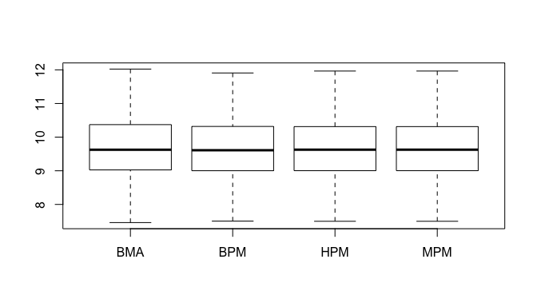<!-- -->


```r
apply(ape, 2, mean)
```

```
##      BMA      BPM      HPM      MPM 
## 9.668484 9.676087 9.690641 9.688312
```

While `BMA` is the best, followed by `BPM`, they are all really close in this case. 

* * *

## Part 6: Conclusion

We set out to examine what factors influence `audience_score`, and in particular to try to predict it form a host of possible explanatory variables.

### Key Findings

Despite all the work we did, `imdb_rating` ultimately does the heavy lifting in the model. We saw from the first scatterplot that these variables were highly correlated and not surprisingly it has far more predictive capability than any other variable.

An important question the studio may have though is the relative importance of `critics_score`. It certainly looks like from this analysis, while it may play some role, it is dwarfed in comparison to `imdb_rating`. This may suggest to them that for advance screenings or testing samples, regular moviegoers may be better predictors than critics.

### Shortcomings

1. Although we should ideally test predicting more films, it looks like our credible intervals were generally too small. While these films could be considered outliers in a sense (an Oscar winner and a widely-panned film), there is nothing inherently wrong with them. That being said, our estimates were fairly close.

2. The Bayesian approach allows us to incorporate our prior beliefs. Even though we have some initial beliefs about what variables will be important for predicting `audience_score`, we used a prior distribution that assumes all models are equally likely. This corresponds to a prior probability of 0.5 that a coefficient is non-zero. We could set different variables with unique prior probabilities of being included based on expert opinion of what we already know. For example, we could have set `imdb_rating` to a prior probability of 1 so it would always be included and reduce uncertainty. 

3. Lastly, given the amount of data available from Rotten Tomatoes and IMDB APIs, it seems like there is no reason we couldn't easily collect more data to see how that might impact our model and predictive capabilities.
