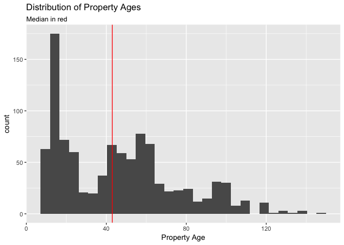
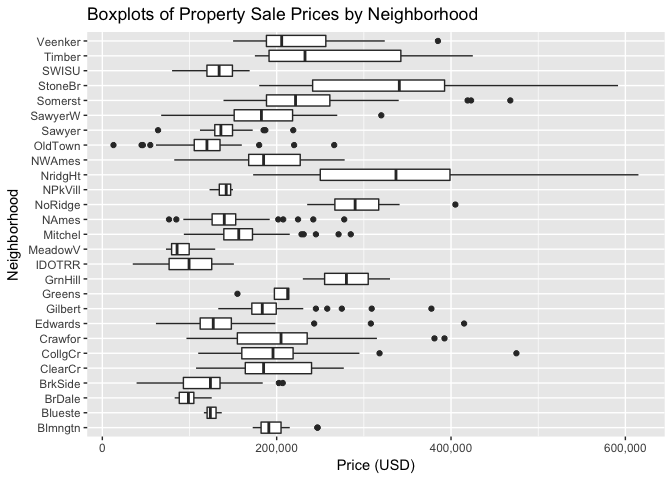
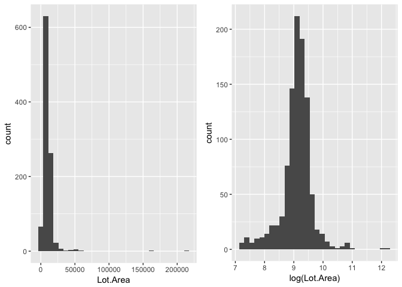
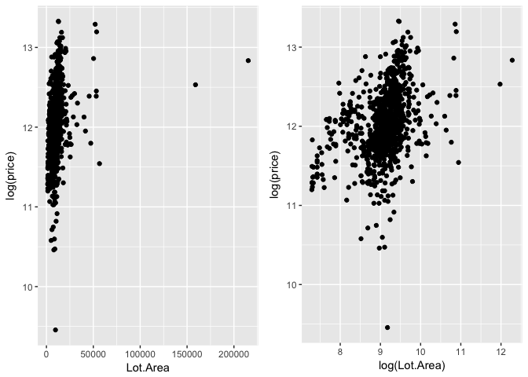
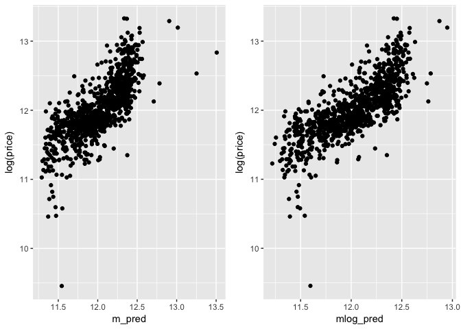

First, let us load the data and necessary packages:


```r
load("ames_train.Rdata")
library(MASS)
library(dplyr)
library(ggplot2)
library(gridExtra)
library(modelr)
library(knitr)
```

#

Make a labeled histogram (with 30 bins) of the ages of the houses in the data set, and describe the distribution.

* * *


```r
# Create the function for mode
getmode <- function(v) {
   uniqv <- unique(v)
   uniqv[which.max(tabulate(match(v, uniqv)))]
}

# create Age variable
ames_train <- ames_train %>%
    mutate(Age = as.integer(format(Sys.Date(), "%Y")) - ames_train$Year.Built)

# plot histogram of Age
ggplot(ames_train, aes(x = Age)) + 
    geom_histogram(bins = 30) +
    geom_vline(xintercept = median(ames_train$Age), color = "red") +
    labs(x = "Property Age", title = "Distribution of Property Ages", subtitle = "Median in red") 
```

<!-- -->

The histogram shows that the shape of the distribution is heavily right skewed. Accordingly, as we'd except from a distribution of this shape, the mean of 45.8 is greater than the median of 43. Both are far less than the mode of 13. 


```r
# find number of properties 2 and 3 sd above mean
n_above3sd <- ames_train %>%
    filter(Age > mean(ames_train$Age) + 3 * sd(ames_train$Age)) %>%
    count() %>%
    pull(n)

n_above2sd <- ames_train %>%
    filter(Age > mean(ames_train$Age) + 2*sd(ames_train$Age)) %>%
    count() %>%
    pull(n)
```

The distribution also has a large spread: a standard deviation of 29.64 years. 33 properties have ages more than two standard deviations above the mean; 4 properties have ages more than three standard deviations above the mean. We might want to treat some of those properties separately as outliers.


* * *


#

The mantra in real estate is "Location, Location, Location!" Make a graphical display that relates a home price to its neighborhood in Ames, Iowa. Which summary statistics are most appropriate to use for determining the most expensive, least expensive, and most heterogeneous (having the most variation in housing price) neighborhoods? Report which neighborhoods these are based on the summary statistics of your choice. Report the value of your chosen summary statistics for these neighborhoods.

* * *


```r
# boxplots of price by neighborhood
ggplot(ames_train, aes(x = Neighborhood, y = price)) +
    geom_boxplot() +
    scale_y_continuous(labels = scales::comma) +
    coord_flip() +
    labs(title = "Boxplots of Property Sale Prices by Neighborhood", y = "Price (USD)")
```

<!-- -->


```r
# calculate most/least expensive, most heterogeneous neighborhoods
most_exp <- ames_train %>%
    group_by(Neighborhood) %>%
    summarize(median = median(price)) %>%
    arrange(desc(median)) %>%
    head(1)

least_exp <- ames_train %>%
    group_by(Neighborhood) %>%
    summarize(median = median(price)) %>%
    arrange(desc(median)) %>%
    tail(1)

high_sd <- ames_train %>%
    group_by(Neighborhood) %>%
    summarize(sd = sd(price)) %>%
    arrange(desc(sd)) %>%
    head(1)

high_IQR <- ames_train %>%
    group_by(Neighborhood) %>%
    summarize(iqr = IQR(price)) %>%
    arrange(desc(iqr)) %>%
    head(1)
```

For skewed data, the median is likely the best single number representation for determining the most and least expensive neighborhoods. Based on the median property value of each neighborhood, StoneBr was the most expensive at a median price of \$340,691.50, and MeadowV was the least expensive neighborhood at a median price of \$85,750.00. 

In order to determine the most heterogeneous neighborhood, we could compare each neighborhood's standard deviation or, if we wanted to focus only on the center of the distribution, the interquartile range. In either case, the result is StoneBr, which has a standard deviation of \$123,459.10 and an IQR of \$151,358.00.

* * *

#

Which variable has the largest number of missing values? Explain why it makes sense that there are so many missing values for this variable.

* * *


```r
library(tidyr)
library(purrr)

# calculate number of missing values in each column
most_missing <- ames_train %>%
    map_df(function(x) sum(is.na(x))) %>%
    gather(variable, num_nulls) %>%
    arrange(desc(num_nulls)) %>%
    head(1) %>%
    pull(variable)
```

Pool.QC is the variable with the most missing values. This makes sense because only a minority of properties have a pool to begin with.

* * *

#

We want to predict the natural log of the home prices. Candidate explanatory variables are lot size in square feet (Lot.Area), slope of property (Land.Slope), original construction date (Year.Built), remodel date (Year.Remod.Add), and the number of bedrooms above grade (Bedroom.AbvGr). Pick a model selection or model averaging method covered in the Specialization, and describe how this method works. Then, use this method to find the best multiple regression model for predicting the natural log of the home prices.

* * *

For this question, I tested two backwards elimination approaches: the first using the p-value as the selection criteria and the second using adjusted R squared as the selection criteria. The method begins with the full set of explanatory variables under consideration in a linear model. Then it sequentially tests the effects of removing variables one at a time according to the chosen selection criteria. Under the p-value method, the process is stopped if all remaining explanatory variables have significant p-values (typically < 0.05). Under the adjusted R squared method, we monitor to see if adjusted R squared increases as a result of the removal of any variable and stop when this is no longer the case.


```r
# backwards elimination: p-value
full_model <- lm(log(price) ~ Lot.Area + Land.Slope + Year.Built +
                     Year.Remod.Add + Bedroom.AbvGr, data = ames_train)

expl_var <- c("Lot.Area", "Land.Slope", "Year.Built", "Year.Remod.Add",
              "Bedroom.AbvGr", NA)

p_values <- anova(full_model)$'Pr(>F)'

p_df <- data.frame(expl_var, p_values)
kable(head(p_df, 5), align = "c")
```

    expl_var       p_values 
----------------  ----------
    Lot.Area        0e+00   
   Land.Slope       2e-07   
   Year.Built       0e+00   
 Year.Remod.Add     0e+00   
 Bedroom.AbvGr      0e+00   


```r
# backwards elimination: adjusted R squared
m1 <- lm(log(price) ~ Lot.Area + Land.Slope + Year.Built + Year.Remod.Add, 
         data = ames_train)
m2 <- lm(log(price) ~ Lot.Area + Land.Slope + Year.Built +
            Bedroom.AbvGr, data = ames_train)
m3 <- lm(log(price) ~ Lot.Area + Land.Slope + Year.Remod.Add +
            Bedroom.AbvGr, data = ames_train)
m4 <- lm(log(price) ~ Lot.Area + Year.Built + Year.Remod.Add +
            Bedroom.AbvGr, data = ames_train)
m5 <- lm(log(price) ~ Land.Slope + Year.Built + Year.Remod.Add +
            Bedroom.AbvGr, data = ames_train)
adjR2_df <- data.frame(model = c("full_model","m1","m2","m3","m4","m5"),
                       adj.r.sq = c(summary(full_model)$adj.r.squared,
                                    summary(m1)$adj.r.squared,
                                    summary(m2)$adj.r.squared,
                                    summary(m3)$adj.r.squared,
                                    summary(m4)$adj.r.squared,
                                    summary(m5)$adj.r.squared))
kable(adjR2_df, align = "c")
```


   model       adj.r.sq  
------------  -----------
 full_model    0.5598345 
     m1        0.5314859 
     m2        0.4922384 
     m3        0.4473663 
     m4        0.5526062 
     m5        0.5220090 

Taking the p-value as the selection criteria, all p-values are well below the 0.05 threshold, suggesting that all explanatory variables are significant. Accordingly, we cannot remove any variables and are finished. Changing the selection criteria to adjusted R-squared gives the same result. Removing any variable from the model results in a lower adjusted R-squared, and so the full model with all of the variables under consideration should be retained.

* * *

#

Which home has the largest squared residual in the previous analysis (Question 4)? Looking at all the variables in the data set, can you explain why this home stands out from the rest (what factors contribute to the high squared residual and why are those factors relevant)?

* * *


```r
# add residuals to the model and arrange by residual
kable(ames_train %>%
    add_residuals(full_model) %>%
    mutate(sq_resid = resid^2) %>%
    arrange(desc(sq_resid)) %>%
    dplyr::select(area, price, Sale.Condition, resid, sq_resid) %>%
    head(), align = "c")
```


 area    price     Sale.Condition      resid       sq_resid  
------  --------  ----------------  ------------  -----------
 832     12789        Abnorml        -2.0878529    4.3591298 
 1728    84900        Abnorml        -1.0254998    1.0516498 
 480     35311        Abnorml        -1.0003537    1.0007075 
 2470    615000        Normal        0.9945048     0.9890399 
 334     39300         Normal        -0.9724980    0.9457524 
 2364    611657       Partial        0.9548393     0.9117180 

The four properties with the largest residuals were negative and so were sold for far less than what our model predicted. The immediate explanation for these properties is that they all had abnormal sale conditions. This would be a good reason to remove abnormal sale properties when trying to model normal properties.


* * *

#

Use the same model selection method you chose in Question 4 to again find the best multiple regression model to predict the natural log of home prices, but this time **replacing Lot.Area with log(Lot.Area)**. Do you arrive at a model including the same set of predictors?


* * *

Replacing `Lot.Area` with `log(Lot.Area)` yields the same collection of explanatory variables according to the backwards elimination method, using either p-value or adjusted R-squared as the selection criteria. Both methods retain all explanatory variables under consideration.


```r
# backwards elimination: p-value
full_model <- lm(log(price) ~ log(Lot.Area) + Land.Slope + Year.Built +
                     Year.Remod.Add + Bedroom.AbvGr, data = ames_train)

expl_var <- c("Lot.Area", "Land.Slope", "Year.Built", "Year.Remod.Add",
              "Bedroom.AbvGr", NA)

p_values <- anova(full_model)$'Pr(>F)'

p_df <- data.frame(expl_var, p_values)
kable(head(p_df, 5), align = "c")
```

    expl_var       p_values  
----------------  -----------
    Lot.Area       0.0000000 
   Land.Slope      0.0241979 
   Year.Built      0.0000000 
 Year.Remod.Add    0.0000000 
 Bedroom.AbvGr     0.0000000 


```r
# backwards elimination: adjusted R squared
m1 <- lm(log(price) ~ log(Lot.Area) + Land.Slope + Year.Built + Year.Remod.Add,
         data = ames_train)
m2 <- lm(log(price) ~ log(Lot.Area) + Land.Slope + Year.Built +
            Bedroom.AbvGr, data = ames_train)
m3 <- lm(log(price) ~ log(Lot.Area) + Land.Slope + Year.Remod.Add +
            Bedroom.AbvGr, data = ames_train)
m4 <- lm(log(price) ~ log(Lot.Area) + Year.Built + Year.Remod.Add +
            Bedroom.AbvGr, data = ames_train)
m5 <- lm(log(price) ~ Land.Slope + Year.Built + Year.Remod.Add +
            Bedroom.AbvGr, data = ames_train)
adjR2_df <- data.frame(model = c("full_model","m1","m2","m3","m4","m5"),
                       adj.r.sq = c(summary(full_model)$adj.r.squared,
                                    summary(m1)$adj.r.squared,
                                    summary(m2)$adj.r.squared,
                                    summary(m3)$adj.r.squared,
                                    summary(m4)$adj.r.squared,
                                    summary(m5)$adj.r.squared))
kable(adjR2_df, align = "c")
```


   model       adj.r.sq  
------------  -----------
 full_model    0.6032018 
     m1        0.5910888 
     m2        0.5363921 
     m3        0.4932282 
     m4        0.6014831 
     m5        0.5220090 
* * *

#

Do you think it is better to log transform Lot.Area, in terms of assumptions for linear regression? Make graphs of the predicted values of log home price versus the true values of log home price for the regression models selected for Lot.Area and log(Lot.Area). Referencing these two plots, provide a written support that includes a quantitative justification for your answer in the first part of question 7.

* * *

`Lot.Area` is a strictly positive variable, and so a log transformation is possible. Log transformations can make highly skewed distributions less skewed. From the histogram on the left below we can see `Lot.Area` is right skewed. They can also help in data that stretches across orders of magnitude. With a minimum value of 1,470 sq ft and a maximum value of 215,245 sq ft, this is also the case for the `Lot.Area` variable. Making the data more linear will help match the assumptions of our linear model. 


```r
# plot histograms of Lot.Area and log(Lot.Area) side by side
p1 <- ggplot(ames_train, aes(x = Lot.Area)) +
    geom_histogram()

p2 <- ggplot(ames_train, aes(x = log(Lot.Area))) +
    geom_histogram()

grid.arrange(p1, p2, ncol = 2)
```

<!-- -->

In order to determine if a log transformation of `Lot.Area` is appropriate, we can compare scatterplots of `Lot.Area` and `log(Lot.Area)` against `log(price)` in terms of linearity. `log(Lot.Area)` appears more linear.


```r
# scatterplots of Lot.Area and log(Lot.Area) against log(price) side by side

p3 <- ggplot(ames_train, aes(x = Lot.Area, y = log(price))) +
    geom_point()

p4 <- ggplot(ames_train, aes(x = log(Lot.Area), y = log(price))) +
    geom_point()

grid.arrange(p3, p4, ncol = 2)
```

<!-- -->

We can do a similar comparison of `Lot.Area` and `log(Lot.Area)` against their respective model predictions. Again, we see a closer linear trend using `log(Lot.Area)`.


```r
# define models using Lot.Area and log(Lot.Area)
m <- lm(log(price) ~ Lot.Area + Land.Slope + Year.Built +
                     Year.Remod.Add + Bedroom.AbvGr, data = ames_train)
mlog <- lm(log(price) ~ log(Lot.Area) + Land.Slope + Year.Built +
                     Year.Remod.Add + Bedroom.AbvGr, data = ames_train)

# add model predictions to dataframe
ames_train <- ames_train %>%
    add_predictions(m, var = "m_pred") %>%
    add_predictions(mlog, var = "mlog_pred")

# scatterplots of Lot.Area and log(Lot.Area) predictions against log(price)
p5 <- ggplot(ames_train, aes(x = m_pred, y = log(price))) +
    geom_point()

p6 <- ggplot(ames_train, aes(x = mlog_pred, y = log(price))) +
    geom_point()

grid.arrange(p5, p6, ncol = 2)
```

<!-- -->

Lastly, the higher adjusted R-squared and lower residual standard error using `log(Lot.Area)` suggests a log transformation would be a good idea.


```r
# compare adj.r.sq and sigma of Lot.Area and log(Lot.Area) models
metric_comparison <- data.frame(
    model = c("Lot.Area", "log(Lot.Area)"),
    adj.r.squared = c(summary(m)$adj.r.squared, summary(mlog)$adj.r.squared),
    residual_std_error = c(summary(m)$sigma, summary(mlog)$sigma)
)
kable(metric_comparison, align = "c")
```

     model        adj.r.squared    residual_std_error 
---------------  ---------------  --------------------
   Lot.Area         0.5598345           0.279047      
 log(Lot.Area)      0.6032018           0.264944      


* * *
